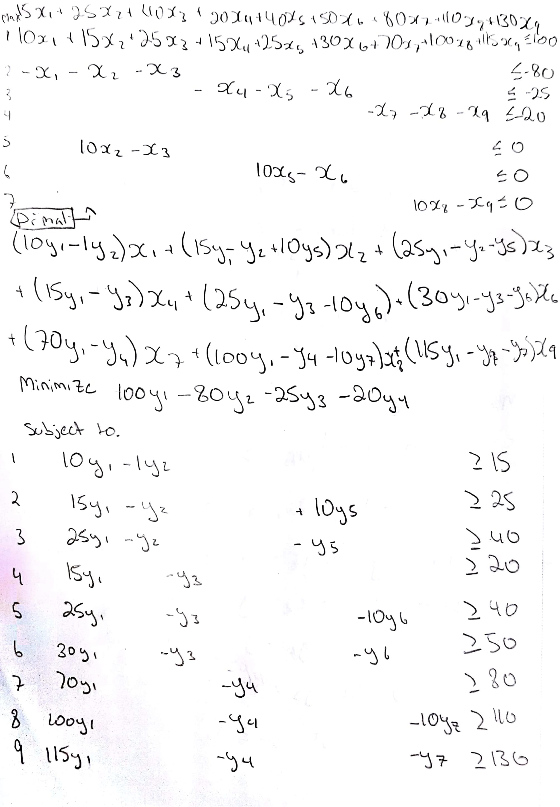
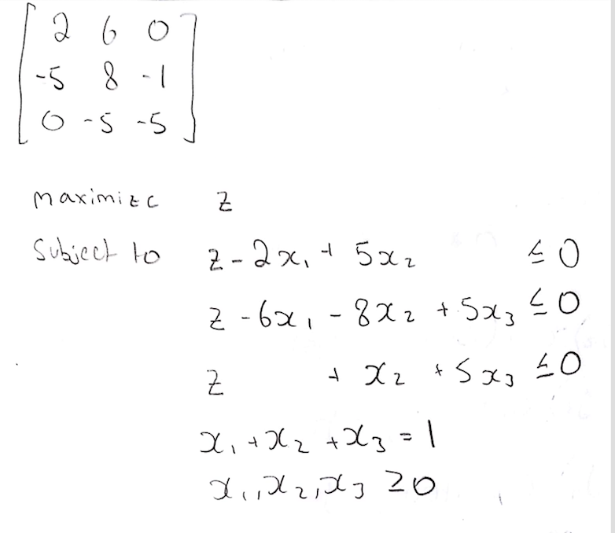
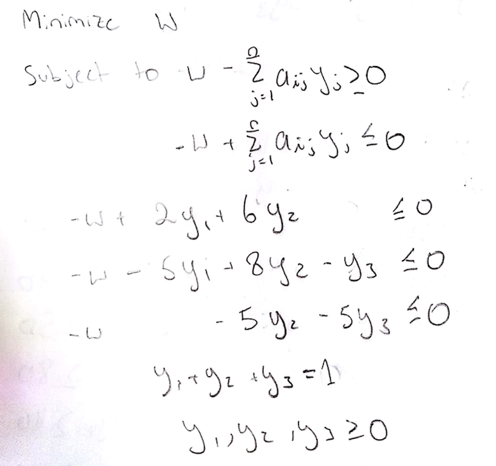

= COMP 360 A2
Ryan Chalmers

== Part I

=== Question 1

==== Original LP

===== Variables

* Staple-poor = x~1~
* Staple-average = x~2~
* Staple-premium = x~3~
* Nail-poor = x~4~
* Nail-average = x~5~
* Nail-premium = x~6~
* Screw-poor = x~7~
* Screw-average = x~8~
* Screw-premium = x~9~

===== Objective

Maximize: +
15x~1~ + 25x~2~ + 40x~3~ + 20x~4~ + 40x~5~ + 50x~6~ + 80x~7~ + 110x~8~ + 130x~9~

===== Subject To

10x~1~ + 15x~2~ + 25x~3~ + 15x~4~ + 25x~5~ + 30x~6~ + 70x~7~ + 100x~8~ + 115x~9~ ≤ 1000, +
x~1~ + x~2~ + x~3~ ≥ 80, +
x~4~ + x~5~ + x~6~ ≥ 25, +
x~7~ + x~8~ + x~9~ ≥ 20, +
x~1~ + x~2~ + x~3~ + x~4~ + x~5~ + x~6~ + x~7~ + x~8~ + x~9~ ≥ 0, +
-10x~2~ + x~3~ ≥ 0, +
-10x~5~ + x~6~ ≥ 0, +
-10x~8~ + x~9~ ≥ 0, +

==== Dual

===== Objective

Minimize: +
100y~1~ - 80y~2~ - 25y~3~ - 20y~2~ +

===== Subject To

10y~1~ - y~2~ ≥ 15 +
15y~1~ - y~2~ + 10y~5~ ≥ 25 +
25y~1~ - y~2~ - y~5~ ≥ 40 +
15y~1~ - y~3~ ≥ 20 +
25y~1~ - y~3~ - 10~6~ ≥ 50 +
70y~1~ - y~4~ ≥ 80 +
100y~1~ - y~4~ -10y~7~ ≥ 110 +
115y~1~ - y~4~ - y~y~ ≥ 130

==== Solution

y~1~ = 2 +
y~2~ = 5 +
y~3~ = 10 +
y~4~ = 60 +
y~5~ = 5 +
y~6~ = 0 +
y~7~ = 0 +
z = -1650

==== Rough Work

.Rough Work

=== Question 2

==== Row Player Optimal Solution

.Formulation

==== Solution
x~1~ = 1 +
x~2~ = 0 +
x~3~ = 0

==== Column Player Optimal Solution

.Formulation

==== Solution
y~1~ = 0 +
y~2~ = 0 +
y~3~ = 1

==== Comments

If the row player is playing optimally and the column player is playing
optimally then on average the row player will win 0.
