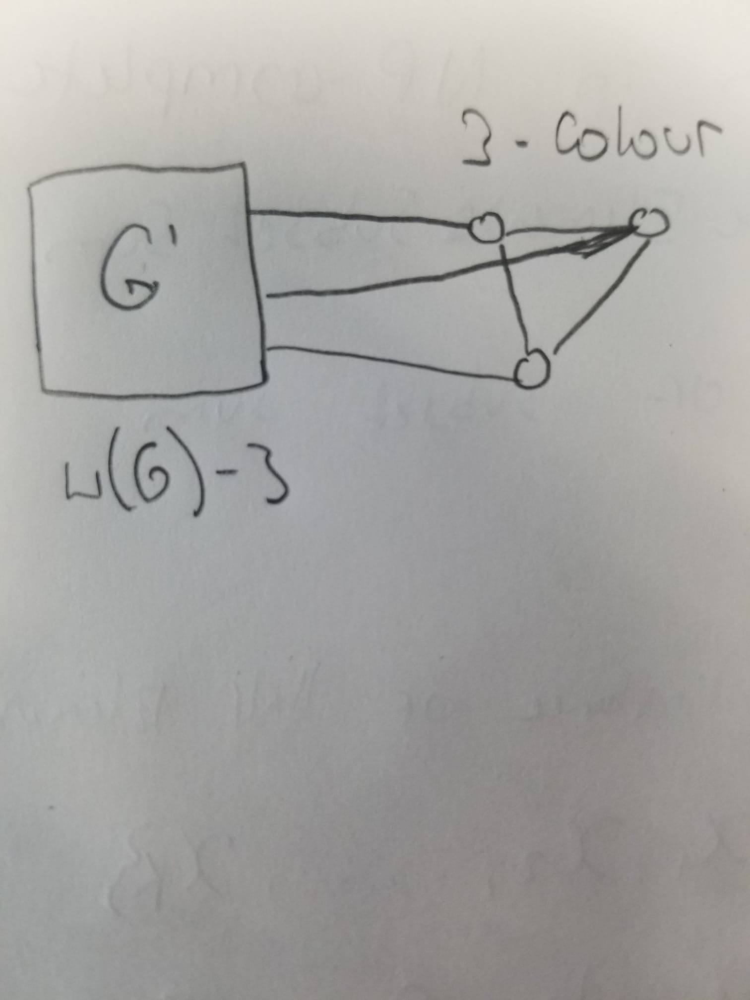

= COMP 360 Assignment 3
Ryan Chalmers

== Question 1

* Let S~m~ be a set consisting of 4m 1's and 2m 2's
* Let S~j~ be a subset of S~m~ where 2m ≤ j ≤ 4m and the Sum of the elements
in S~j~ is equal to 4m
* Let _|S~j~| = |S~1~| + |S~2~|_ where S~1~ is the subset of S~j~ consisting of all
1's, S~2~ the same for 2's
* From problem description: _|S~1~| = 2j - 4m ; |S~2~| = 4m - j_
* Then, _|S~j~| = 2j - 4m + 4m - j = j_

=== Proof:

_∑(S~j~) = 1*|S~1~| + 2*|S~2~|_ +
 _= 1*(2j - 4m) + 2(4m - j)_ +
 _= 2j- 4m + 8m - 2j_ +
 _= 4m_ +

* From this we have show that for any set S~j~ constrained by 2m ≤ j ≤ 4m there
is a solution of size j where the sum of all elements of the set is equal to
4m

== Question 2

* Will attempt to reduce subset sum problem to a problem in NP
* Prove: Subset-Sum ≤ Half The Elements Subset Sum
* Let S~k~ be a set with k-integers +
S~k~ = {c~1~,c~2~, ..., c~k~} +
* We then want to double the set to get a 2K set: +
S~2k~ = {c~1~,c~2~, ..., c~k~,c~1~,c~2~, ..., c~k~}
* Then we add an element to S~2k~: _T-∑S~k~_, Where T is the target
* This element is chosen because as you can see if we take the original set
S~k~ from S~k~ we can formulate that: _T=(T - ∑S~k~) + ∑S~k~_
* From this we know that the subset _S={S~k~, (T - ∑S~k~)}_ has a solution T
* Thus we know that if the original set has a solution then so will the Half
sum set problem
* The certificate for this is to take the solution subset, and sum the set and
verify is equals the target which is in poly time

== Question 3

* We prove this by reducing 3-colouring≤w(G)-colouring
* We first create a graph G` that is a complete subgraph and has a colouring
w(G)-3
* We also want to create another graph G that is 3-coloured
* Connecting every node in the G to the graph G' we have reduced the problem
from 3-coloring≤w(G)-colouring
* To reduce w(G)-colouring≤3-SAT
** For each node create a w(g) literals
** Need a clause so that each node only has 1 colour, ie only one literal can
be true
** We also need clauses to verify that each node is not the same colou\r as a node
adjacent to it
* The certificate of this problem to to iterate through the nodes and verify that
no node has the same colour as an adjacent node

== Question 4

|========
| x | y | {x OR not y} AND {not x OR y}
| F | F | T
| F | T | F
| T | F | F
| T | T | T
|========

* In every instance of a True solution, if y is assigned true then so is x as
you can see by the truth table

== Question 5

* We want to reduce 3-SATy≤only 5 copies satisfiability
* If a literal appears only 5 times in the satisfiability instance then
there is no issue
* If a literal appears more than 5 times we want to create a new set which
we can call x~n~ where x~n~ corresponds to the the literal that appears more than
five times, then for each literal above the upper bound create a new literal
y~n~. Thus we get: x~n~={y~1~,y~2~,...,y~n~}
* Now for this new literal we can create a new clause A such that: +
_A={y~1~ OR y~2~ OR ... OR y~n~}_
* Now we add two new clauses to the original set of clauses C~j~: +
C~x'n~ = x~n~ OR A OR A +
C~xn~ = x~n~ OR not A OR not A +
* The certificate for this is to solve the satisfiability

== Question 6

* Page 1091 he is proving the solution is NP-hard not NP-complete
