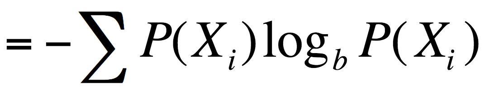

= Assignment 5
Ryan Chalmers

== Question 1

* We know from class that the entropy provides an absolute limit on the best
lossless encoding of any message, assuming the message may be represented
as a sequence independent identically distributed random variables.
* However, we know that the message is not independent, since each word must
be separated by a space, the number of spaces is directly dependent on the
number of words.
* We will attempt to produce an encoding that is better than the entropy by
using Huffman. We know Huffman is within 0.586 of the entropy. In an attempt
to improve upon this we will take into account that every word in the message is
from the english language. If we preprocess the words in the dictionary we can
can use the fact that in the English language some letters are more likely to
be proceeded by others (e.g. t is likely proceeded by h). Therefore we can
give each letter in the alphabet its own Huffman encoding that uses the increased
probability of the letters proceeding it to improve upon Huffman. By doing this
we are using the extra information given by the question to generate an encoding
that is better than the entropy.

== Question 2

== Question 3

* To be able to solve the an instance of the 16x16 matrix multiplication using
the Strassen algorithm we must recursively divide each matrix into 4 sub-matrices
each of size n/2 by n/2, until we reach matrices of size 2x2.
* In other words to multiply one 2x2 we use 7 multiplications, a 4x4 uses
7^2^ multiplications, a 8x8 uses 7^3^ multiplications, and a 16x16 uses 7^4^.

== Question 4

* Suppose we have some instance of Huffman encoding where there are two symbols,
one has a very high probability (approaching 1) and one has a very low
probability (approaching 0).
* We can represent these two symbols using one bit, therefore R(S) = 1
* According to the formula given for entropy in class:

* Calculating H(S) using our chosen probabilities we get a entropy H(S) which
is near 0.
* In this case R(S) ≤ H(S) + 0.586 does not hold.

== Question 5

=== 5.a.

* In this case since we have 7 vertices and each are in their own cycle, each
vertex will rank 1/7 and have an equal page rank of 1.

=== 5.b.

image::images/assignment5-94277.png[align=center]

* In order to find the page rank we attempt to solve (P-I)R = 0.

* Solved using gaussian elimination.

|==============
|x~1~| 0.34133
|x~2~| 0.37777
|x~3~| 0.24813
|x~4~| 0.29851
|x~5~| 0.93756
|x~6~| 0.88455
|x~7~| 1.00000
|==============

* Now we can rank the vertices (1 being the highest, 7 the lowest).

|====================================
| Rank | 1 | 2 | 3 | 4 | 5 | 6 | 7
| Vertex | G | E | F | B | A | D | C
| ===================================
