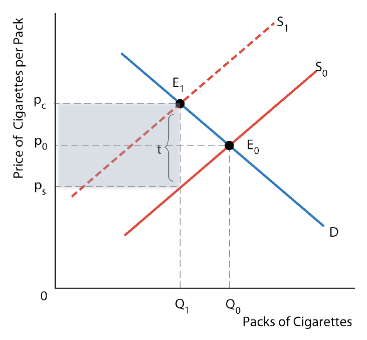
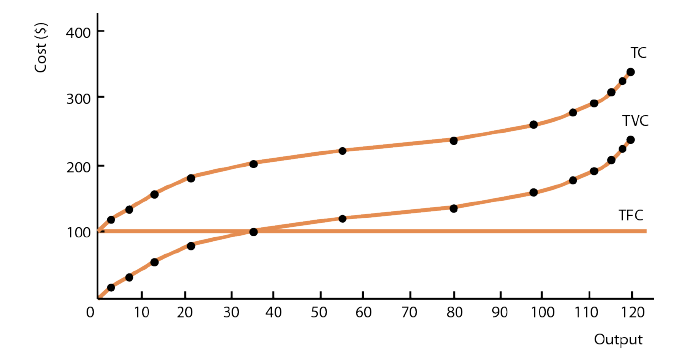

= ECON 208

== 1.

=== What is Economics

* Economics is the study of the use of scarce resources to satisfy unlimited
human wants

* *Factors of Production*: land, labour, resource
** Outputs: goods, or services

==== Scarcity and Choice

* Scarcity indicates having to make a choice
* For every choice made there is an opportunity cost (whatre you giving up to
produce these resources)
* *Opportunity Cost* the value of the next best alternative that is forgone
when one alternative is chosen

//TODO: add  graph pizza/beer opportunity cost graph

* Production Possibility Boundary (PPB)
** Illustrates
*** Scarcity
*** Choice
*** Opportunity Cost

** Items on boundary are most efficient, using all resources possible

//TODO: add PPB graph

* Opportunity cost for activity includes three things:
1. The direct cost of activity, plus
2. Whatever you give up in order to do the activity, minus
3. Whatever savings the activity generates

==== Four Key Economic Problems

1. What is produces and how?
* *Resource allocation* determines the quantities of various goods that are
produced

2. What is consumed and by whom?
3. Idk
4. Is productive capacity growing?

//TODO: the effect of economic growth on PPB

==== Economics and Government

* Can tax
* Alter allocation of resources
* Improve distribution of consumption
* Can affect the overall output and income

=== The Complexity of Modern Economics

==== Nature of the Economy

* *Many transactions* leads to a *complex* system that is *self-organized*
* Self organizing: individual consumers and producers seek to maximize
their own satisfaction which leads to the overall state of the economy
* Incentives and self-interest:
** everyone is selfish
** individuals respond to incentive

* Efficiency: will we produce the goods and services people want using the
least possible resources

=== The Decision Makers and Their Choices

* Consumers: maximizes satisfaction/utility with budget constraint
* Producers: maximized profits
* Government

//TODO: the circular flow of income and expenditure figure

==== Production and Trade

* displays two characteristics
** specialization of labour
** division of labour

* specialization: allocation of jobs to different people
** Advantageous because
*** individual abilities differ - comparative advantage

* Division of labour: the breaking up of a production process into a series of
specific tasks

* *Market Economy* a society in which people specialize in productive activities
and and meet most of their material wants through voluntary market transactions
with other people.

=== Is There an Alternative to Market Economy

==== Types of Economic Systems

* Traditional: one where behavior is primarily based on tradition, custom, and
habit
* Command Economies (Centrally planned Economy): the economic behavior is
determined by a central authority, usually the government
* Free-Market Economies: decision about resource allocation are made without
any central direction, they are a result of innumerable independent decisions
made by producers and consumers.
* Mixed Economy: in general all economies are some mix of the the previous 3

== 2. Economic Theories, Data, and Graphs

=== Positive and Normative Statements

* *Normative Statement* depend on value judgements and opinions - cannot
be settled by resource facts
* *Positive Statements* do not involve value judgements, they are statements
about what is, was, or will be

=== Building and Testing Economic Theories

* *Correlation* is a measure of degree of relationship of two variables
* *Causal Relationship* between two events exists if the occurrence of one event
causes the other

* *Endogenous* a variable that is explained within a theory
* *Exogenous* a variable that is determined outside a theory

=== Economic Data

==== Index Number

* Index Number: a measure of some variable, conventionally expressed relative
to a base period, which is assigned a value of 100
* Value of index for any given period

==== Consumer Price Index

* The price index of the average price paid by consumers for a typical basket
of goods that they buyxf

=== Graphing Economic Theories

image::images/2018/09/income-and-consumption.png[income and consumption]

== 3. Demand Supply and Price

=== Demand

* Quantity demanded: the total amount consumers desire to purchase in some time
period
* _ceteris paribus_: the price of a product and the quantity demanded are
*negatively* related

* A change in variables other than price will shift the demand curve
  - average household income
  - prices of other products

- Shifts in the Demand curve
  - rightward: increase in demand
  - leftward: decrease in demand

- A *change in demand* is a change in the quantity demanded at every price
shift the entire curve
- A *change in quantity demanded* refers to a movement from one point on a
demand curve to another point

=== Supply

* Quantity supply: the amount of product that a firm desires to sell in some
time period
* _ceteris paribus_: the price of a product and the quantity demanded are
*positively* related
* Shifts in supply curve:
  - increase price of inputs
  - technology government taxes and subsidies
* Quantity supplied it the amount that firms are willing to offer for sale and
not necessarily the quantity sold
- A *change in supply* is a shift of the entire curve
- A *change in quantity supplied*: refers to a movement from one point on a
supply curve to another point

=== The Determination of Price

* *Market* a market may be defined as any situation in which buyers and sellers
negotiate the transaction of some goods and services
* *Perfectly competitive market* buyers and sellers are price takers

==== Changes in Market Prices

* Four "laws" of supply and demand
1. An increase in demand causes an increase in both equilibrium price and
equilibrium quantity
2. A decrease in demand demand causes a decrease in both equilibrium price and
equilibrium quantity

.Shifts in the demand curve

3. An increase in supply causes a decrease in the equilibrium price and in
increase in the equilibrium quantity
4. A decrease in supply causes an increase in the equilibrium price and a
decrease in the equilibrium quantity

.Shifts in the supply curve
image::images/ECON208Lecture-2bded.png[align=center]

=== Relative Prices and Inflation

* The *absolute price* of a product is the amount of money that must be spent
to acquire one unit of that price
* A *relative price* is the price of one good in terms of another
* Demand and supply curves are drawn in terms of relative prices rather than
absolute prices

== 4. Elasticity

=== Price Elasticity of Demand

* Demand is *elastic* when quantity demanded is very responsive to change
in the products own price (*inelastic* is opposite)
* Related to the slope of the demand curve but not the same

.Elastic demand

.inelastic demand
image::images/ECON208Lecture-92ebe.png[align=center]

* *Note* we can only do visual comparison if: both the curves are drawn on the
same scale
* We start from the same price-quantity equilibrium

==== The Measurement of Price Elasticity

* Elasticity is defined as

image::images/ECON208Lecture-e3de9.png[align=center]

* Demand elasticity is *negative*, but economists usually use the
*absolute value*
* Elasticity measures the change in p and Q relative to some base values of
p and Q

.Example: from point 0 to 1
image::images/ECON208Lecture-18dc3.png[align=center]

.Elasticity along a linear demand curve
image::images/ECON208Lecture-f468b.png[align=center]

.Demand Curves with constant elasticity
image::images/ECON208Lecture-0d509.png[align=center]

* D~1~ is perfectly inelastic
* D~2~ is perfectly elastic at p~0~
* D~3~ is unit elastic: a given % increase in p induces an equal % decrease
in q at all points on the curve

==== What Determines Elasticity of Demand

* Demand elasticity tends to be high when there are many *close substitutes*
* The availability of substitutes is determined by:
** the length of the time interval considered
** whether the good is a necessity or a luxury
** how specifically the product is defined

==== Total Expenditure

* The change in total expenditure depends on the relative changes in price and
quantity: +
_Total Expenditure = Price X Quantity_
* Elasticity > 1: Changes in price cause TE to change in opposite direction
* Elasticity < 1: Changes in price cause TE to change in the same direction
* TE reaches maximum when demand is *unit elastic*

=== Price Elasticity of Supply

* Price elasticity of supply measures the responsiveness of the quantity
supplied to a change in the products own price
* it is denoted as _n_~s~ and is defined as:

image::images/ECON208Lecture-8ff68.png[align=center]

==== Determinants of Supply Elasticity

* The elasticity of supply depends on how easily firms can increase
output in response to an increase in the product's price
* Depends on:
** The technical ease of substitution
** The nature of production costs
** The time span under consideration

* Are resource inputs really available
* Are factors mobile, ie can workers move when needed
* Can finished products be easily stored
* etc...

==== Important Example of Where Elasticity Matters

* *Exice Tax*: A tax on the sale of a particular commodity
* *Tax Incidence* Who bears the burden of the tax?

.The effect of a cigarette exice tax

.The effect of a cigarette on exice tax 2.0

* The burden of an exice tax is independent of who actually remits the tax to
the government - it depends only on relative *elasticities* of demand and
supply
* More inelastic is demand, more burden for consumers

=== Other Demand Elasticities

==== Income Elasticity of Demand

image::images/ECON208Lecture-3ee63.png[align=center]

===== Luxuries Versus Necessities

* The more necessary an item is in the consumption pattern of consumers, the
lower its income elasticity
* Income elasticities for any one product also vary with the level of a
consumer's income
* The distinction between luxuries and necessities also helps to explain
differences in income elasticities between countries

==== Cross Elasticity of Demand

image::images/ECON208Lecture-26485.png[align=center]

== 5. Price Controls and Market Efficiency

=== Government-Controlled Prices

==== Disequilibrium Prices

* At any disequilibrium price, quantity exchanged is determined by the lesser
of quantity demanded or quantity supplied

* If price is set above equilibrium, some sellers will be unable to find buyers
* Conversely, if price is set below equilibrium, some buyers will be unable to
find sellers
* With administered prices, the quantity is determined by the *lesser* of
quantity demanded and supplied
* *Partial Equilibrium* is the analysis of a single market in which the feedback
effects from the market are ignored

.The determination of quantity exchanged in disequilibrium
image::images/ECON208Lecture-c2051.png[align=center]

==== Price Floors

* *Price floors lead to excess supply Either an unsold surplus will exist, or
someone must enter the market and buy the surplus.

.A binding price floor
image::images/ECON208Lecture-c2051.png[align=center]

* Price floors make it illegal to sell the product below the controlled price
* Price floors lead to excess

* *Deadweight loss* caused by the binding price floor and represents the overall
loss of economic surplus on society

==== Price Ceilings

.A price ceiling and Black-Market pricing
image::images/ECON208Lecture-20e1f.png[align=center]

* A price ceiling is the maximum price at which a product may be exchanged
* *Price ceilings lead to excess demand*
* Reasons for excess demand:
** Restrict production
** Keep specific prices down
** satisfy (normative) notions of quantity

=== Rent Controls: A case study of Price Ceilings

* The predicted effects of rent controls
** Binding rent controls are a specific form of price ceiling

.Short-run and long-run effects of rent controls
image::images/ECON208Lecture-ecb12.png[align=center]

* Existing tenants in rent-controlled apartments win
* Landlords lose
* Potential future tenants also suffer

==== Policy Alternatives

* Housing shortages can be reduced if the government (at taxpayers' expense)
either subsidizes housing production or produces public housing directly
* The government may also provide lower-income households with income assistance
* But no policy is "free" every policy involves resources cost

=== An Introduction to Market Efficiency

* Legislated minimum wages make firms and some workers worse off, but benefit
those workers who retain their jobs
* Rent controls make some tenants better off at the expense of landlords
* *Market Efficiency* How does this effect society overall?

==== Demand as Value and Supply as Cost

* Price corresponding to a specific quantity demanded is the highest price
consumers are willing to pay
** As shown by the height of the demand curve

* Price corresponding to a specific quantity supplied is the lowest price
producers are willing to accept
** As show by the height of the supply curve

==== Reinterpreting the Demand Curve

image::images/ECON208Lecture-877b2.png[align=center]

* For each pizza the price on the demand curve shows the value consumers
receive from consuming that pizza

==== Reinterpreting the Supply Curve

* For each pizza, the price on the supply curve shows the additional costs to
firms of producing that pizza

==== Economic Surplus

* *Economic Surplus*: for any given quantity the area below the demand curve and
above the supply curve shows the economic surplus associated with the prodution
and consumption of that good
** Represents the net value that society as a whole earns by producing and
consuming that good

.Economic surplus in the pizza market

.Economic surplus in the pizza market 2

==== Economic Surplus and Market Efficiency

image::images/ECON208Lecture-ef633.png[align=center]

==== Market Inefficiency with Price Controls

.Price floor
image::images/ECON208Lecture-e450e.png[align=center]

* Change in CS=-(B + D)
* Change in PS=B-E
* Change in Total Surplus = -(D + E)

.price ceiling

* Change in CS=C-D
* Change in PS=-(C-E)
* Change in Total surplus = - (D+E)

.output quotas

* Change in CS = - (B+D)
* Change in PS = B - E
* Change in total surplus = - (D + E)

== 6. Consumer Behavior

=== Marginal Utility and Consumer Choice

* Consumers are motivated to maximize their utility
* *Utility*: the total satisfaction that they derive from the goods and services
they consume
** *Total Utility* the full satisfaction resulting from the consumption of some
product by a consumer
** *Marginal Utility* additional satisfaction resulting from consuming one more
unit of some product

==== Diminishing Marginal Utility

* All things being equal, the utility that any consumer derives from successive
units of a particular product, is assumed to diminish as total consumption of
the product increases
* Marginal utility falls as the level of consumption rises
* Important assumption to be able to compare total and marginal utility:
** Individuals know the utility from different actions
** Individuals can compare the utility from different actions

.Total Utility

.Marginal Utility
image::images/ECON208Lecture-a428a.png[align=center]

==== Total Utility, Marginal Utility, and Demand Curve

1. Shape of marginal utility = Shape of demand curve
2. Marginal utility is the slope of the total utility function

==== Market Demand Curve

* Theory of consumer behavior predicts negatively sloped market demand curve
in addition to a negatively sloped demand curve for the individual

.Market and Individual Demand Curves

==== Maximizing Utility

* Consumers must decide how to adjust their expenditure to maximize total utility
* Assume 2 goods (x and y): +
_max. U = f(x,y)_ +
_s.t. income = p~x~x+p~y~y_ +
* A utility maximizing consumer allocates expenditures so that the utility
obtained from the last dollar spent on each product is equal

image::images/ECON208Lecture-d935c.png[align=center]

===== Example: Burritos and Juice

==== Maximizing Utility

* For two products X and Y, the utility maximizing condition is:

image::images/ECON208Lecture-1f837.png[align=center]

==== The Consumer's Demand Curve

* If the price of juice (X) rises, then at the previous utility-maximizing
consumption bundle, we have:

image::images/ECON208Lecture-e2484.png[align=center]

* As the consumer reduces consumption of juice, the marginal utility of juice
rises and this increases the relation on the left-hand side of the equation

=== Income and Substitution Effects of Price Changes

* A change in price has two distinct effects - it alters *relative prices* and
it changes consumers' *real income*

==== The Substitution Effect

* The substitution effect increases the quantity demanded of a good whose
(relative) price has fallen and reduces the quantity demanded of a good whose
(relative) price has increased

==== The Income Effect

* For a *normal good*, the income effect leads consumers to but more of a product
that has fallen in price
* For and *inferior good*, the income effect leads consumers to but less of a
product that has fallen in price
* The size of the income effect depends on the amount of income spent on the
good whose price changes and on the amount by which the price changes

==== The Slope of the Demand Curve

* The overall effect of a price change is the *combination* of the income and
substitution effects
* For a price increase:
** The substitution effect is to reduce quantity demanded
** The income effect could go either way

.Income and Substitution Effects of a Price Change

==== Conspicuous Consumption Goods

* Some products are consumed because the have "snob appeal": the high price
confers status on its purchaser

=== Consumer Surplus

* Consumer surplus on each unit is the difference between what the consumer is
willing to pay for that unit, and what they actually pay for that unit

.Consumer Surplus on Milk Consumption
image::images/ECON208Lecture-4aa64.png[align=center]

* The value placed by a consumer on the total consumption of some product can
be estimated in two ways

1. The valuations that the consumer places on each unit may be summed
2. The consumer may be asked how much he or she would be willing to pay to
consume the *total* amount if the alternative were to consume *more*

* It is important to understand the difference between marginal value and
total value to the consumer

==== The Paradox of Value

* Water is cheap but "invaluable", whereas diamonds are expensive but mostly
unnecessary
* We must distinguish between total value (area under the curve) from marginal
value (height of the curve)

image::images/ECON208Lecture-9095a.png[align=center]

== Producers in the Short Run

=== What Are Firms?

* Firms come in six basic types
1. Single proprietorships
2. Ordinary partnerships
3. Limited partnerships
4. Corporations
5. State-owned corporations
6. Non-profit organizations

* Some firms are transnational corporations, or often called multinational
enterprises

==== Financing of Firms

* Firms use financial capital - *equity* and *debt*
* A firm acquires funds from its owners in return for *stocks*, *shares*, or
*equity*
* A firm's creditors are lenders (not owners) - using debt instruments or *bonds*.
Firms have the obligation to repay the principal and some interest to the lender

==== Goals of Firms

* Economists usually make two key assumptions about firms
1. Firms are assumed to be profit-maximizers
2. Each firm is assumed to be a single, consistent decision making unit

=== Production, Costs, and Profits

==== Production

* Firms use four types of inputs for production
1. Intermediate products
2. Inputs provided by nature
3. Inputs provided by people
4. Inputs provided by the services of physical capital

* Factors of production: *land, labour, capital*
* The *production function* describes the technological relationship between the
inputs the firm uses and the output it produces +
_q = f(L,K)_ +
* Production is a flow, number of units per period time

==== Costs and Profits

* Profit = Total Revenue - Total Cost
* Accounting Profits = Total Revenue - Explicit Costs
* Economic Profits = Total Revenue - (Explicit + Implicit Costs)
* Implicit costs: *Opportunity cost of the owner's time and capital* in the
firm's costs +
Economic Profits < Accounting Profits +
If economic profit is positive, then the owner's capital is earning more than it
could in its next best alternative use

==== Profit-Maximizing Output

* A firms economic profit is equal to total revenues minus total (economic)
costs +
*π=TR - TC* +
* What happens to profits as output changes depends on what happens to both
revenues and costs
* TR: depends on the type of demand firms' face
* TC: depends on the time horizons for decision making

==== Time Horizons for Decision Making

* The *short run* is a length of time over which some of the firms factors
of production are fixed
** Typically capital is fixed in the short run

* The *long run* is the length of time over which all of the firm's factors of
production can be varied, but its technology is fixed
* The *very long run* is the length of time over which all the firm's factors
of production *and* its technology can be varied

=== Production in the Short Run

==== Total, Average, and Marginal Products

* *Total Product (TP)* is the total amount of output that is produced during
a given period of time
* *Average Product (AP)* is the total product divided by the number of units
of the variable factor used to produce it (usually labour) +
*AP = TP/L* +
* The *marginal product (MP)* is the change in total output that results from
using one more unit of a variable factor

image::images/ECON208Lecture-d7a81.png[align=center]

.Total Product
image::images/ECON208Lecture-1ffb9.png[align=center]

.Average and Marginal Product
image::images/ECON208Lecture-a1bec.png[align=center]

* MP is the slope, TP is the curve

==== Diminishing Marginal Product

* The *law of diminishing returns*
* As workers are added to a production process, each can specialize in one task,
and the workers' marginal product initially rises
* But there is a fixed amount of physical capital, eventually the marginal
product is likely to fail

image::images/ECON208Lecture-259fa.png[align=center]

==== The Average-Marginal Relationship

* If an additional worker's output raises the average product, the *MP* must
exceed *AP*
* Similarly, if the marginal worker's output reduces the average product, the
*MP* must be less than the *AP*
** the *AP* curve slopes upward as long as the *MP* curve is above it

* The *MP* curve must intersect the *AP* curve at its maximum point

=== Costs in the Short Run

==== Defining Short-Run Costs

image::images/ECON208Lecture-fb9e9.png[align=center]

* *Marginal Cost (MC)* is the increase in total resulting from increasing output
by one unit

* Because fixed costs do not vary the output, the only part of *TC* that changes
is the *variable cost*

==== Why U-Shaped Curve

* *KEY IDEA* each additional worker adds the same amount to total cost but a
different amount to total output
* Eventually diminishing *MP* of the variable factor implies eventually
rising *MC*

NOTE: *MC* reaches its minimum when *MP* reaches its maximum

* Initially each additional worker costs the same but adds more output than the
previous one
* Eventually each additional worker costs the same but adds less output than
the previous one

==== Short-Run Cost Curves

* *MC* is the slop of the *TVS* curve
* *TFC* do not vary with output, it is horizontal
* *TC=TVC+TFC*

.Total Cost Curve

.Marginal and Average Cost Curve

* *ATC=AVC+AFC*
* *AFC* declines steadily as output rides - this is called spreading the overhead

===== The Shape of the ATC Curve

* Failing *AFC* tends to push down *ATC*
* rising *MC* tends to push up *ATC*
* at some point the second effect overcome the first effect and *ATC* begins to
rise
* *ATC* slopes downward when *MC* is below, slopes upward when *MC* is above

==== Capacity

* The level of output that corresponds to the minimum short-run *ATC* is the
*capacity* of the firm
* Capacity is the largest output that can be produced without encountering
rising average cost per unit
* A firm that is producing at an output less than the point of minimum *ATC*
is said to have *excess capacity*

==== Shifts in Short-Run Cost Curves

* A change in the price of any variable input will shift the *ATC* and *MC* curves
upward for a price increase and downward for a price decrease
* There is also a different short-run cost curve given quantity of the fixed factor
s

== 8. Producers in the Long Run

=== 8.1 The Long Run: No Fixed Factors

* Technical Efficiency: Output/physical amount all inputs
* Economic Efficiency: Output/value of the inputs

==== Profit Maximization and Cost Minimization

* For any level of output, maximizing profits requires firms to choose their
inputs to minimize total costs
* Use K an L to represent capital and labour
* p~k~ and p~k~ as the prices for the two facotos
