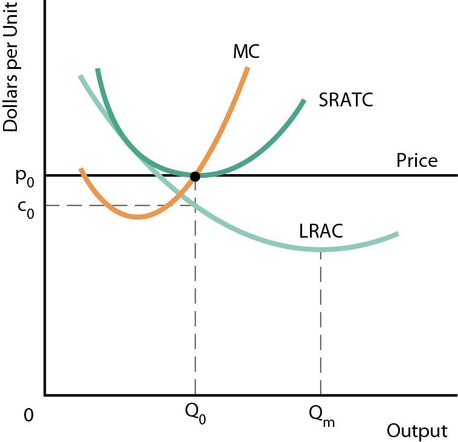
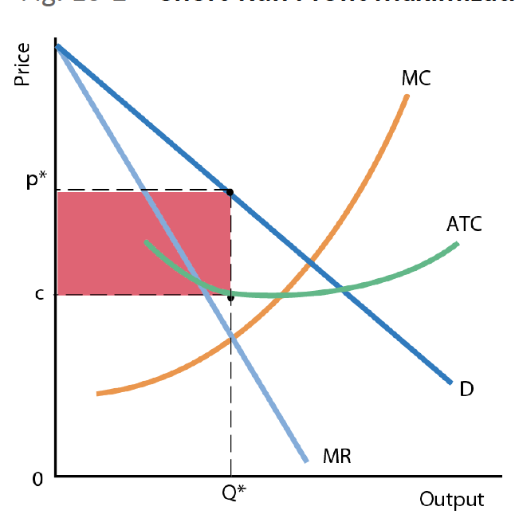
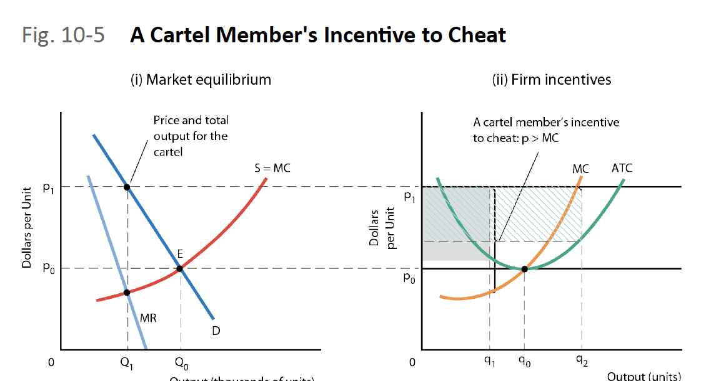
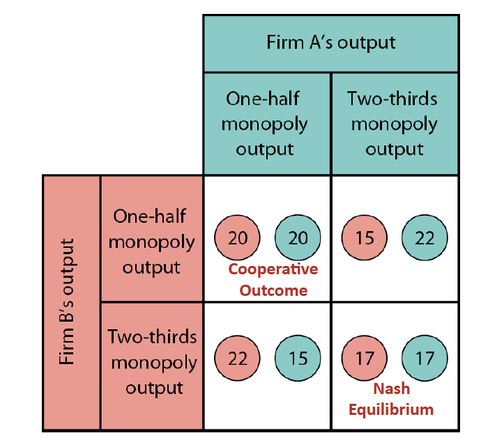

= ECON 208

== 1.

=== What is Economics

* Economics is the study of the use of scarce resources to satisfy unlimited
human wants

* *Factors of Production*: land, labour, resource
** Outputs: goods, or services

==== Scarcity and Choice

* Scarcity indicates having to make a choice
* For every choice made there is an opportunity cost (whatre you giving up to
produce these resources)
* *Opportunity Cost* the value of the next best alternative that is forgone
when one alternative is chosen

//TODO: add  graph pizza/beer opportunity cost graph

* Production Possibility Boundary (PPB)
** Illustrates
*** Scarcity
*** Choice
*** Opportunity Cost

** Items on boundary are most efficient, using all resources possible

//TODO: add PPB graph

* Opportunity cost for activity includes three things:
1. The direct cost of activity, plus
2. Whatever you give up in order to do the activity, minus
3. Whatever savings the activity generates

==== Four Key Economic Problems

1. What is produces and how?
* *Resource allocation* determines the quantities of various goods that are
produced

2. What is consumed and by whom?
3. Idk
4. Is productive capacity growing?

//TODO: the effect of economic growth on PPB

==== Economics and Government

* Can tax
* Alter allocation of resources
* Improve distribution of consumption
* Can affect the overall output and income

=== The Complexity of Modern Economics

==== Nature of the Economy

* *Many transactions* leads to a *complex* system that is *self-organized*
* Self organizing: individual consumers and producers seek to maximize
their own satisfaction which leads to the overall state of the economy
* Incentives and self-interest:
** everyone is selfish
** individuals respond to incentive

* Efficiency: will we produce the goods and services people want using the
least possible resources

=== The Decision Makers and Their Choices

* Consumers: maximizes satisfaction/utility with budget constraint
* Producers: maximized profits
* Government

//TODO: the circular flow of income and expenditure figure

==== Production and Trade

* displays two characteristics
** specialization of labour
** division of labour

* specialization: allocation of jobs to different people
** Advantageous because
*** individual abilities differ - comparative advantage

* Division of labour: the breaking up of a production process into a series of
specific tasks

* *Market Economy* a society in which people specialize in productive activities
and and meet most of their material wants through voluntary market transactions
with other people.

=== Is There an Alternative to Market Economy

==== Types of Economic Systems

* Traditional: one where behavior is primarily based on tradition, custom, and
habit
* Command Economies (Centrally planned Economy): the economic behavior is
determined by a central authority, usually the government
* Free-Market Economies: decision about resource allocation are made without
any central direction, they are a result of innumerable independent decisions
made by producers and consumers.
* Mixed Economy: in general all economies are some mix of the the previous 3

== 2. Economic Theories, Data, and Graphs

=== Positive and Normative Statements

* *Normative Statement* depend on value judgements and opinions - cannot
be settled by resource facts
* *Positive Statements* do not involve value judgements, they are statements
about what is, was, or will be

=== Building and Testing Economic Theories

* *Correlation* is a measure of degree of relationship of two variables
* *Causal Relationship* between two events exists if the occurrence of one event
causes the other

* *Endogenous* a variable that is explained within a theory
* *Exogenous* a variable that is determined outside a theory

=== Economic Data

==== Index Number

* Index Number: a measure of some variable, conventionally expressed relative
to a base period, which is assigned a value of 100
* Value of index for any given period

image::images/ECON208Lecture-a5584.png[align=center]

==== Consumer Price Index

* The price index of the average price paid by consumers for a typical basket
of goods that they buyxf

=== Graphing Economic Theories

image::images/2018/09/income-and-consumption.png[income and consumption]

== 3. Demand Supply and Price

=== Demand

* Quantity demanded: the total amount consumers desire to purchase in some time
period
* _ceteris paribus_: the price of a product and the quantity demanded are
*negatively* related

image::images/2018/09/demandcurve.png[demand curve]

* A change in variables other than price will shift the demand curve
  - average household income
  - prices of other products

- Shifts in the Demand curve
  - rightward: increase in demand
  - leftward: decrease in demand

- A *change in demand* is a change in the quantity demanded at every price
shift the entire curve
- A *change in quantity demanded* refers to a movement from one point on a
demand curve to another point

image::images/2018/09/increase-of-demand.png[increase of demand]

=== Supply

* Quantity supply: the amount of product that a firm desires to sell in some
time period
* _ceteris paribus_: the price of a product and the quantity demanded are
*positively* related
* Shifts in supply curve:
  - increase price of inputs
  - technology government taxes and subsidies
* Quantity supplied it the amount that firms are willing to offer for sale and
not necessarily the quantity sold
- A *change in supply* is a shift of the entire curve
- A *change in quantity supplied*: refers to a movement from one point on a
supply curve to another point

image::images/ECON208Lecture-66915.png[align=center]

=== The Determination of Price

* *Market* a market may be defined as any situation in which buyers and sellers
negotiate the transaction of some goods and services
* *Perfectly competitive market* buyers and sellers are price takers

==== Changes in Market Prices

* Four "laws" of supply and demand
1. An increase in demand causes an increase in both equilibrium price and
equilibrium quantity
2. A decrease in demand demand causes a decrease in both equilibrium price and
equilibrium quantity

.Shifts in the demand curve
image::images/ECON208Lecture-66915.png[align=center]

3. An increase in supply causes a decrease in the equilibrium price and in
increase in the equilibrium quantity
4. A decrease in supply causes an increase in the equilibrium price and a
decrease in the equilibrium quantity

.Shifts in the supply curve

=== Relative Prices and Inflation

* The *absolute price* of a product is the amount of money that must be spent
to acquire one unit of that price
* A *relative price* is the price of one good in terms of another
* Demand and supply curves are drawn in terms of relative prices rather than
absolute prices

== 4. Elasticity

=== Price Elasticity of Demand

* Demand is *elastic* when quantity demanded is very responsive to change
in the products own price (*inelastic* is opposite)
* Related to the slope of the demand curve but not the same

.Elastic demand
image::images/ECON208Lecture-7a8e3.png[align=center]

.inelastic demand

* *Note* we can only do visual comparison if: both the curves are drawn on the
same scale
* We start from the same price-quantity equilibrium

==== The Measurement of Price Elasticity

* Elasticity is defined as

* Demand elasticity is *negative*, but economists usually use the
*absolute value*
* Elasticity measures the change in p and Q relative to some base values of
p and Q

.Example: from point 0 to 1
image::images/ECON208Lecture-18dc3.png[align=center]

.Elasticity along a linear demand curve

.Demand Curves with constant elasticity
image::images/ECON208Lecture-0d509.png[align=center]

* D~1~ is perfectly inelastic
* D~2~ is perfectly elastic at p~0~
* D~3~ is unit elastic: a given % increase in p induces an equal % decrease
in q at all points on the curve

==== What Determines Elasticity of Demand

* Demand elasticity tends to be high when there are many *close substitutes*
* The availability of substitutes is determined by:
** the length of the time interval considered
** whether the good is a necessity or a luxury
** how specifically the product is defined

==== Total Expenditure

* The change in total expenditure depends on the relative changes in price and
quantity: +
_Total Expenditure = Price X Quantity_
* Elasticity > 1: Changes in price cause TE to change in opposite direction
* Elasticity < 1: Changes in price cause TE to change in the same direction
* TE reaches maximum when demand is *unit elastic*

=== Price Elasticity of Supply

* Price elasticity of supply measures the responsiveness of the quantity
supplied to a change in the products own price
* it is denoted as _n_~s~ and is defined as:

image::images/ECON208Lecture-8ff68.png[align=center]

==== Determinants of Supply Elasticity

* The elasticity of supply depends on how easily firms can increase
output in response to an increase in the product's price
* Depends on:
** The technical ease of substitution
** The nature of production costs
** The time span under consideration

* Are resource inputs really available
* Are factors mobile, ie can workers move when needed
* Can finished products be easily stored
* etc...

image::images/ECON208Lecture-1027d.png[align=center]

==== Important Example of Where Elasticity Matters

* *Exice Tax*: A tax on the sale of a particular commodity
* *Tax Incidence* Who bears the burden of the tax?

.The effect of a cigarette exice tax
image::images/ECON208Lecture-79e2a.png[align=center]

.The effect of a cigarette on exice tax 2.0
image::images/ECON208Lecture-2eeef.png[align=center]

* The burden of an exice tax is independent of who actually remits the tax to
the government - it depends only on relative *elasticities* of demand and
supply
* More inelastic is demand, more burden for consumers

=== Other Demand Elasticities

==== Income Elasticity of Demand

image::images/ECON208Lecture-3ee63.png[align=center]

===== Luxuries Versus Necessities

* The more necessary an item is in the consumption pattern of consumers, the
lower its income elasticity
* Income elasticities for any one product also vary with the level of a
consumer's income
* The distinction between luxuries and necessities also helps to explain
differences in income elasticities between countries

==== Cross Elasticity of Demand

image::images/ECON208Lecture-26485.png[align=center]

== 5. Price Controls and Market Efficiency

=== Government-Controlled Prices

==== Disequilibrium Prices

* At any disequilibrium price, quantity exchanged is determined by the lesser
of quantity demanded or quantity supplied

* If price is set above equilibrium, some sellers will be unable to find buyers
* Conversely, if price is set below equilibrium, some buyers will be unable to
find sellers
* With administered prices, the quantity is determined by the *lesser* of
quantity demanded and supplied
* *Partial Equilibrium* is the analysis of a single market in which the feedback
effects from the market are ignored

.The determination of quantity exchanged in disequilibrium
image::images/ECON208Lecture-c2051.png[align=center]

==== Price Floors

* *Price floors lead to excess supply Either an unsold surplus will exist, or
someone must enter the market and buy the surplus.

.A binding price floor
image::images/ECON208Lecture-c2051.png[align=center]

* Price floors make it illegal to sell the product below the controlled price
* Price floors lead to excess

* *Deadweight loss* caused by the binding price floor and represents the overall
loss of economic surplus on society

==== Price Ceilings

.A price ceiling and Black-Market pricing

* A price ceiling is the maximum price at which a product may be exchanged
* *Price ceilings lead to excess demand*
* Reasons for excess demand:
** Restrict production
** Keep specific prices down
** satisfy (normative) notions of quantity

=== Rent Controls: A case study of Price Ceilings

* The predicted effects of rent controls
** Binding rent controls are a specific form of price ceiling

.Short-run and long-run effects of rent controls
image::images/ECON208Lecture-ecb12.png[align=center]

* Existing tenants in rent-controlled apartments win
* Landlords lose
* Potential future tenants also suffer

==== Policy Alternatives

* Housing shortages can be reduced if the government (at taxpayers' expense)
either subsidizes housing production or produces public housing directly
* The government may also provide lower-income households with income assistance
* But no policy is "free" every policy involves resources cost

=== An Introduction to Market Efficiency

* Legislated minimum wages make firms and some workers worse off, but benefit
those workers who retain their jobs
* Rent controls make some tenants better off at the expense of landlords
* *Market Efficiency* How does this effect society overall?

==== Demand as Value and Supply as Cost

* Price corresponding to a specific quantity demanded is the highest price
consumers are willing to pay
** As shown by the height of the demand curve

* Price corresponding to a specific quantity supplied is the lowest price
producers are willing to accept
** As show by the height of the supply curve

==== Reinterpreting the Demand Curve

image::images/ECON208Lecture-877b2.png[align=center]

* For each pizza the price on the demand curve shows the value consumers
receive from consuming that pizza

==== Reinterpreting the Supply Curve

* For each pizza, the price on the supply curve shows the additional costs to
firms of producing that pizza

==== Economic Surplus

* *Economic Surplus*: for any given quantity the area below the demand curve and
above the supply curve shows the economic surplus associated with the prodution
and consumption of that good
** Represents the net value that society as a whole earns by producing and
consuming that good

.Economic surplus in the pizza market
image::images/ECON208Lecture-8501f.png[align=center]

.Economic surplus in the pizza market 2
image::images/ECON208Lecture-ae06e.png[align=center]

==== Economic Surplus and Market Efficiency

image::images/ECON208Lecture-ef633.png[align=center]

==== Market Inefficiency with Price Controls

.Price floor

* Change in CS=-(B + D)
* Change in PS=B-E
* Change in Total Surplus = -(D + E)

.price ceiling
image::images/ECON208Lecture-1c204.png[]

* Change in CS=C-D
* Change in PS=-(C-E)
* Change in Total surplus = - (D+E)

.output quotas
image::images/ECON208Lecture-8c00d.png[]

* Change in CS = - (B+D)
* Change in PS = B - E
* Change in total surplus = - (D + E)

== 6. Consumer Behavior

=== Marginal Utility and Consumer Choice

* Consumers are motivated to maximize their utility
* *Utility*: the total satisfaction that they derive from the goods and services
they consume
** *Total Utility* the full satisfaction resulting from the consumption of some
product by a consumer
** *Marginal Utility* additional satisfaction resulting from consuming one more
unit of some product

==== Diminishing Marginal Utility

* All things being equal, the utility that any consumer derives from successive
units of a particular product, is assumed to diminish as total consumption of
the product increases
* Marginal utility falls as the level of consumption rises
* Important assumption to be able to compare total and marginal utility:
** Individuals know the utility from different actions
** Individuals can compare the utility from different actions

.Total Utility
image::images/ECON208Lecture-30132.png[align=center]

.Marginal Utility

==== Total Utility, Marginal Utility, and Demand Curve

1. Shape of marginal utility = Shape of demand curve
2. Marginal utility is the slope of the total utility function

==== Market Demand Curve

* Theory of consumer behavior predicts negatively sloped market demand curve
in addition to a negatively sloped demand curve for the individual

.Market and Individual Demand Curves
image::images/ECON208Lecture-85d52.png[align=center]

==== Maximizing Utility

* Consumers must decide how to adjust their expenditure to maximize total utility
* Assume 2 goods (x and y): +
_max. U = f(x,y)_ +
_s.t. income = p~x~x+p~y~y_ +
* A utility maximizing consumer allocates expenditures so that the utility
obtained from the last dollar spent on each product is equal

===== Example: Burritos and Juice

image::images/ECON208Lecture-8a9ef.png[align=center]

image::images/ECON208Lecture-669f3.png[align=center]

image::images/ECON208Lecture-1caf3.png[align=center]

==== Maximizing Utility

* For two products X and Y, the utility maximizing condition is:

==== The Consumer's Demand Curve

* If the price of juice (X) rises, then at the previous utility-maximizing
consumption bundle, we have:

* As the consumer reduces consumption of juice, the marginal utility of juice
rises and this increases the relation on the left-hand side of the equation

=== Income and Substitution Effects of Price Changes

* A change in price has two distinct effects - it alters *relative prices* and
it changes consumers' *real income*

==== The Substitution Effect

* The substitution effect increases the quantity demanded of a good whose
(relative) price has fallen and reduces the quantity demanded of a good whose
(relative) price has increased

==== The Income Effect

* For a *normal good*, the income effect leads consumers to but more of a product
that has fallen in price
* For and *inferior good*, the income effect leads consumers to but less of a
product that has fallen in price
* The size of the income effect depends on the amount of income spent on the
good whose price changes and on the amount by which the price changes

==== The Slope of the Demand Curve

* The overall effect of a price change is the *combination* of the income and
substitution effects
* For a price increase:
** The substitution effect is to reduce quantity demanded
** The income effect could go either way

.Income and Substitution Effects of a Price Change
image::images/ECON208Lecture-59da2.png[align=center]

==== Conspicuous Consumption Goods

* Some products are consumed because the have "snob appeal": the high price
confers status on its purchaser

=== Consumer Surplus

* Consumer surplus on each unit is the difference between what the consumer is
willing to pay for that unit, and what they actually pay for that unit

.Consumer Surplus on Milk Consumption

* The value placed by a consumer on the total consumption of some product can
be estimated in two ways

1. The valuations that the consumer places on each unit may be summed
2. The consumer may be asked how much he or she would be willing to pay to
consume the *total* amount if the alternative were to consume *more*

* It is important to understand the difference between marginal value and
total value to the consumer

==== The Paradox of Value

* Water is cheap but "invaluable", whereas diamonds are expensive but mostly
unnecessary
* We must distinguish between total value (area under the curve) from marginal
value (height of the curve)

== Producers in the Short Run

=== What Are Firms?

* Firms come in six basic types
1. Single proprietorships
2. Ordinary partnerships
3. Limited partnerships
4. Corporations
5. State-owned corporations
6. Non-profit organizations

* Some firms are transnational corporations, or often called multinational
enterprises

==== Financing of Firms

* Firms use financial capital - *equity* and *debt*
* A firm acquires funds from its owners in return for *stocks*, *shares*, or
*equity*
* A firm's creditors are lenders (not owners) - using debt instruments or *bonds*.
Firms have the obligation to repay the principal and some interest to the lender

==== Goals of Firms

* Economists usually make two key assumptions about firms
1. Firms are assumed to be profit-maximizers
2. Each firm is assumed to be a single, consistent decision making unit

=== Production, Costs, and Profits

==== Production

* Firms use four types of inputs for production
1. Intermediate products
2. Inputs provided by nature
3. Inputs provided by people
4. Inputs provided by the services of physical capital

* Factors of production: *land, labour, capital*
* The *production function* describes the technological relationship between the
inputs the firm uses and the output it produces +
_q = f(L,K)_ +
* Production is a flow, number of units per period time

==== Costs and Profits

* Profit = Total Revenue - Total Cost
* Accounting Profits = Total Revenue - Explicit Costs
* Economic Profits = Total Revenue - (Explicit + Implicit Costs)
* Implicit costs: *Opportunity cost of the owner's time and capital* in the
firm's costs +
Economic Profits < Accounting Profits +
If economic profit is positive, then the owner's capital is earning more than it
could in its next best alternative use

==== Profit-Maximizing Output

* A firms economic profit is equal to total revenues minus total (economic)
costs +
*π=TR - TC* +
* What happens to profits as output changes depends on what happens to both
revenues and costs
* TR: depends on the type of demand firms' face
* TC: depends on the time horizons for decision making

==== Time Horizons for Decision Making

* The *short run* is a length of time over which some of the firms factors
of production are fixed
** Typically capital is fixed in the short run

* The *long run* is the length of time over which all of the firm's factors of
production can be varied, but its technology is fixed
* The *very long run* is the length of time over which all the firm's factors
of production *and* its technology can be varied

=== Production in the Short Run

==== Total, Average, and Marginal Products

* *Total Product (TP)* is the total amount of output that is produced during
a given period of time
* *Average Product (AP)* is the total product divided by the number of units
of the variable factor used to produce it (usually labour) +
*AP = TP/L* +
* The *marginal product (MP)* is the change in total output that results from
using one more unit of a variable factor

image::images/ECON208Lecture-d7a81.png[align=center]

.Total Product

.Average and Marginal Product

* MP is the slope, TP is the curve

==== Diminishing Marginal Product

* The *law of diminishing returns*
* As workers are added to a production process, each can specialize in one task,
and the workers' marginal product initially rises
* But there is a fixed amount of physical capital, eventually the marginal
product is likely to fail

==== The Average-Marginal Relationship

* If an additional worker's output raises the average product, the *MP* must
exceed *AP*
* Similarly, if the marginal worker's output reduces the average product, the
*MP* must be less than the *AP*
** the *AP* curve slopes upward as long as the *MP* curve is above it

* The *MP* curve must intersect the *AP* curve at its maximum point

=== Costs in the Short Run

==== Defining Short-Run Costs

* *Marginal Cost (MC)* is the increase in total resulting from increasing output
by one unit

image::images/ECON208Lecture-09a2b.png[align=center]

* Because fixed costs do not vary the output, the only part of *TC* that changes
is the *variable cost*

==== Why U-Shaped Curve

* *KEY IDEA* each additional worker adds the same amount to total cost but a
different amount to total output
* Eventually diminishing *MP* of the variable factor implies eventually
rising *MC*

NOTE: *MC* reaches its minimum when *MP* reaches its maximum

* Initially each additional worker costs the same but adds more output than the
previous one
* Eventually each additional worker costs the same but adds less output than
the previous one

==== Short-Run Cost Curves

* *MC* is the slop of the *TVS* curve
* *TFC* do not vary with output, it is horizontal
* *TC=TVC+TFC*

.Total Cost Curve
image::images/ECON208Lecture-ba54a.png[align=center]

.Marginal and Average Cost Curve
image::images/ECON208Lecture-bac39.png[align=center]

* *ATC=AVC+AFC*
* *AFC* declines steadily as output rides - this is called spreading the overhead

===== The Shape of the ATC Curve

* Failing *AFC* tends to push down *ATC*
* rising *MC* tends to push up *ATC*
* at some point the second effect overcome the first effect and *ATC* begins to
rise
* *ATC* slopes downward when *MC* is below, slopes upward when *MC* is above

==== Capacity

* The level of output that corresponds to the minimum short-run *ATC* is the
*capacity* of the firm
* Capacity is the largest output that can be produced without encountering
rising average cost per unit
* A firm that is producing at an output less than the point of minimum *ATC*
is said to have *excess capacity*

==== Shifts in Short-Run Cost Curves

image::images/ECON208Lecture-0aad4.png[align=center]

* A change in the price of any variable input will shift the *ATC* and *MC* curves
upward for a price increase and downward for a price decrease
* There is also a different short-run cost curve given quantity of the fixed factor
s

== 8. Producers in the Long Run

=== 8.1 The Long Run: No Fixed Factors

* Technical Efficiency: Output/physical amount all inputs
* Economic Efficiency: Output/value of the inputs

==== Profit Maximization and Cost Minimization

* For any level of output, maximizing profits requires firms to choose their
inputs to minimize total costs
* Use K an L to represent capital and labour
* p~k~ and p~k~ as the prices for the two factors, cost is minimized when:

* The *principle of substitution*: firms adjust the quantities of factors in
response to changing relative factor prices

* Example:

* The last dollar spent in K adds 4 units to output
* The last dollar spent on L adds 10 units to output
* In this case the firm can resource the cost of producing its current level of
output by using more L and less K

==== Long-Run Cost Curves

* When all factors of production can be varied, consider the least-cost method
of producing any level of output
* The long-run average cost (LRAC) curve:
** Indicates the minimum achievable cost for each level of output
** Separates unattainable and attainable cost levels, given technology and
factor prices

.Long-Run average cost curve

* Falling LRAC -> increasing returns to scale (delta output > delta input)
* Constant LRAC -> constant returns to scale (delta output = delta input)
* Rising LRAC -> decreasing returns to scale (delta output < delta input)
* *q~M~ Minimum Efficient Scale*: the smallest level of output at which LRAC
reaches its minimum
** When output exceeds q~M~ the firm has rising unit costs, such an *increasing-cost*
firm is said to encounter *decreasing returns to scale*

* *Returns to Scale*: how the output of a business responds to a change in factor
inputs

.Relationship between the LRAC and SRATC curves

* A short-run ATC curve cannot fall below the LRAC curve
* Each SRATC curve is tangent to the LRAC curve at the level of output for which
the quantity of the fixed factor is optimal

* Shifts in the LRAC
** A rise in a factor price or technology shifts the LRAC upward
** A fall in the factor prince or technology shifts the LRAC downward

=== 8.2 The Very Long Run: Changes in Technology

* Economists use the notion of productivity to measure the extent of technology
change
* Most economists believe that productivity growth driven by technological change
is the primary cause of rising material living standards

==== Causes of Productivity Growth

* Growth in the capital worker: investment in new machinery and equiptment
* Growth in quality of workforce: better workers can produce more
* Growth in technological knowledge: inventing new products, changing the way
of producing things

==== Policies to Increase Productivity Growth

* Policies to investment in new physical capital
** Firms will invest if they expect a higher rate of return if taxes are high
the rate of return will be lower in future business environment

* Increase the quality of the workforce
** reducing income tax or direct funding of education

* Promoting technological improvements
** tax policies and regulatory policies

==== Technological Change

* Changes in technology are often *endogenous response* to changing economic
signals

* Three kinds of changes in the very long run:
** New techniques - process innovation
** New inputs
** New products - production innovation

==== Firms' Choices in the Very Long Run

* Faced with increases in the price of an input, firs may either substitute away
or innovate (LR) or innovate away (VLR) from the input
** Substitute away: changing its production techniques within the confines of
existing technology
** Innovate away: developing new production techniques

== Competitive Markets

=== 9.1 Market Structure and Firm Behavior

==== Competitive Market Structure

* The *competitive of the market* - influence that individual firms have on
market prices
* The *less* power an individual firm has to influence the market price, the
*more* competitive is that market's structure
* Zero market power:
** Extreme form of competitive market: perfectly competitive market
** Firms able to sell as much as they want the prevailing price

==== Competitive Behavior

* The term *competitive behavior* refers to degree to which individual firms
vie with one another for business
* Examples:
. MasterCard and Visa engage in competitive behavior but their market is not
competitive
* Two wheat farmers do not engage in competitive behavior but they both exist
in a very competitive market

==== The Assumptions of Perfect Competition

. All firms sell a homogenous product
. Customers know the product and each firm's price
. Each firm reaches its minimum LRAC at a level of output that is small relative
to the *industry's* total output
. Firms are free to exit and enter the industry

.Demand curve for a competitive industry and the one firm in the industry

* Each firm in a perfectly competitive market faces a horizontal demand curve
even though the industry demand curve is downward sloping

==== Total, Average and Marginal Revenue

* Total Revenue (TR):

* Average Revenue (AR):

* Marginal Revenue (MR):

* For a perfectly competitive firm *AR = MR = p*

.Revenues for Price-Taking Firm

=== 9.3 Short-Run Decisions

==== Should a Firm Produce at All?

* The firms objective is to maximize profits: Profits = TR - TC
* A firm should only produce if at some level of output, TR exceeds TVC (total
variable cost of production)
* A firm should produce only if at some level of output, TR > TVC
* A firm should produce only if at some level of output, price > AVC
* At the *shut-down price* the firm can just cover its average variable cost, and
so is indifferent between producing and not producing

==== How Much Should the Firm Produce

.Shut-down price for a competitive firm

* Suppose p > AVC -> firm does not shut down
* When a firm decides to increase production in 1 unit, then for each extra unit
the firm has to contemplate
** If MR>MC it is better to produce more q
** If MR=MC there is no incentive to change q
** If MR<MC it is better to produce less q

* To maximize profits, the firm chooses the output where MR=MC
** For a competitive firm, MR=p: choose output where p = MC

.Profit Maximization for A Competitive Firm

* The market determines the equilibrium price, the firm then picks the quantity of
the output that maximizes its own profits
* When the firm has reached q*, it has no incentive to change its output

.Profit Maximization for A Competitive Firm

* The profit maximizing level of output is the point at which price (marginal
revenue) equals marginal cost
* When the firm has reached q*, it has no incentive to change its output

* *Should a firm produce at all?* firm does not shutdown if *p > AVC*
* *How much should the firm produce?* choose output where *p=MR=MC*

==== Short-Run Supply Curves

.The Derivation of the Supply curve for a competitive Firm

* A competitive firm's supply curve is given by its marginal cost curve for
prices above avc

.The Derivation of a Competitive Industry's Supply Curve

* A competitive industry's supply curve is the horizontal summation of the
individual MC curves (above minimum AVC curves)

==== Short-Run Equilibrium in a Competitive Market

* When an industry is in short-run equilibrium, two things are true
** The market price is such that the market clears
** Each firm is maximizing its profits at this price

image::images/ECON208Lecture-0382f.png[align=center]

* How large are each firm's profits in the SR equilibrium

* Profits per unit = p - ATC

===== Zero Economic Profits

* The typical firm is just covering its costs, *p = ATC*
* There is zero economic profit

==== Positive Economic Profits

* Typical firm maximizes profit at q*
* Since p > ATC, the firm make positive economic profits equal to the blue area
* Positive profits means that this firm is earning more than it could in its
next alternative venture

==== Negative Economic Profits

* The typical firm maximizes its profits by at q*
* But if p < ATC, the firm suffers losses equal to the red shaded area

=== 9.4 Long-Run Decisions

* In long-run equilibrium, all existing firms:
** must be maximizing their profits
** are earning zero economic profits
** are the minimum point of its LRAC: are not able to increase their profits
by changing the size of their production facilities

==== Entry and Exit

* If existing firms have positive economic profits, new firms have incentive
to enter the industry
* If existing firms have zero profits, there are no incentives for new firms to
enter, and no incentives for existing firms to exit
* If existing firms have economic losses, there is an incentives for existing
firms to exit the industry

* Example: suppose there are positive profits at initial SR equilibrium
1. Positive profits attract new firms
2. Entry leads to an increase in supply and a decline in price
3. positive profits are eroded

* In LR equilibrium, competitive firms produce at the minmum point in their
LRAC curves
* At q~0~, the firm is maximizing short-run profits but not long-run profits

* In LR competitive equilibrium, each firms average cost of production is the
lowest attainable, given the limits of known technology and factor prices

==== Long-Run Equilibrium

* The LR industry equilibrium occurs when there is no longer any incentive for
entry or exit
* In long-run equilibrium, all existing firms
** Must be maximizing their profits
** Are earning zero economic profits
** Are not able to increase their profits by changing the size of their production
facilities

== 10. Monopoly, Cartels, and Price Discrimination

=== 10.1 A Single Price Monopolist

* Monopoly: Market containing a single firm
* Monopolist: a firm that is the only seller in a market

==== The demand curve for a Monopolist

* A monopolist faces (downward sloping) market demand curve
* The monopolist is the sole producer of the product so the demand curve it
faces it the market demand curve

==== Revenue Concepts for a Monopolist

* If the monopolist charges the same price for all units sold, the total revenue
(TR) is: * TR = p * X
* Average revenue (AR) is the total revenue divided by the quantity:

* Marginal revenue (MR) is the revenue resulting from the sale of an additional
unit of production:

* The monopolist must reduce the price to increase its sales - therefore the MR
curve is below the demand curve

.A Monopolist's Average and Marginal Revenue

==== Short-Run Profit Maximization

* The profit-maximizing level of output is where MC=MR
* A profit-maximizing monopolist has p > MC
* The monopolist does not have a supply curve because it chooses its price
* Competitive Industry: equilibrium output such that MC=MR=p
* Monopoly: Equilibrium output such that MC=MR

.The Inefficiency of Monopoly

* A monopolist reduces output below the competitive level and this reduces the
amount of economic surplus generated in the market
* The monopolist's restriction of output creates a deadweight loss for society
* The monopolist creates an inefficient market outcome
* *Anti-trust policies* attempt to make companies act in a competitive manner
by breaking up companies that are monopolies, prohibiting mergers that would
increase market power, and finding and fining companies that collude to
establish higher prices (cartels)

==== Entry Barriers and Long-Run Equilibrium

* Despite incentives to enter, effective entry barriers allow monopoly profits
to persist in the long run
* Entry barriers are of two types
** "natural" - economics of scale
** "created" - by advertising campaigns or by government regulation

===== Natural Entry Barriers

* Economics of scale: when the industry demand conditions allow no more than
one firm to cover its costs while producing its MES
* Setup Cost: a large capital market investment is needed to even enter the
monopolists market
* Firms int he market: organized crime (mafia)
* Government regulations

* *Creative Destruction* the replacement of monopolist with another through
innovation

=== 10.2 Cartels as Monopolies

* Several firms in an industry may form a cartel
* *Effects of Cartelization* Cartelization will reduce output and raise price
from the perfectly competitive levels

==== Problems that Cartels Face

* Cartels tend to be unstable because members have incentive to cheat

* Any one firm within the cartel incentive to cheat

=== 10.3 Price Discrimination

* A producer price discriminates by charging different prices for different
units of its product for reasons not associated with difference in cost

* When is price discrimination possible?
1. When firms have market power
2. When consumers differ in their valuations of the product
3. When firms can prevent

==== Price Discrimination Among Units of Output
* A firm captures consumer surplus by charging different prices for different
units sold
* Perfect price discrimination transfers all consumer surplus to the seller

.Price Discrimination Among Units of Output

* Conditions for this to work: different market segments with different elasticities
of demand AND members of different market segment must be identifiable AND must
be minimal or no arbitrage

.A Numerical Example of Profitable Price Discrimination

* Profit maximization requires that MR be equalized across two segments
** Price is higher in the segment with less elastic demand

* *Hurdle Pricing* the hurdle is used to get consumers to assign themselves into
the different market segments

==== The Consequences of Price Discrimination

* Increases firms profits
* for price *discrimination by the unit*, firms will often increase their output
and overall efficiency will increase
* For discrimination among market segments; not necessarily more

== 11. Imperfect Competition and Strategic Behavior

=== 11.1 The Structure of the Canadian Economy

* *Monopolistic competition* studies the behavior and the outcomes in industries
with many small firms, each with some market

==== Industries with a Few Large Firms

* Industries that are dominated by large firms contain several firms, these
are not competitive markets
* *Oligopoly* helps us understand industries with few large firms each with market
power that compete actively with each other

==== Industrial Concentration

* *Concentration Ratio* measures economic power in an industry and shows the
market shares of the largest four or eight producer

=== 11.2 What is Imperfect Competition

==== Firms Choose Their Products

* *Differentiated product*: a group of products that are similar enough to be
called the same product but different enough that they have different prices
* Most firms in imperfectly competitive markets sell differentiated products
* Firms a typically *price setters*

==== Non-Price Competition

* Imperfectly competitive firms typically engage in behavior absent in either
monopoly or perfect competition
** Firms often spend large sums on money or advertising
** Often engage in non-price competition
** Firms may create entry barriers to prevent erosion of current pure profits

==== Two Market Structures

* Applies to the following imperfectly competitive market structure
** Industries with a large number of small firms - the theory of
*Monopolistic Competition*
** Industries with a small number of large firms - the theory of *oligopoly*

=== 11.3 Monopolistic Competition

==== The Assumptions of Monopolistic Competition

1. Each firm produces one variety of the differentiated product, thus it has a
negatively sloped highly elastic demand curve
2. All firms have access to the same technology and thus the same cost curves
3. The industry contains enough firms that each one ignores competitors when
making price and output decisions
4. Firms are free to enter and exit the industry

==== Predictions of the Theory

.Firm in the short run

* A monopolistically competitive firm faces a downward sloping demand curve and
maximizes profits by equating *MR=MC*
* *Excess-capacity theorem* of monopolistic competition
** As new firms enter, profits per firm are reduced and eventually eliminated
** In the LR equilibrium, each firm has excess capacity

.Firm in the long run

* This firm is earning positive profits
** Incentive for new firms to enter industry
** The existing market demand must be shared among a larger number of firms

* Compared to perfect competition, the LR equilibrium in monopolistic competition,
does not minimize ATC - there is excess capacity
* Society faces a tradeoff between product variety and lower cost per unit

=== 11.4 Oligopoly and Game Theory

* *Oligopoly* an industry containing two or more firms, at least one of which
produces a significant portion of the industry's total output
** An oligopolistic firm faces only a few competitors

==== The Basic Dilemma of Oligopoly

* Oligopolistic firms will make more joint profits if they cooperate, or collude,
but each individual firm will make more profits if they cheat
* Game Theory each player takes account of the others' expected reactions when
making a move

==== Some Simple Game Theory

* *Game Theory* the theory that studies decision making in situations in which
one player anticipates the reactions of other players to its own actions

.Payoff matrix

* A *Nash Equilibrium* is an outcome in which each firm is doing the best given
what the other firm is doing
* For each firm the best action is to "compete" no matter what the other firm
is doing
* Notice that the Nash equilibrium does not maximize joint profits (prisoners
dilemma)

=== 11.5 Oligopoly in Practice

==== Types of Cooperative Behavior

* *Collusion* when firms agree to cooperate in order to restrict output and
raise prices
** *explicit* firms formally agree
** *tacit* cooperation without explicit agreement

==== Types of Competitive Behavior

* firms may compete for market share
* firms may offer secret discount to increase sales
* firms may use innovation and attempt to gain advantage over rivals in the
very long run

==== The Importance of Entry Barriers

* Oligopolistic firms must create entry barriers if they are to earn profits in
the long run

===== Brand Proliferation as an Entry Barrier

* A large number of differentiated products leaves small market share available
to a new firm

===== Advertising as a Barrier to Entry

* Heavy advertising can force an "outside" firm to spend heavily on its own
advertising
* If the "outside" firm had a low MES, the new advertising costs may result in
a much higher MES

===== Predatory Pricing

* A firm will not enter a market if it expects continued losses after entry
* Existing firms can create such an expectation by keeping prices below their
own costs until the entrant goes bankrupt

==== Oligopoly and the Economy

* Temporary changes in demand lead to more price volatility in competitive
markets than in oligopoly markets
* Permanent changes in demand lead to similar changes in both market structures
* Oligopoly is an important market structure because there are many industries
in which the MES is simply too large to support many competitive firms
* Oligopolists often grow through mergers or by driving rivals into bankruptcy
* This process increases the size and market share of survivors and possibly
reduces the extent of competition in the market
* The challenge for public policy is to keep oligopolies competing and using
their competitive energies to improve products and reduce costs

== 12. Economic Efficiency and Public Policy

=== 12.1 Productive and Allocative Efficiency

* Examples of inefficiency in the use of fully employed resources
. Firms do no use the least-cost method of production
. Marginal cost is not the same for every firm in an industry
. Too much of one product and too little of another product is produced

==== Productive Efficiency

* *Productive efficiency for the firm* occurs when the firm chooses among all
available production to produce a given level of output at the lowest cost
* *Productive efficiency for the industry* occurs when the industry is producing
a given level of output at the lowest possible cost
** Marginal cost must be equated across all firm s in the industry

* If firms and industries are productivity efficient, the economy will be on,
rather than inside, the production possibility boundary

* At any point on the production possibility boundary is productively efficient
* Any point inside the curve, such as A, is productively inefficient

==== Allocative Efficiency

* *Allocative Efficiency* is a situation in which the output of each good is
such that its market price and marginal cost are equal
* When utility maximizing consumers face the market price for some good, they
adjust their consumption of the good until their marginal value is just equal
to their price
* If the level of output of a good is such that the marginal cost to producers
exceeds the marginal value to consumers, too much of the good is bing produced,
and vice versa
* *Pareto efficient* when the combination of produced goods is allocated efficiently

.allocative efficiency and the production possibilities boundary

==== Which Market Structures are Efficient

===== Perfect Competition

* In long run equilibrium, each perfectly competitive firm is producing at the
lowest point on its LRAC curve.
** Profit-maximizing firm is productively efficient

* All firms face the same market price and equate their own marginal cost to
price, so marginal cost is equal across all firms
** Industry as a whole productively efficient

* If perfect competition were the market structure for the whole economy, price
would equal marginal cost in each industry, resulting in allocative efficiency
across the entire economy

===== Monopoly

* A monopolist's profits are maximized when it adopts the lowest cost production
method, so a profit maximizing monopolist operates on its LRAC curve and will
be productively efficient
* Since firm is alone, the industry is also productively efficient
* Price is greater than marginal cost, so the monopoly is not allocatively
efficient

===== Monopolistic Competition and Oligopoly

* Monopolistic competitors and oligopolists maximize their profits when they
adopt the lowest-cost production method
** The operate on their LRAC curves and are productively efficient

* Cannot conclude whether the industry is productively efficient since all firms
sell differentiated products and there is no single industry-wide price
* Price is greater than marginal cost, so neither market structure is allocatively
efficient

==== Allocative Efficiency and Total Surplus

* *Consumer surplus* is the demand area under the demand curve and above the market
price line
* *Producer surplus* is the area above the supply curve and below the market
price line
* Competitive equilibrium is allocatively efficient because it maximizes the
sum of consumer and producer surplus
* The competitive equilibrium occurs at Q* and p*
* *For level below Q**: consumers value an extra unit of the product more than
it costs to produce, more should be produced
* *For level above Q**: consumers value an extra unit of the produce less than
it costs to produce, less should be produced

* A monopolist generates a deadweight loss by restricting the output below the
competitive level
* The deadweight loss is shown the sum of areas 3 and 5

==== Allocative Efficiency and Market Failure

* Market failure occurs when market economies fail to produce efficient outcomes
* externalities: involve economic costs or benefits for parties that are external
to the transaction

=== 12.2 Economic Regulation to Promote Efficiency

==== Regulation of Natural Monopolies

* A *natural monopoly* is an industry characterized by economics of scale
sufficiently large that one firm can most efficiently supply the entire market
demand
* One solution to natural monopoly is for the government to assume ownership
of the firm (crown corporations)
* Another solution is to allow private ownership but regulate

===== Marginal-cost pricing

* Price is set where the market demand curve and the marginal cost curve intersect
* Monopoly suffers losses

===== Two-Part Tariff

* The losses incurred as a result of marginal-cost pricing cannot be sustained for
long
* A two-part tariff permits the natural monopoly to cover its costs by having
customers pay one price to gain access to the product and a second price for
each unit consumed

===== Average-cost pricing

* Average cost pricing allows the natural monopoly to set prices just high
enough to cover total costs, thus generating neither profits nor losses
* The firm produces to level of output at which the demand curve cuts
the LRAC curve

==== Regulation of Oligopolies

* Industrial countries pushed towards deregulation and privatization when it
was realized that
** Regulation often reduced competition
** Public ownership was not clearly more efficient
** Globalization led to more international competition

=== 12.3 Canadian Competition Policy

==== The Evolution of Canadian Policy

* *Competition Policy* is policy designed to prohibit the acquisition and
exercise of monopoly power by business firms
* By 1950s, the following activities were illegal
. Price-fixing agreements that unduly lessen competition
. Mergers or monopolies that operate to the detriment of public interest
. unfair trade practices

===== Recent Reforms

* In 2009 the competition act was amended to
. Increase penalties for deceptive marketing and empower the courts to award
restitution to victims of false advertising
. Create a more effective mechanism for the criminal prosecution of significant
cartel agreements
. Introduce a two-stage merger review process to improve efficiency and effectiveness
. Allow the competition tribunal to assign monetary penalties to companies who
abuse a dominant position in the marketplace

===== Future Challenges

* The ongoing process of globalization poses two challenges for Canadian competition
policy
. As the flow of goods and services across national boundaries increases, it
becomes more important to define markets on an international rather than a
national basis
. Firms are mobile and will tend to locate in countries where competition policy is
most las so that countries have an incentive to standardized their competition policy

== 14. Labour Markets

=== 14.1 Wage Differentials

==== Wage Differentials in Competitive Markets

* In competitive labour markets, supply and demand set the equilibrium wage
and level of employment
* No worker or firm is able to affect the market wage
* Reasons for wage differentials:
. Working conditions
. inherent skills
. human capital
. discrimination

===== Inherent Skills

* Large incomes for those who have inherent skills that cannot be taught
* High market clearing wages as a result of small and inelestic supply curve
and a large enough demand
* These are equilibrium wage differentials

===== Human Capital

* Investment in human capital is costly and the return is usually in terms of
higher future wages
* Formal education
* On the job training
* As long as human capital is costly to acquire, some wage differentials will
persist in equilibrium

===== Discrimination

* Suppose market E (elite) discriminates a certain group while market O (ordinary)
does not
** discrimination will force a flow of some labour from E to O markets
** Wages in the E market will rise and wages in the O market will fall

==== Wage Differentials in Non-Competitive Markets

===== Monopoly: a Union in a Competitive Market

* A labour union has monopoly power:
** It can change the supply of labour - driving up the wage

* Firms are generally able to choose the level of employment, once the wage is
determined by negotiations

* The new (union) supply curve for labour is given by w~1~xS~0~
* At the higher wage, there are unemployed union workers
* To prevent this, the union may restrict entry - shifting the supply curve to
the left

===== Raising Wages by Restricting Entry

* By limiting enrollments in professional programs at universities, this restricts
supply of labour drives wages in these occupations higher

=== 14.3 Income Inequality

==== Measuring Income Inequality

* The *Functional Distribution of income* is the distribution of national income
among the major factors of production: labour, capital, and land
* The *size distribution of income* is the distribution of income among individuals
without regard to source of income

==== Canadian Data

* Lorenz curve shows inequality of income distribution
* The size of the area between the lorenz curve and the diagonal is a measure
of the inequality of income distribution

==== Causes of Rising Income Inequality

. Skill-based technology change
. Globalization
. Other
.. Decline of labour unions
.. contract work
.. Executive compensation
.. Superstar theory
.. Piketty Argument

==== What Can Governments Do

* Some argue taxing high-income
* Some say this does not treat the underlying problem

== 16. Market Failures and Government Intervention

=== 16.1 Basic Functions of Government

* The operative choice between which mix of markets and government intervention
best suites peoples hopes and needs
* When government's monopoly of violence is secure and functions without
restrictions against its arbitrary use, citizens can safely carry on their
ordinary economic and social activities

=== 16.2 The Case for Free Markets

* The *formal* case for free markets is based on the concepts of allocation
efficiency
* If all markets were perfectly competitive, and if governments allowed all
prices to be determined by demand and supply, then price would equal marginal
cost for all products and the economy would be allocatively efficient
* *Allocative efficiency* means that resources are used in such a way that total
surplus to society is maximized
* *Informal* case is based on three central arguments
. Free Markets coordinate actions automatically
. The pursuit of profits leads to innovation and growth
. Free markets decentralize economic power

==== Automatic Coordination

* Decentralized market adjusts quickly to change
* As market conditions change, prices in a market economy also change - decision
makers can react continually
* A market system coordinates without anyone needing to understand how the whole
system works

==== Innovation and Growth

* Firms in free markets innovate because they get to keep the rewards
* Similar motives five individuals an incentive to invest in human capital

==== Decentralization of Power

* Market systems have less centralized power than planned economies
** Probably less scope for corruption

=== 16.3 Market Failures

* *Market Failure* a situation in which the free market fails to achieve allocative
efficiency

==== Market Power

* Firms with market power will typically reduce output below competitive levels
and lead to allocative inefficiency

==== Externalities

* Externality: when actions taken by firms or consumers impose costs or confer
benefits on third parties
* Individual agents care about *private costs*, but what matters for allocative
efficiency is *social cost*

* *Private cost*: the cost faced by the private decision maker
* *Social cost*: includes the private costs and any other costs imposed to third
parties
* Examples of externalities
** A smoker annoys others with second hand smoke
** A pulp mill pollutes the air and water in town

* To simplify things we discuss externalities in terms of distinction between
private and social cost
** Your smoking cigarettes can reduce their benefits or, equivalently increase
their costs

* With negative externalities, a free market produces too much of the product

* With positive externalities a free market produces too little of the product

===== Solutions to Resolve the Problems of the Externalities

* *Private solutions*: as long as property rights are clearly assigned, externalities
need not lead to allocative inefficiency
* *Public solutions*: The government can use taxes and fines or subsidies

===== Externalities and the Coase Theorem

* If two sides of an externality - the one causing and the one suffering - can
bargain together costlessly, they will produce the allocatively efficient
outcome

===== Externalities and Taxes

* Example: polluting firm
** With negative externality, a free market produces too much of the product
** With the tax the outcome will be allocatively efficient

===== Externalities and Subsidies

* Example: R&D generated by a firm
** With a positive externality, a free market produces too little of the product
** With the subsidy the outcome will be allocative efficient

==== Non-Rivalrous and Non-Excludable Goods

* A product is *rivalrous* if one person's consumption of it means that no one
else can also consume it
* A product is *excludable* if people can be prevented from consuming it

* Four different types of goods
** Private goods
** Public goods
** Common-property resource
** club goods

===== Non-Excludable but Rivalrous: Common-Property Resources

* Ex: my use of a river water reduces the amount available to you, but there is
no practical way to control this
* No practical way to make me pay for it
* There is zero price, private users will tend to overuse these resources

===== Excludable but Non-Rivalrous: Club Goods

* Ex: art galleries, roads and bridges
* Non-rivalry means that the marginal cost of providing the good to one extra
person is zero
* A positive price would prevent people from using it, this would be inefficient
(MB>MC)
** _To avoid inefficient exclusion often governments will provide these types of_
goods
* When congestion occurs the MC is not zero anymore, price helps to ration the
good

===== Non-Excludable and Non-Rivalrous Goods: Public Goods

* The existence of public goods and common property resources raises the
*free-rider problem*
* The private market will generally not produce efficient amounts of public
goods because it is impractical and often impossible to make users pay
** _Public goods must therefore be provided by the government_

.The optimal provision of a public good

* How much of a public good should the government provide
* The MB curve for society is the *vertical sum* of the individual MB curves
* Therefore provide the quantity where MC=MB

===== Remember

* *Non-rivalrous*: MC=0, then we want p=0 so that no one is prevented from using
the product
* *Non-excludable*: p=0, difficult to exclude people from overusing the resource
* *Non-rivalrous + Non-excludable*: Free-rider problem, these goods and services
would be underprovided by the free market

==== Asymmetric Information

* Parties involved in a transaction may have asymmetric information => market failure
* *Moral hazard* -> unobservable actions
** Exists when one party to a transaction has both the incentive and the ability
to shift costs to the other party
* *Adverse selection* -> unobservable characteristics

* *Adverse Selection* refers to the tendency for people who are more at risk than
average to purchase insurance, and for those who are less at risk to reject insurance

===== The Market for Lemons

* *Consequence is Market Failure*
* Car salesmen in food condition will no longer be interested in selling
* Buyers not knowing with they buy a "lemon" or a "peach" may abandon the used
car market
* Demand for used cars will decrease and sellers may receive less thank the
value of their vehicles
* Market failure because mutually beneficial exchanges do not take place

===== Averse Selection and Health Insurance

* *Private solutions* Insurance companies can solve the asymmetric information
problem by obtaining information by filtering: past claims, aptitude tests,
medical tests
* *Public Solutions* The government can also intervene by introducing compulsory
insurance plan

===== Moral Hazard and Workers Compensation Programs

* Two types of moral hazard problems
** Under provision of accident-preventing efforts by the insured worker
** False reporting of injuries

=== 16.4 Broader Social Goals

* Even with no market failures, governments may choose to intervene for other
reasons

==== Income Distribution

* The tax-and-transfer system redistributes income, as do many policies such
as employment insurance and child benefits
* Policies designed to redistribute income often reduce economic efficiency

==== Preferences for Public Provision

* Some things - like justice and police services - are viewed by most people
as being better provided by government than by private sector

==== Protective Individuals from Others

* Individual freedom generally does no include having the freedom to harm others

==== Paternalism

* Some government policies are designed to protect people from themselves

==== Social Responsibility

* It is generally illegal to "buy" your way out of mandatory national service or
to sell one's right to vote

==== Economic Growth

* Growth in productivity is crucial for increase in out material living standards
* Governments now routinely ask how various policies will affect the economy's
growth rate

==== A General Principle

* Free markets are unlikely to generate outcomes consistent with most peoples
social goals but there is often a tradeoff between achieving these social goals
and achieving allocative efficiency

=== 16.5 Government Intervention

* Governments can choose to use cost-benefit analysis to weigh the costs and
benefits of specific policies

==== Tools of Government Intervention

* Public provision
* Redistribution programs
* Regulation

==== The Costs of Government Intervention

* All government intervention involves resource costs
* The costs of government interventions are of two types
** Direct costs
** Indirect costs

* Some examples of indirect costs are:
** Changes in cost of production
** Costs of compliance of regulations
** "rent seeking" behaviour

==== Government Failure

* *Public choice theory* examines the incentives of individual decision makers
and tries to explain political and economic outcomes
* Government decision makers often face political constraints that lead them to
act against the broad public interest

==== How Much Should Government Intervene

* To sensibly evaluate the costs and benefits of government intervention we
must compare two realistic alternatives:
** The free market as it actually works
** Government intervention as it actually works

== 33. The Gains From International Trade

=== 33.1 The Gains from Trade

* An *open economy* is an economy that engages in international trade
* A *closed economy* is one that has no foreign trade

==== Interpersonal, Interregional, and International Trade

* Without trade everyone is self-sufficient
* With trade, people can specialize in what they do well and satisfy others by
trading
* The *gains from trade* is the increased output attributable to the specialization
that is made possible by trade

==== Illustrating the Gains From Trade

* One region has an *absolute advantage* over another in the production of good X
when an equal quantity of resources can produce more X in the first over the
second
* One country has *comparative advantage* in the production of good X if the cost
of producing X in terms of forgone output of other goods is lower in that country
than another

.The gains from trade with constant opportunity costs

* Canada specializes in wheat, the EU in cloth, consumption possibilities are
increased in both countries

* Conclusions
. The *opportunity cost* of producing X is the output of other products that
must be sacrificed to increase the output of X by one unit
. Country A has a *comparative advantage* over Country B in producing a product
when its *opportunity cost of production is lower*
. If one country has a *comparative advantage* in one product then it must have
a *comparative disadvantage* in another
. When *opportunity costs* for all products are the *same* in all countries,
there is no comparative advantage and *no* possibility gains from specialization
and trade
. When *opportunity costs differ* in any two countries and both countries are
producing both products, it is always *possible to increase production of both
products* by suitable reallocation of resources within each country

==== Other Gains from Trade

===== Economics of Scale

* International trade allows small countries to produce for the large global
market and reapply the benefits of scale economics

===== Learning by Doing

* Learning by doing is the reduction in unit costs that often results as workers
learn through repeatedly performing the same tasks

===== Different Factor Endowments

* According to the Heckscher-Ohlin theory, countries have comparative advantages
in the production of goods that use intensively the factors of production with
which they are abundantly endowed

===== Different Climates

* A country's comparative advantage is influenced by various aspects of its climate

===== Human Capital

* People can acquire skills - human capital - that influences a country's
comparative advantage

===== Acquired Comparative Advantage

=== 33.2 The Determination of Trade Patterns

==== The Law of One Price

* The law of one price states that when a product is traded throughout the entire
world, the prices in various countries will differ by no more than the cost of
transporting the product between countries

==== The Patterns of Foreign Trade

* Exports occur whenever there is excess supply domestically at the world price

* Imports occur whenever there is excess demand domestically at the world price

== 33 Trade Policy

=== 33.1 Free Trade or Protection

* A *tariff* is a tax applied on imports of goods or services
* *Non-tariff Barriers* are restrictions other than tariffs designed to reduce
imports

=== 33.2 Methods of Protection

==== Tariffs

image::images/ECON208Lecture-43071.png[align=center]

* Consider the market for some imported good with a world price of p~w~
* Under free trade, domestic production is Q~0~ and domestic consumption is Q~1~
* imports are Q~0~Q~1~
* A tariff of $T per unit raises the domestic price to p~d~
* Domestic consumption falls to Q~3~, and domestic production rises to Q~2~
* Producer surplus increases by area 1
* The decrease in consumer surplus is 1+2+3+4
* imports fall to Q~2~Q~3~
* The government receives tariff revenue equal to area 3
* The overall loss to the domestic economy is ares 2+4
* The sum of areas 2 and 4 is the deadweight loss of the tariff

* A tariff
** Imposes costs on domestic consumers
** Generates benefits for domestic producers
** Generates revenue for the government

* The overall net effect is negative
* A tariff generates a deadweight loss for the economy

==== Quotas and Voluntary Export Restraints

* An *Import Quota* is a limit set on the quantity of a foreign product that
may be imported in a given time period
* A *voluntary export restriction* is an agreement by an exporting country to
limit the amount of good exported to another country
* Import quotas and voluntary export restriction impose larger deadweight loss
than tariffs

==== The Case for Free Trade

* Encourages all countries to specialize in producing products in which they
have a comparative advantage
* Maximizes world production and maximizes average world living standards
* Makes country better as a whole, even though it may not make every individual
in the country better off

==== The Case for Protection

* Interferes with free trade to protect domestic firms and workers

===== Promoting Diversification

* Specialization can be a risk for small countries
* Technology may render the basic product obsolete
* Swings in world prices lead to large swings in national income

===== Protecting Specific Groups

* Cost of protection is a reduction in the country's average living standards

===== Improving the Terms of Trade

* Large countries can sometimes improve their terms of trade by levying tariffs
on some imported goods

===== Protecting Infant Industries

* New domestic industries with potential for economics of scale or learning by
doing need to be protected from established foreign producers

==== Invalid Arguments for Protection

1. Keep the money at home
2. Protect against low wage foreign labour
3. Exports are good; imports are bad
4. Create domestic jobs

==== Tariffs Versus Quotas: an Application

* Exporting country prefers quota
* Importing country prefers a tariff
