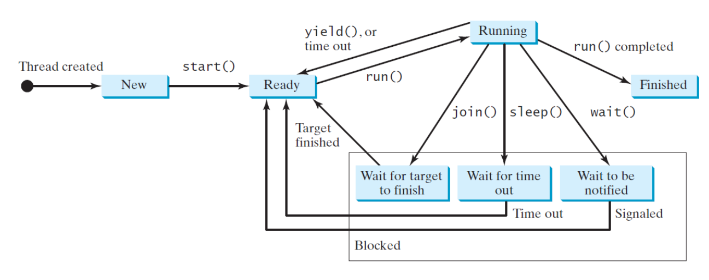
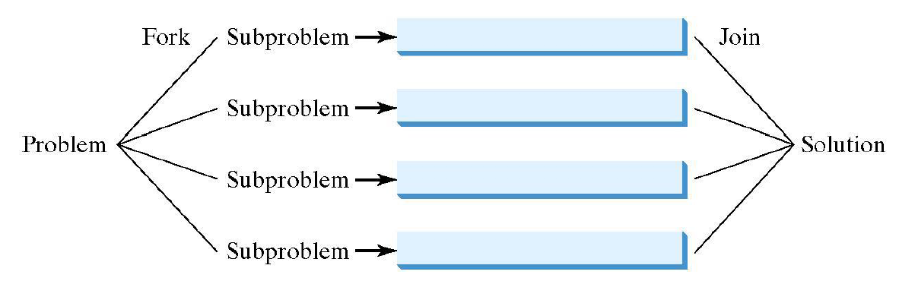

# ECSE420

## Overview of Multithreaded & Parallel Programming in Java

### Avoiding Deadlocks

Avoid using resource ordering:
- assign an order on all objects whose locks must be aquired
- ensure that each thread acquires the locks in that order

### Thread States

- States: New, Ready, Running, blocked, finished
- IsAlive(): true on ready, blocked or running
- interrupt(): interrupts a thread
  - if a thread is currently in the ready or running its interrupt flag is set
  - if the thread is blocked, it is awakened and enters the ready state and an interrupt exception is thrown
- isInterrupt()

### Fork/Join Framework

Split the problem into subproblems (Fork), solve the subproblems and join them
- A fork can be viewed as an independent task that runs on a thread
- defines a task using ForkJoinTask class
- executes task as instance of ForkJoinPool

A ForkJoinTask is thread-like but is much lighter than a normal threads
