= ECSE 429

== 01. Intro to Software Quality Assurance

=== Basic Terminology

==== Error, Fault, and Failure

image::images/ECSE429LectureNotes-e11a2.png[align=center]

image::images/ECSE429LectureNotes-d1749.png[align=center]

* mistake: people commit errors
* defect: a mistake in software can lead to defect
* failure: occurs when defect executes
* incident: consequence of failures-failure occurrence may or may not be apparent
to user

==== Defects Root Cause and Effect

* Root cause of defect: earliest action/condition that contributed to creating
defect
* Root Cause Analysis: Identify root cause to reduce occurrence of similar
defects in the future
* Effects of a defect: observed by user/customer, product owner

==== Nine Causes of Software Defects

1. Faulty requirements definitions
2. Client-developer communication
3. Deliberate deviations from software requirements
4. Logical design errors
5. Coding errors
6. non-compliance with documentation and coding instructions
7. Shortcomings of the testing process
8. Procedure errors
9. Documentation errors

=== Software Quality

==== Conformance to Requirements

* Lack of bugs:
** Low defect rate
** well documented defects

* High reliability/Availability
** *Mean time to failure* the probability of failure free operation until a
specified time
** *Mean time between failures* the probability that the system is up and
running at any given point in time

==== Software Quality Challenge

* The uniqueness of the software product
** High complexity: pervasive in an increasing number of industries
** Invisibility of the product
** Limited opportunities to detect defect compared to other industries
*** Development, not production

* The environments in which software is developed
** Contracted
** Subjected to customer-supplier relationship
** Requirements for teamwork
** etc.

=== Software Quality Factors

==== McCaul Method

image::images/ECSE429LectureNotes-83059.png[align=center]

* Correctness
** Accuracy and completeness of required output
** up to date

* Reliability
** First failure
** Max failure rate

* Efficiency
** hardware resources needed to perform function

* Integrity
** System security

* UX
* Maintainability
** Effort to identify and fix errors

* Flexibility
* Testability
** Support for testing, traceability

* Portability
** Adaptation to other environments

* Reusability
** Use of software components for other projects

* Interoperability
** Ability to interface with other components/systems

=== SQA

==== Objectives

1. Acceptable confidence that software will conform to functional technical
requirements
2. Acceptable confidence that software will conform to managerial scheduling
and budgetary requirements
3. Activities for the improvement/efficiency of software software development,
software maintenance, and software quality assurance activities

==== Three key principles

1. know what you are doing
* what is being built, how its being built, what it does
* Management structure
* Reporting Policies
* Tracking

2. know what you should be doing
* Having explicit requirements and specifications
* Requirements analysis
* Acceptance tests
* User feedback

3. know how to measure the difference
* Measure comparing what is being done with what should be done
* Includes:
** Formal methods: prove mathematically
** Testing: explicit input to exercise software and check for expected output
** Inspections: human examination of requirements, design, code... checklists\
** Metrics: measure a known set of properties related so quality

==== Software Quality Shrine

image::images/ECSE429LectureNotes-09f32.png[align=center]

==== Verification vs Validation

* Verification: are we building the product right?
* Validation: are we building the right product?

image::images/ECSE429LectureNotes-4e094.png[align=center]

==== SQA Includes

* Defect prevention
** Prevents defects from occurring in the first place
** Activities: training, planning, simulation

* Defect detection
** finds defects in a software artifact
** Activities: inspections, testing, or measuring

* Defect removal
** Isolation, correction, verification of fixes
** Activities: fault isolation, fault analysis, regression testing

* Typical Activities of an SQA Process
** Requirements validation
** design verification
** Static code checking
** dynamic testing
** Process engineering and standards
** Metrics and continuous improvement

image::images/ECSE429LectureNotes-90e56.png[align=center]

=== Software Development Lifecycle Models

* Sequential and Iterative development processes
* Continuous Integration (CI)
** A software development process where a continuous integration server rebuilds
a branch of source code ever time code is committed to the source control
system

* Continuous Deployment
** A software production process where changes are automatically deployed to
production without any manual intervention

* Continuous Delivery
** A software production process where the software can be released to
production at any time with as much automation as possible for each step

== 02. Software Testing

=== Software Testing Definitions and Objective

==== Definitions

* Mistake: people commit errors
* Defect: a mistake can lead to a defect
* Failure: a failure occurs when a defect executes
* Incident: a consequence of failures
* Software testing: exercise the software with test cases to gain confidence in
the system

==== Testing vs. Debugging

* Debugging
** Find the cause of the bug
** Find, analyzes and fixes such defect
** Carried out mostly by the development team

* Testing
** Find the bug
** Shows failures caused by defects
** Carried out mostly by the QA team

=== Why is Testing Difficult

* Exhaustive testing  is impractical if not impossible
* Upper limit to total number of test cases
* *continuity property* small differences in operating conditions will not result
in dramatically different behavior -> *not true in software!*

=== Seven Testing Principles

1. Program testing can be used to show the presence of bugs, but never
their absence
2. Exhaustive testing is impossible
3. Early testing saves time and money
4. Defects cluster together
5. Pesticide Paradox: a system tends to build a resistance to a particular
technique
6. Testing is context dependent
7. Absence of errors is a fallacy

=== Test Levels

image::images/ECSE429LectureNotes-b7b3f.png[align=center]

==== Component/Unit Testing

* Done in isolation from the rest of the system
* May cover functional and non-functional aspects
* Defects are fixed as soon as found
* No formal defect management

==== Integration Testing

* Component integration testing
** Interactions and interfaces between integrated components
** Right after component testing
** Typically automated

* System integration testing
** Interactions and interfaces between packages, subsystems, microservices,
external services
** After/in parallel with system testing

==== System Testing

* Typically carried out by independent testers
* Best practice: involve testers early in defining user stories

==== Acceptance Testing

* User level: fitness for use by intended users
* Operational: sysadmins perform in a simulated production environment
* Contractual: check with respect to contract's acceptance criteria
* Alpha and Beta: build confidence among potential or existing customers and
operators that they can use the system under regular conditions

=== Test Types

==== Functional

* evaluate that the system performs with respects to requirements and
specifications (ie. user stories, use cases)
* Completeness, and correctness
* *functional coverage* to what extent a functional element has been exercised
by tests

==== Non-Functional

* evaluate characteristics system as a whole
* Reliability, performance, security, usability
* Sample technique: boundary value analysis

==== Black-box

* Same as Functional

==== White Box

* Derive tests on the system's internal structure e.g control or data flow

==== Oracles and Test Coverage

* Associated criteria
** Test cases must cover ... in the model

==== Regression Testing

* Different *scopes*
** Local: direct testing of the code changed or added
** Surrounding: testing of function supported or directly impacted by the change
** Confidence: predefined suite of tests routinely run after any change is
made to product/system

==== Maintenance Testing

* Goal:
** Carried after system is in production
** Evaluate success + ensure lack of side effects

* Triggers for Maintenance
** Modification
** Migration
** Retirement

* Impact analysis for maintenance
** Evaluate the planned/execute changes

=== Test Activities and Processes

==== Test Planning

* Define objectives
* Define approach on how to meet test objectives within constraints

==== Test Monitoring and Control

* Compare actual progress against the test plan using monitoring metrics
* Evaluate exit criteria (check test results against coverage criterial)

==== Test Analysis

* BDD
* Determines what to test in terms of measurable coverage criteria
** Identify testable features
** Define and prioritize associated test conditions
** Capture traceability

* Analyze test basis to identify testable features

==== Test Design

* Elaborate test condition s into high-level test cases
* Design and prioritize test cases
* Identify necessary data to support test conditions and cases
* Design test environment and identify required infrastructure and tools
* Capture traceability between test basis, test conditions, test cases, and
test procedures

==== Test Implementation

* Do we now have everything in place to run the tests?
* Create test software for test execution
* Preparing test data and load into test environment
* Verify and update traceability between the test basis, test conditions,
test cases, test procedures, and test suites

==== Test Execution

* Run test suites in accordance with test execution schedule
** Execute
** Compare results
** Analyze anomalies
** Report defects based on the observed failures
** Log
** Verify and update traceability

==== Test Completion

* Collect data from completed test activities to consolidate experience
* Occurs at project milestones
** Check if all defect reports are closed
** Create a test summary report
** Analyze lessons learned

==== Importance of Traceability

* Bidirectional traceability between test basis and test work product
** Analyze the impact of changes
** Auditing and certification
** Improve understandabilty of various test reports

==== Test Driven Development

* Listen->Test->Code->Design
* Listen to customers while gathering requirements, develop test cases, code
the program, (re-)design / refactor / clean up as more code is added to the
system

=== Test Automation

=== In Class Quiz

1. Valid objective for testing? find as many failures as possible so that defects
can be identified and corrected
2. Difference between testing and debugging? testing shows failures caused by
defects; debugging finds, analyzes, and removes the cause of failures in the
software
3. Failure in testing or production? product crashed when the user selected
and option in a dialog box
4. Which is a key principle of software testing? it is impossible to test
all input and precondition combinations of a system
5. In what way can testing be a part of Quality Assurance? It reduces the level
of risk to the quality of the system
6. Which of the following is performed during the test analysis activity?
evaluating test basis for testability
7. How can white-box testing be applied during acceptance testing? To check if
all work process flows have been covered

== 03. Static Validation and Verification Techniques

=== Static V&V Techniques

* No execution of work product
* Enables early detection of defects
* Cheaper to remove defects when found early

* Typical defects found  by static V&V
** Requirement defects
** Design defects
** Coding defects
** Incorrect interface specifications
** Security vulnerabilities
** Maintainability defects

=== Review Process

* *review process* a process or meeting during which a work product, or set of
work products, is presented to project personnel, managers, users, customers,
or other interested parties for comment or approval
* Purpose:
** Identify defects and new risks
** Informally exchange knowledge
** Collect data to learn from mistakes

* Human examination of any work products
** Requirements, design, source code, test cases...

==== Types of Reviews

* Informal Review:
** Performed by development team
** Main purpose: detect potential defects

* Walkthrough
** Mostly informal, driven by author of work product
** Man purpose: find defects, improve software product, consider alternative
implementations, evaluate conformance to standards and specifications

* Technical Review
** Document process, experts are involved
** Main purpose: gain consensus, detect potential defects

* Inspection
** Formally document process, external experts, moderators involved
** Main purpose: detect potential defects, evaluate quality and build conformence
in the work product, prevent future similar defects through author learning and
root cause analysis

=== Inspections

* Strict, formal review
* Obtain defects, collect data, communicate development documents
* Roles:
** Moderator
** Scribe
** Reviewer
** Reader
** Producer

==== Checklists

* Most important tool for formal reviews
* Generate checklists for various types of reviews
** Requirements
** Design
** Generic code
** Specific language code
** Generic Document

* Organizations develop specific checklists
* Should be maintained, improved, developed updated

==== Inspections: Roles

* Moderator
** Ensures that inspection procedures are followed
** Verifies that the work products readiness for inspection
** Assembles inspection team
** Comes from outside the project team

* Recorder
** Documents all defects that arise from the inspection meeting in an inspection
defect list
** Not just a procedural task, requires technical knowledge

* Reviewer
** Analyzes and detects defects in the work product
** All participants play this role

* Producer:
** Work product author
** Responsible for correcting any found defects

==== Inspection Process

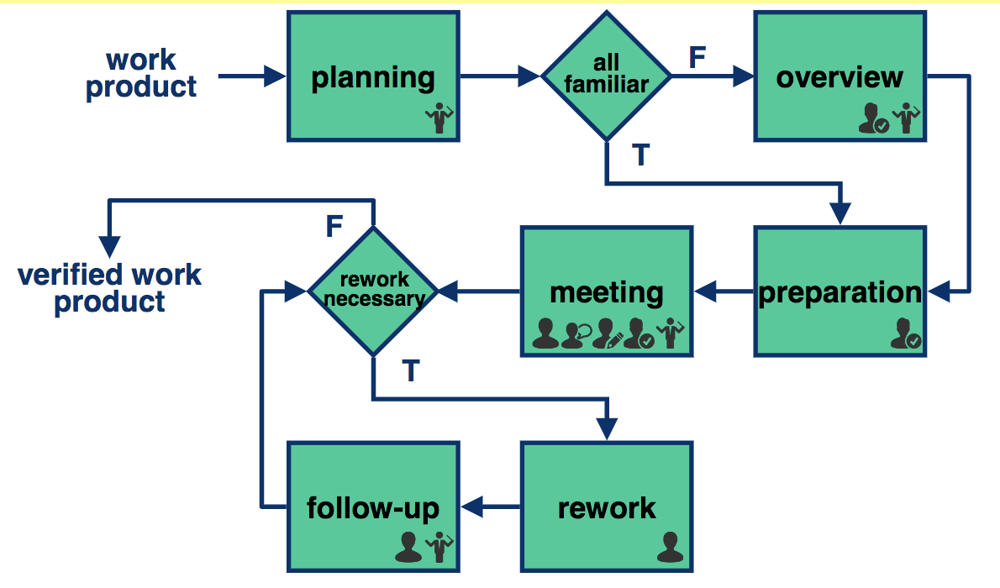

* Planning
** identify work product, determine, whether the product meets entry criteria,
select the team, assign roles, prepare and distribute the inspection forms and
materials, set the inspection schedule, and determine whether to hold an overview

* Overview
** Optional phase where team members who are unfamiliar receive orientation

* Preparation
** Key stage in which members of the inspection team inspect the work individually
looking for defects in work product
** Most of the defects are found during this step, not during inspection meeting

* Inspection Meeting
** Inspection team members meet to find, categorize, and record possible defects
in the work product
** No resolution of defects is attempted but action items are assigned

* Third Hour
** Optional additional time, apart from the inspection meeting, that can be used
for discussion, possible solutions, of closure of open issues raised during the
inspection meeting

* Rework
** The work product is revised by the author to correct defects found during the
inspection

* Follow up
** Meeting between the moderator and author to determine if defects found during
the inspection meeting have been corrected and to ensure that no additional
defects have been introduced

==== Review Reports

* Rate the severity of a defect
* Possibly determine statics about findings and invested resources, quality
metrics

=== Modern Code Reviews

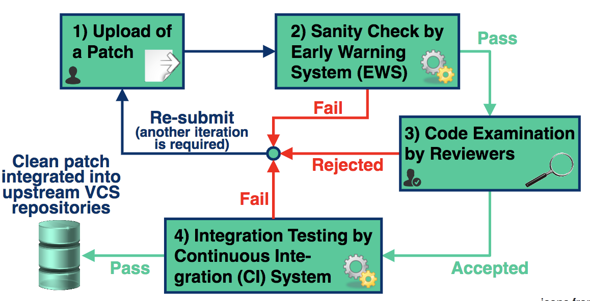

==== Roles

* Author:
** Responsible for correcting problems that are identified

* Reviewer
** Analyzes and detects problems in the artifacts

==== Preparing for a Review

* Prefer small changes
* Only submit complete, self-reviewed, self-tested code
* Commit messages guidlines

==== Performing Code Reviews

* Purpose: does it fulfill its purpose
* Implementation: how did you solve the problem?
* Legibility and Style
* Maintainability
* Security

==== How to Comment

* General guidelines: concise, friendly, actionable
* Critique the code not the author
* Differentiate between
** Suggestion
** Required changes
** Points that need clarification

* Once complete indicate: required response, or re-review

=== 10. Principles of Good Code Review

. If you commit to code review, review thoroughly
. Aim to understand every changed line
. Dont assume the code works - build and test yourself
. Commenting matters
. Review temporary code as strictly as production code
. Consider how the code will work in production
. Check documentation, tests and build files
. keep priorities straight when making suggestions
. Follow-up on reviews
. Reviewers are not perfect

==== Pressman's Inspection Guidelines

. Review the product not the producer
. Set and agenda and maintain it
. Limit debate and rebuttal
. Identify problem areas, but problem solving should be postponed until after
the review meeting
. Take written notes
. Limit the number of participants and insist on advanced preparation
. Develop a checklist for each product that is likely to be reviewed
. Allocate resources and schedule time for review
. Conduct meaningful training for all reviewers
. Prepare report and establish follow-up procedure
. Review the review process

=== Appendix A

TODO::

=== Appendix B

TODO::

=== Coding Guidelines

* Set of rules giving recommendations on style and best programming practices

=== Pattern-Based Static Analysis Tools

* Automated analysis of software without code execution
* Scope
** Basic static properties with error patterns

==== Visitor Pattern in Static Analysis

* Visitor pattern: separate an algorithm from an object structure
** Each class has an "accept" method that takes a visitor object as an argument
** The visitor is an interface that has a different "visit" method for each
element
** The "accept" method of an element class calls back the "visit" method for
its class
** Separate concrete visitor classes can perform some particular operations

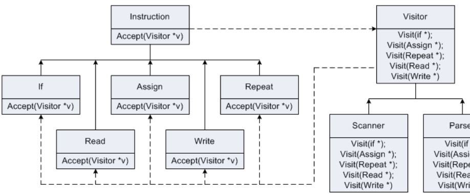

==== ASG/DOM

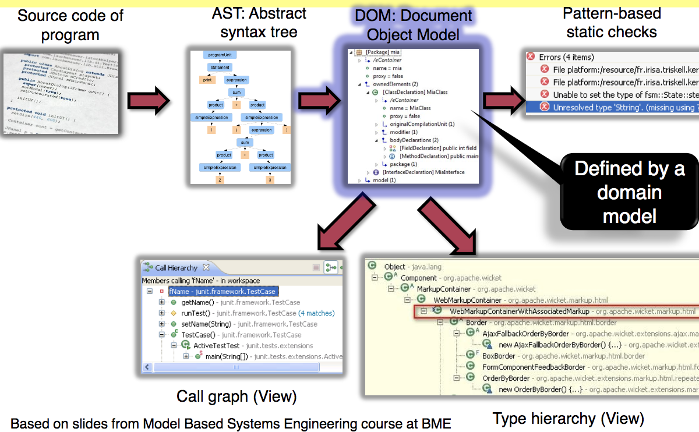

==== Pattern-based Static Analysis

* Abstract Syntax Graph: knowledge representation of program as typed and
attributed graphs
* Find erroneous cases by graph pattern matching
** Find a small graph pattern in a large graph model
** Match: complete mapping
*** Graph pattern nodes -> graph model nodes
*** Graph pattern edges -> graph model edges
*** No match -> no violations

==== Example: Graph Patterns

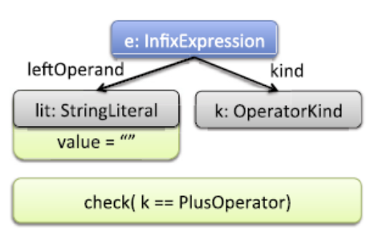

* Concatenation to Empty String
** Nodes: NodeType(var)
*** e: InfixExpression
*** lit: StringLiteral
*** k: OperatorKind

** Edges: edgeType(from, to)
*** leftOperand(e, lit)
*** kind(e,k)

** Attribute Checks:
*** lit.value == ""
*** k == PlusOperator

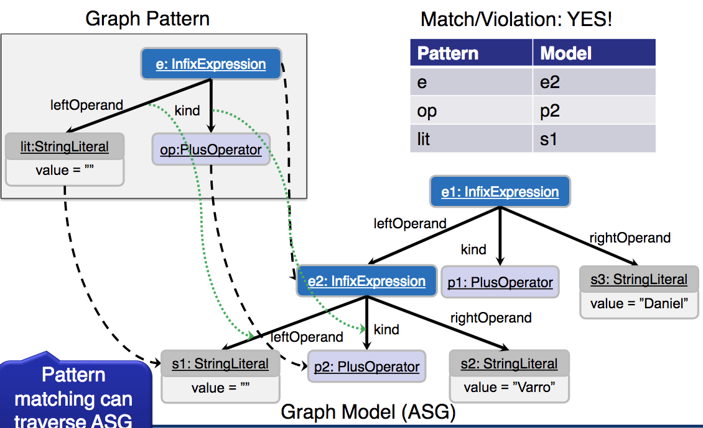

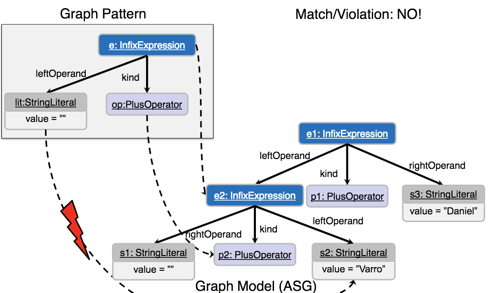

==== Use of Lightweight Analyzers

* Typically part of the CI chain
* Customize the tools
* Review results carefully
** False Positives (false alarm)
*** Reported issue/defect would not cause a failure

** False negatives
*** Lack of errors does not mean correct software

=== Abstract Interpretation for Static Analysis

* Goal:
** Testing: investigates one run of the program
** Static analysis: Reason about all runs of the program

* Outcome:
** Testing: Pass/Fail

* Static Analysis
** Safe/Error/Incomplete

==== Complexity Issues

* Can the analyzer prove that for any program P and Input I, P will terminate
or not?
** The Halting Problem (HP) -> Undecidable

==== Soundness vs Completeness

* Soundness
** If prover says that P is true -> P is true
** Trivially sound: SA says nothing
* If SA says program is error free it is really error free

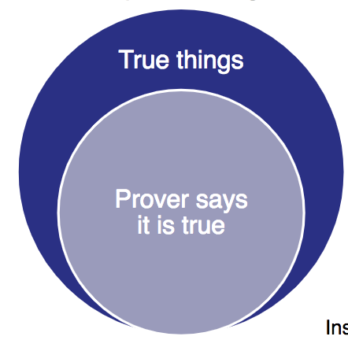

* Completeness
** If P is true -> SA says that P is true
** Trivially complete: say everything
** If program is claimed to be erroneous it is erroneous

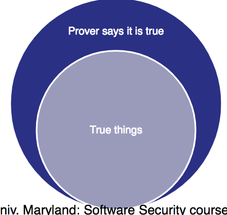

* IF SA says P is true <-> P is true
** Things I say are all the true things

== 04. White Box Testing

=== What is White Box Testing

* Focus on system's internal logic
* Based on a system's *source code* as opposed to its specific implementation
* The notion of coverage can also be applied to structural (white-box) testing
* Advantages: Test what is actually there (source code)
* Disadvantages:
** May miss functionality in specification that was not implemented
** Can be cumbersome

* *Control Flow*-oriented approaches: based on the analysis of how control flows
through a program
* *Data flow*-oriented approaches: based on the analysis of how data through the
program
* *Mutation* testing: helps develop effective tests

=== Control Flow Analysis

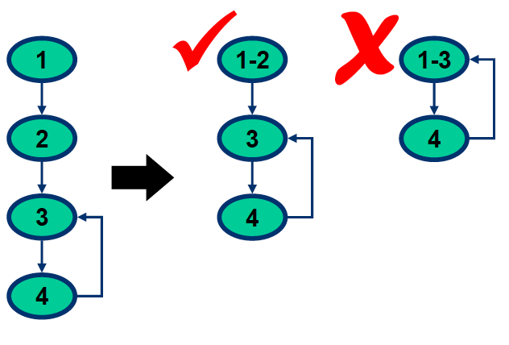

* Directed graph
** Nodes are blocks of sequential statements
** Edges are transfers of control

* Edges may be labeled with predicate representing the condition of control
transfer
* Intermediate statements in a sequence of statements are not shown
** As long as there is not more thank one exiting edge and one entering edge

==== Example Control Flow

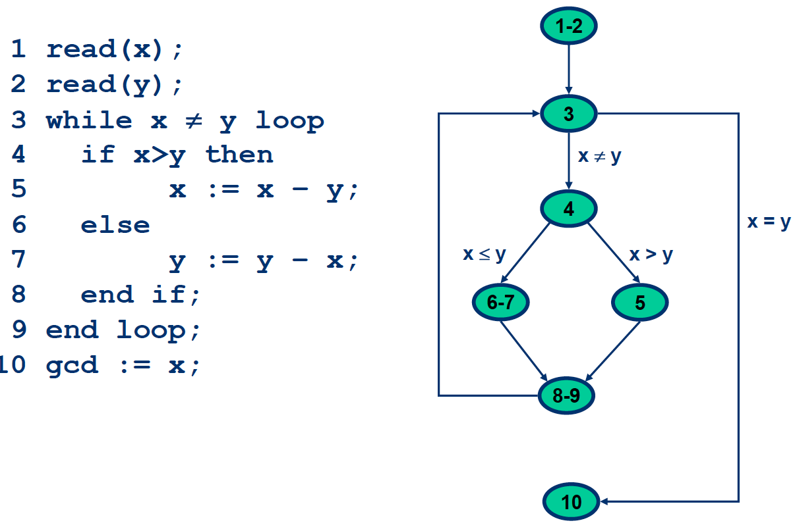

==== Control Flow Basics

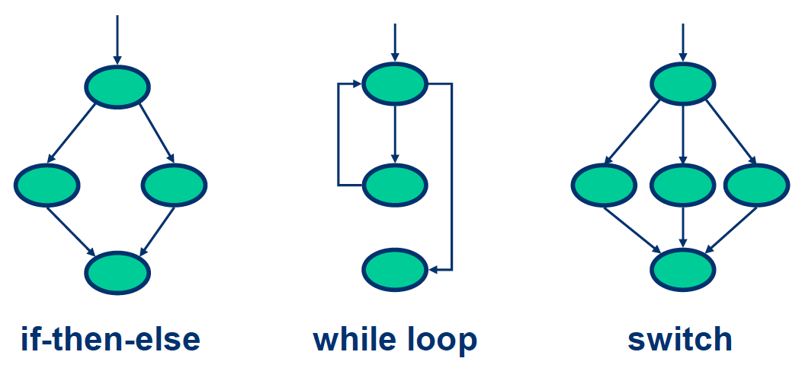

* From source code to control flow graph--issue about branching
* In a control flow graph, nodes correspond to branching (if, while, ...) should
not contain any assignment

===== Example

....
if (i++==1) {
  j := ...
}
....

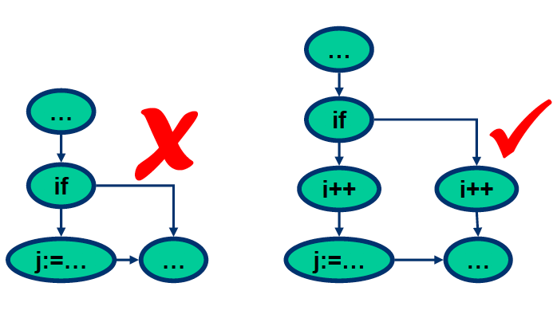

==== Statement/Node Coverage

* All instructions Executed
* Faults cannot be discovered if the parts containing them are not executed
* Equivalent to covering all nodes in control flow graph
* Executing a statement is a weak guarantee of correctness, but easy to achieve
* In general, several inputs execute the same statements

===== Example

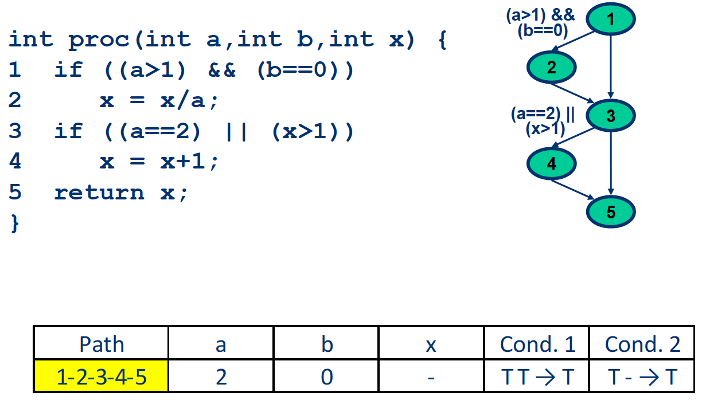

==== Branch/Edge Coverage

* Use the program structure i.e. control flow graph
* Every decision branch is executed (sometimes called *decision coverage*)
* *Each edge* of control flow graph is traversed at least once
* Exercise all conditions that govern control flow programs at least once with
true and once with false
* Minimum coverage - IEEE unit test standard

===== Example

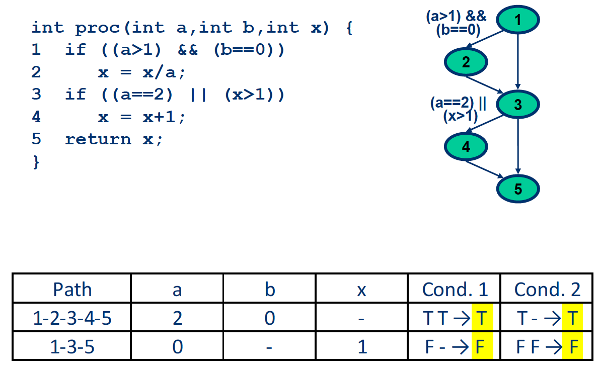

==== Condition/Decision Coverage

* Each condition constituent evaluated true at least once and to false at least
once
* *Combines* criteria for condition and branch coverage

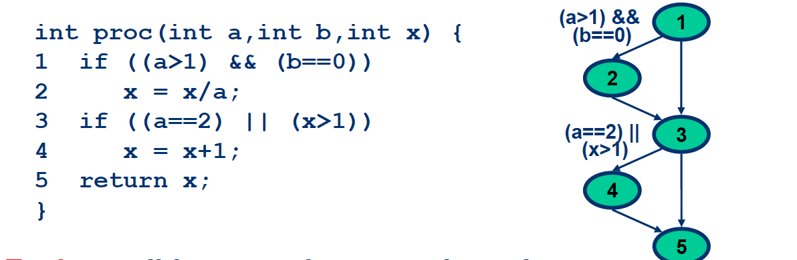

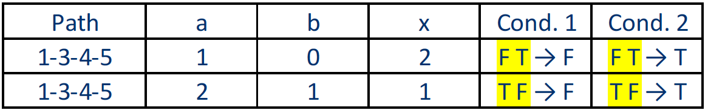

==== Multiple Condition Coverage

* All Combinations of condition constituents in decisions

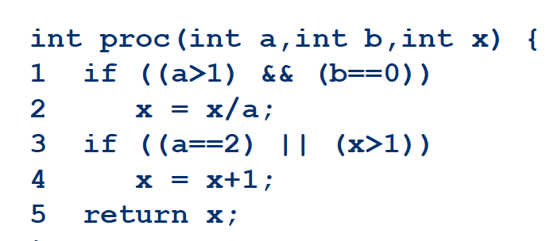

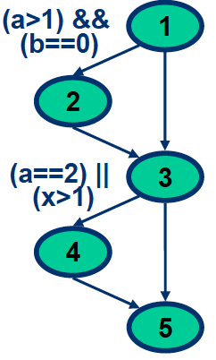

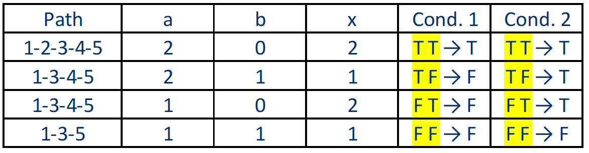

==== Modified Condition/Decision Coverage

* Full MC/DC coverage achieved if:
** Each entry and exit point invoked
** Each decision takes every possible outcome
** Each condition in a decision takes every possible outcome (true/false)

* Consequences:
** There exists a pair of test cases where only the one condition changes and
the outcome changes too
** Requires n+1 test cases for one decision with n conditions

===== Example

* Assume four test cases with values for conditions A, B, and C as well as the
corresponding result
* Pair 1+3: only A changes its value and result changes too
* Pair 1+2 shows independence of B
* Pair 1+4 shows independence of C
* 4 test cases needed for modified condition/decision coverage for three
conditions

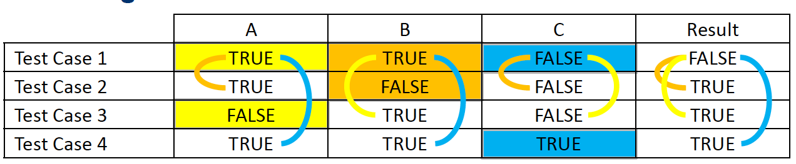

==== Path Coverage

* Test case for each possible path
* In practice, however, the number of paths is too large if not infinite
* Some paths are infeasible
* It is key to determine "critical paths"

===== Example

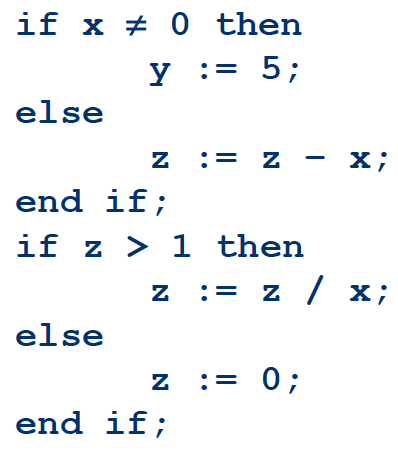

* T1 = {<x=0, z=1>, <x=1, z=3} (executes all edges but does not show risk of
division by zero)
* T2 = {<x=0, z=3>, <x=1, z=1>} (would find the problem by exercising the
remaining possible flows of control through the program)
* T1UT2 -> all paths covered

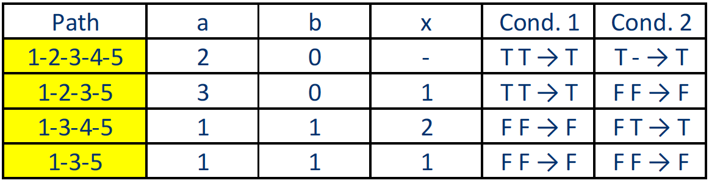

==== Loop Coverage

* Minimal Coverage should when possible, execute the loop body:
** Zero times
** once
** Twice or more

* Single loop -> more extensive coverage, set loop control variable:
** Minimum -1, minimum, minmum +1
** Typical
** Maximum -1, maximum, maximum + 1

* Nested Loop:
** Start at innermost loop -> proceed to outermost
** For the current focus loop -> Proceed by moving outwards
*** Set the outer loops to their minimum values
*** Set all inner loops to their typical values
*** Test cases for a single focus loop
*** Move up one level in nested loop

==== White-Box Testing Process

. Set Coverage goal
. Derive control flow graph (CFG) from source code
. Determine paths to obtain coverage goal
. For each path
.. Sensitize path for input values
.. Use specification (or oracle) for expected output
.. Watch for infeasible paths
. Run test cases
. Check Coverage

==== Path Instrumentation

* To measure code coverage:

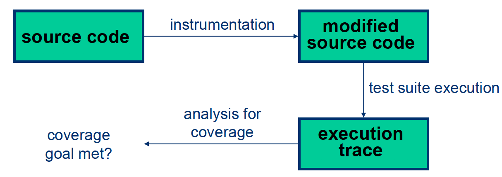

* Approaches:
** Link markers, link counters, symbolic debugger, code coverage tool

==== Path Sensitization

* To find a set of inputs to force a selected path:
** Backward strategy (from exit to entry)
** Forward strategy (from entry to exit)

* Problem with infeasible paths (may call for rewriting of program)
** Not all statements are usually reachable in real world programs
** It is not always possible to decide automatically if a statement is reachable
and the percentage of reachable statements
* When one does not reach 100% coverage it is difficult to determine the reason

==== Path Condition

* Conjunction of branch predicates required to hold for all the branches along
a path
* Used to find:
** Values for a path (sensitizing)
** Infeasible paths

* Determined using symbolic evaluation
** Variables take symbolic values (e.g. x~0~, x~1~, ... , )

===== Symbolic Values

WARNING: Do lecture exercises

=== Data Flow Analysis

* CFG paths that are significant for the data flow in the program
* Focusses on the assignment of values to variables and their uses i.e. where
data is defined and used
* Analyze occurrences of variable
* *Definition of Occurrence* value is bound to variable
* *Use Occurrence* value of variable is referred
** Predicate use: variable used to decide whether predicate is true
** Computational: use compute a value for defining other variable or output value

==== Definitions and Uses

* A program written in a programming language such as C and Java contains variables
* Variables are defined by assigning values to them and are used in expressions

===== Pointers

* Consider the following sequence of statements that use pointers: +
----
z = &x; //defines a pointer variable z but does not use x
y = z+1; //defines y and uses z
*z = 25; //defines x accessed through the pointer variable z
y = *z + 1; //defines y and uses x accessed through pointer variable z
----

===== Arrays

* Arrays are also tricky - consider the following declaration and two statements
in C: +
----
int A[0];
A[i] = x + y
----

* First statement defines variable A
* Second statement defines A and uses i, x and y
* Alternate view for second statement: defines A[i] not the entire array

==== c-use

* Uses of a variable that occur within an expression as a part of an assignment
statement, in an output statement, as a parameter within a function call, and in
subscript expressions, are classified as c-use, where the "c" in c-use stands
for computational
* In general, a definition of A[E] is interpreted as a c-use of variables in E
followed by a def of A
* In general, a reference to A[E] is interpreted as a use of variables in E
followed by a use of A

NOTE: c-use example question on slide 44

==== p-use

* The occurrence of a variable in an expression used as a condition in a branch
statement such as an if and while, is considered as a p-use, where the "p" in
p-use stands for a predicate

NOTE: p-use example question on slide 45

==== Basics of Data Flow Analysis

* Variable definition
** d(v,n): value is assigned to v at node n (e.g. LHS of assignment, input statement)

* Variable use
** c-use(v,n): variable v used in a computation at node (e.g. RHS of assignment,
argument of procedure call, output statement)
** p-use(v,m,n): variable v used in predicate from node M to n (e.g as part of
and expression used for a decision)

* Variable kill:
** k(v,n): variable v deallocated at node n

===== Example

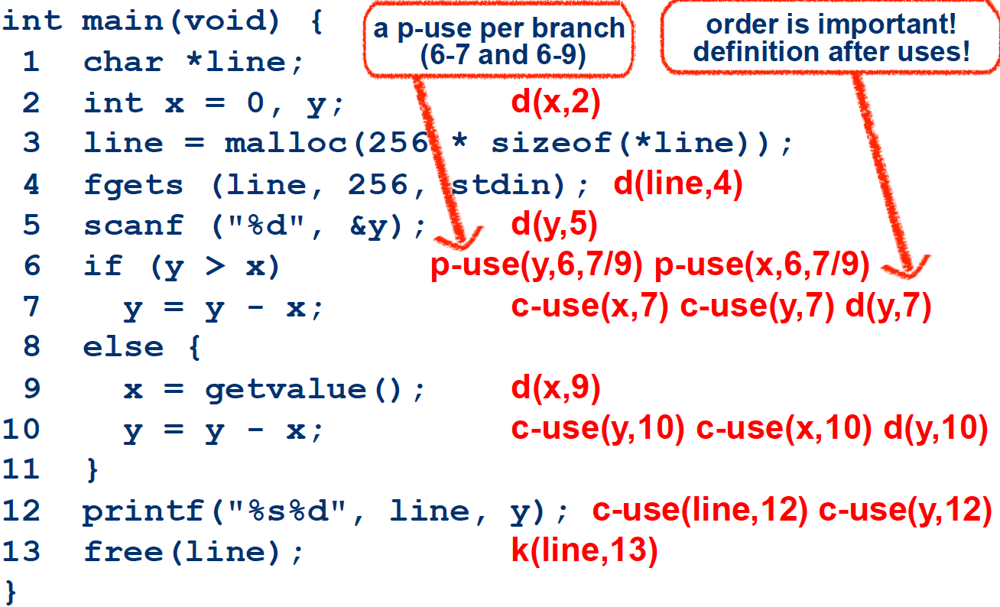

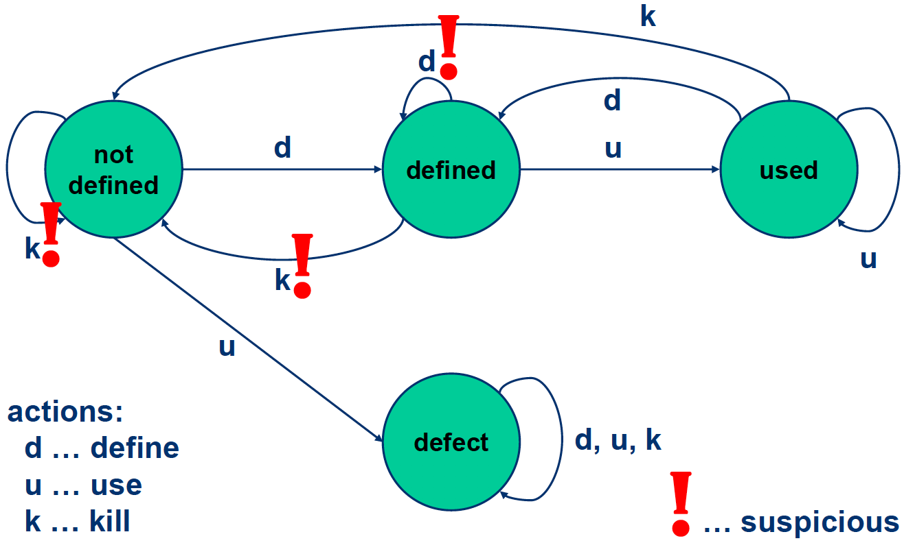

.Data Flow Actions Checklist: Pairs of Actions
[%header]
|================
| Successive Actions | Result
| dd | suspicious
| dk | probably defect
| du | normal case
| kd | okay
| kk | probably defect
| ku | a defect
| ud | okay
| uk | okay
| uu | okay
|================

.Data Flow Actions Checklist: First Occurrence
[%header]
|=========
| First Action | Result
| k | suspicious
| d | okay
| u | suspicious
|=========

.Data Flow Actions Checklist: First Occurrence
[%header]
|========
| Last Action | Result
| k | okay
| d | suspicious
| u | okay
|========

==== Data Flow Graph

*  A data flow graph of a program captures the flow of definitions and uses
across basic blocks in a program
* It is similar to a control flow graph of a program in that the nodes, edges,
and all paths in control flow graph are preserved in the data flow graph
* Annotate each node with def and c-use as needed and each edge with p-use as
needed
* Label each edge with the condition which when true causes the edge to be taken

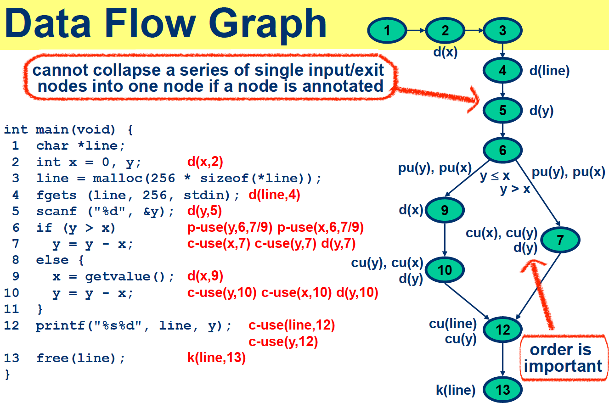

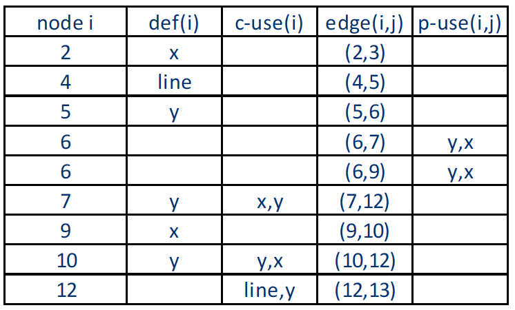

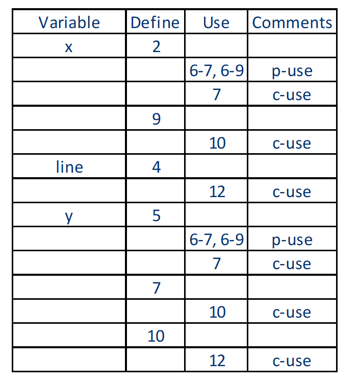

===== Data Flow Graph: Paths and Pairs

* Complete path: initial node is start node, final node is exit node
* Simple path: all nodes except possibly first and last node are distinct
* Loop free path: all nodes are distinct
* def-clear path with respect to v: any path
** starting from a node at which variable v is defined and
** ending at a node at which v is used
** without redefining v anywhere else along the path

* du-pair with respect to v: (d, u)
** d ... node where v is defined
** u ... node where v is used
** def-clear path with respect to v from d to u

* Definition-use path (du-path) with respect to v: a path P=<n~1~, n~2~, ..., n~j~,
n~k~> such that d(v, n~1~) and  either one of the following two cases:
** c-use of v at node n~k~, and P is a def-clear simple path with respect to v
(i.w. at most a single loop traversal)
** p-use of v on edge n~j~ to n~k~, and <n~1~,n~2~, ...,n~j~> is def-clear loop-free
path (i.e. cycle free)

===== All-Definitions

* At least one def-clear path from every defining node of v, to at least one
use of v, regardless if it is a c-use or a p-use

===== All-Uses

* For all variables v: At least one def-clear path from every defining node of
v ti every reachable use of v

===== All-P-Uses/Some-C-Uses

* For all variables v: At least one def-clear path from every defining node of
v to every reachable p-use of v, if def of v has none, then use c-use

===== All-C-Uses/Some-P-Uses

* For all variables v: at least one def-clear path from every defining node of
v to every reachable c-use of v, if def of v has none, then to a p-use

===== All-DU-Paths

* All du-paths covered: for all variables v from every defining node of v to
every use of v

===== Hierarchy of Data Flow Coverage Criteria

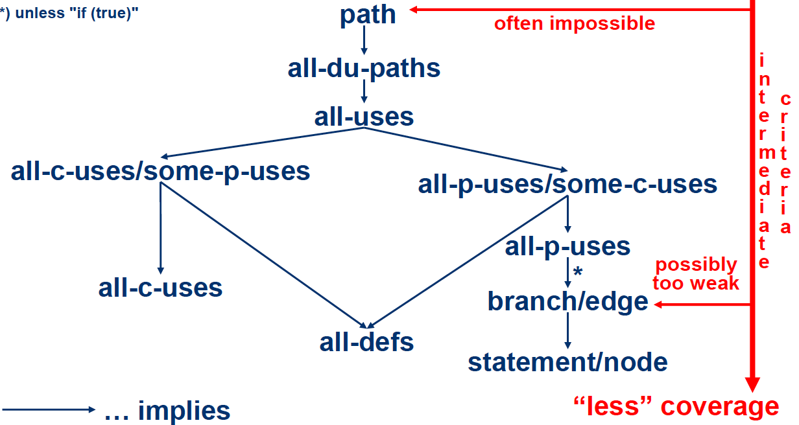

=== Mutation Testing

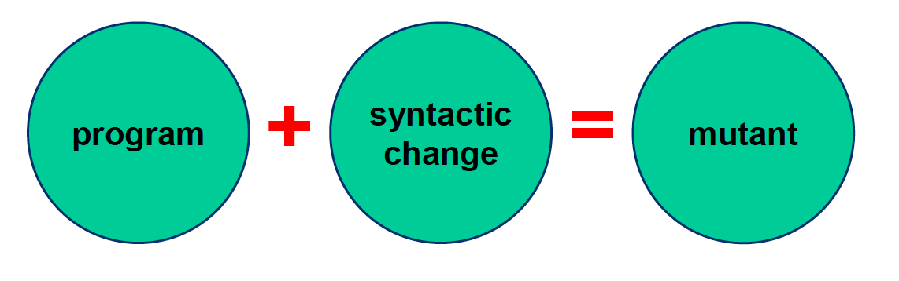

* *Fault-based Testing* directed towards "typical" faults that could occur in a
program
* Basic idea:
** Take a program and test data generated for that program
** Create a number of similar programs (mutants), each differing from the original in one
small way
** The original test data then run through the mutants
** IF the test data detects all difference in mutants, then the mutants are said
to be dead and the test set is adequate

* A Mutant remains *live* either because it is equivalent to the original program
(functionally identical but syntactically different - *equivalent mutant*) or
the test set is inadequate to *kill* the mutant
* For the automated generation of mutants we use mutation operators

==== Different Mutants

* *Stillborn Mutant* syntactically incorrect, killed by compiler
* *Trivial mutant* killed by almost any test case
* *Equivalent mutant* always produces the same output as the original program

==== Specifying Mutation Operators

* Ideally, we would like the mutation operators to be representative of *all*
realistic types of faults that could occur in practice
* Mutation operators change with programming languages, design and specification
paradigms
* In general, the number of mutation operators is *large* as they are supposed
to capture all possible syntactic variations in a program
* Mutants are considered to be good indicators of test effectiveness

==== Mutation Coverage

* Complete coverage equates to killing all non-equivalent mutants
* The amount of coverage is called *mutation score*
* We can see each mutant as a test requirement

==== Assumptions

* *Competent Programmer Assumptions*: Given a specification a programmer develops
a program that is either correct or differs from the correct program by a combination
of simple errors
* *Coupling Effect Assumption*: test data that distinguishes all programs differing
from a correct one by only simple errors is so sensitive that it also implicitly
distinguishes more complex errors

==== Mutation Testing Process

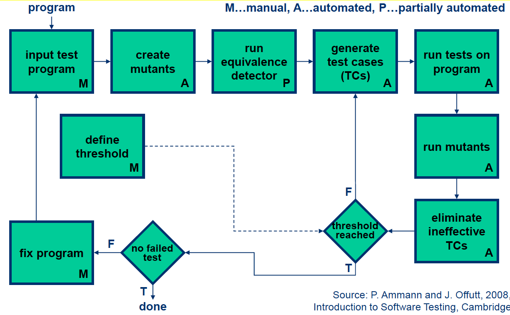

==== Mutation Testing Discussion

* Measures the quality of test cases
* Assumptions: in practice, if the software contains a fault, there will usually
be a set of mutants that can only be killed by a test case that also detects that
fault
* Provides the tester with a clear target
* Computationally intensive, a possibly very large number of mutants is generated
* Equivalent mutants are a practical problem: it is in general an undecidable
problem

=== Summary: White-Box Testing

* One advantage of structural criteria is that their coverage can be measure
automatically
* High coverage is not a guarantee of fault-free software, just an element of
information to increase our confidence
* Control/data flow-oriented approaches
* Mutation testing
* Hierarchies of coverage criteria

== 05. Unit Testing Smells and Best Practices

=== Test Smells

* Anti-patterns/"code smells"
** Opposite of a design pattern
** Identify poor solutions to recurring design problems
** Symptoms of poor design choices

==== Categorization of Test Smells

==== Code Smells

* Classic bad smells
* Examples
** Obscure test
** Conditional test logic
** Hard-to-test code

==== Behavior Smells

* Encountered when we compile or run tests
* Examples
** Assertion roulette
** Erratic Test
** Fragile Test

==== Project Smells

* Something has gone wrong with the project
* Examples
** Buggy tests
** Developers not writing tests
** High test maintenance costs

* A project manager can watch out for
** Buggy tests: Bugs are regularly found in the automated tests
** Developers arent writing automated tests
*** Not enough time
*** Wrong test automation strategy

** High test maintenance costs
*** Too much effort spent on maintaining existing tests

** Production bugs
*** Too many bugs found during formal test or production

=== (Test) Code Smells

==== Obscure Test

* It is difficult to understand the test at a glance
* Impact
** Makes test harder to understand and maintain
** Can lead to High Test Maintenance Cost

* Causes
** Having wrong information in the test
** Too Much information

==== Eager Test

* The test is verifying too much functionality in a single Test Method
* Fix:
** It is better to have a suite of independent single condition tests

==== Mystery Guest

* The test reader is not able to see the cause and effect between fixture and
verification logic because part of it is done outside the Test Method
* Examples
** A filename of an existing external file
** The contents of a database record identifies by a literal key
** The contents of a file is read and used in calls to Assertion Methods to
verify the expected outcome

==== General Fixture

* The test is building or referencing a larger fixture than is needed to verify
the functionality in question

==== Hard-coded Test Data

* Data values in the fixture, assertions or arguments of the SUT are hard-coded
in the test method obscuring cause-effect relationships between inputs and
expected outputs

==== Conditional Test Logic

* A test contains code that may or may not be executed
* Impact
** it makes it hard to know exactly what a test is going to do

===== Causes of Conditional Test Logic

* Flexible Test
** test code verifies different functionality on when or where it is run

* Conditional Verification Logic, Production Logic
** CTL to verify expected outcome
** CTL in the results verification section

* Complex Teardown
** More likely to leave test environment corrupted by not cleaning up correctly

* Multiple Test Conditions
** A test is trying to apply the same test logic to many sets of input values
each with their own corresponding expected result

==== Hard to Test Code

* Code is difficult to test
* Impact: hard to verify quality
* Causes
** Highly coupled code: code cannot be tested without testing several other classes
** Asynchronous code: a class cannot be tested via direct method calls

==== Test Code Duplication

* The same test code is repeated many times
* Impact
** Increase code maintenance due to copy paste

==== Test Logic Production

* The code that is put into production contains logic that should be exercised
only during tests
* Impact
** Makes the SUT more complex
** Opens the door to additional kinds of bugs

* Causes
** test hooks: conditional logic within the SUT determines whether the real code
or test-specific logic is run
** For tests only: code in the SUT strictly for use by tests
** Test dependency in production

=== Behavior Smells

==== Assertion Roulette

* It is hard to tell which of several assertions within the same test method
caused a test failure
* Impact
** if the test only runs on a build server, it is hard to tell what is wrong

* Causes
** Eager tests: a single test verifies too much functionality
** Missing assertion massage

==== Erratic Tests

* One or more tests are behaving erratically; sometimes they pass, sometimes
they fail
* Impact
** Tempted to remove failing test from suite -> lost test

* Causes
** Interaction test/test suite: test suite depend upon each other
** Resource leakage: tests or the SUT consume finite resources
** Resource optimism: test depends on external resources -> non-deterministic
results depending on when/where it is run
** Unrepeatable Tests: a test behaves differently the first time it is run
then how it behaves in subsequent runs
** Test run war: test failures occur at random when several people are running
tests simultaneously

==== Fragile Tests

* A test fails to compile or run when the SUT is changed in ways that do no
affect the part the test is exercising
* Impact
** Increase the cost of test maintenance

* Causes:
** Interface sensitivity: test fails to compile or run because some part of the
interface of the SUT has changed
** Behavior sensitivity: changes to the SUT cause other tests to fail
** Data sensitivity: test fails because the data being used to test the SUT has
been modified
** Context sensitivity: the state behavior of the context in which the SUT
executes has changed

==== Frequent Debugging

* Manual debugging is required to required to determine the cause of most test
failures
* Symptoms
** The output of the Test Runner is insufficient to determine the problem so we
have to use an interactive debugger to determine where things went wrong

* Impact
** manual debugging is slow

* Causes
** Missing unit tests
** Missing component tests

==== Manual Intervention

* A test requires a person to perform some manual action each time it is run
* Impact:
** tests cannot be automated -> high maintenance costs

* Causes
** Fixture setup
** Result verification
** Even injection

==== Slow Tests

* The tests take too long to run
* Impact
** Reduced productivity

* Causes
** Slow component usage: A SUT component has high latency

=== Principles and Best Practices of Test Automation

==== Test Automation Manifesto

. Write the tests first (TDD)
. Design for testability
. Use the front door first (public interface)
. Communicate intent
. Do not modify the SUT
. Isolate the SUT
. Keep the tests independent
. Minimize test overlap
. Minimize untestable code
. Keep test logic out of production code
. Verify one condition per test
. Test concerns separately
. Ensure commensurate effort and responsibility

==== Verify One Condition per Test

* (Bad) Idea:
** Many tests require a specific initial state
** Many operations change this to a new state
** Reuse the new state for the second test

* Not recommended
** When one assertion fails, the rest of the test will not be executed

==== How to Structure Test Code

* Setup test fixture
** Patterns: inline setup, delegated setup, implicit setup

* Exercising the SUT
** Call its API

* Verify the expected outcome
** Call assertion methods

* Tear down test fixture

==== Naming Conventions

* Name test classes and methods systematically
* Test class test method should convey
** Name of the SUT class
** Name of method/feature being tested
** Important characteristics of any input values related to the exercising of
the SUT
** Anything relevant about the state of the SUT or its dependencies

==== Code Reuse: Parameterized Tests

* We pass information needed to do fixture setup and results verification to a
utility method that implements the entire test lifecycle

==== Code Reuse: Test Utility Method

* We encapsulate the test logic we want to reuse behind a suitably name utility
method

== 06. Black-Box Component Testing

* Based on system's specification as opposed to its structure

=== Equivalence Partitioning

* Equivalence Classes (ECs): partition of the input set according to specification
* Entire input set is covered: completeness (a)
* Disjoint Classes: avoid redundancy (b)

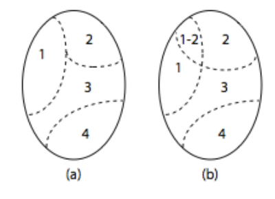

==== Weak/Strong EC Testing

* Weak equivalence class testing (WECT): choose one variable from each equivalence
class
* Strong equivalence testing (SECT): based on the Cartesian product of the partition
subsets i.e. test all class interactions

==== EC: Discussion

* If error conditions are a high priority we should extend strong equivalence
testing to include both valid and invalid inputs
* Equivalence partitioning is appropriate when input data is defined in terms
of ranges and sets of discrete values
* SECT makes the assumption that values are independent

==== Heuristic for Identifying EC

* For Each external input

. If input is a range of valid values
.. One valid EC within range
.. Two invalid EC (one outside each end of the range)
. If input is a number (N) of valid values, define:
.. One valid EC
.. Two invalid ECs
. If input is an element from a set of valid values, define:
.. One valid EC (withing set)
.. One invalid EC (outside set)
. If input is a "must be" situation, define:
.. One valid EC (satisfies)
.. One invalid EC (does not satisfy)
. If there is a reason to tbelieve that elements in an EC are not handled in
an identical manner by the program"
.. subdivide EC into smaller ECs
. Consider creating equivalence partitions that handle the default, empty,
blank, null, or none conditions

==== Myer's Test Selection Approach

. Until all valid ECs have been covered by test cases:
.. Write da new test case that covers as many of the uncovered valid ECs as
possible
. Until all invalid ECs have been covered by test cases:
.. Write a test case that covers one, and only one, of the uncovered invalid
ECs

=== Boundary Value Analysis

* Testing focussed on the edge of the planned operational limits of the software

==== BVA: Guidelines

* Use input variables within a class at: min, min+m nom, max-, max
* Hold the values of all but one variable at their nominal value, letting one
assume its extreme values
* For each boundary condition:
** Include boundary value in at least one valid test case

==== General Case and Limitations

* A function with n variables will require 4n+1 test cases
* Technique to increase Robustness Testing (6n + 1 test cases)
** For each boundary condition additionally include the value just beyond the
boundary in at least one invalid test case

==== Worst Case Testing

* Test for when more than one variable has an extreme value (5^n^ cases)

=== Decision Tables

==== Decision Table: Structure

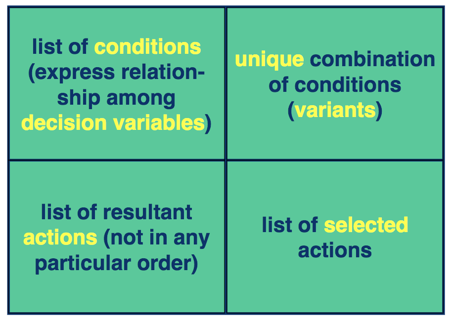

==== Decision Table: Format

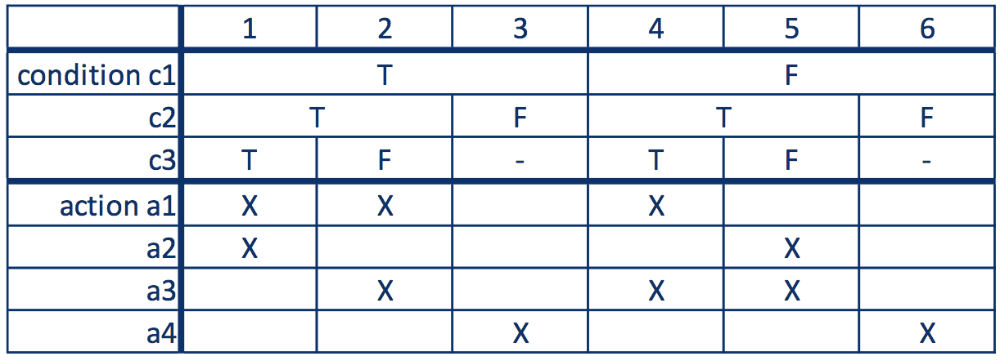

==== Decision Table: Don't Care

* Don't care decision variables reduce the number of variants
* Don't care can correspond to:
** The inputs are necessary but have no effect
** The inputs may be omitted
** Mutually exclusive cases

==== Test Generation Strategies for Decision Tables

* All-Explicit Variants: a test case for each explicit don't care taken into
account
* All-variants: a test case for each implicit variant 2^n^ for n conditions
* All-true: a test case for each variant with an outcome
* All-false: a test case for each variant without an outcome

=== Binary Decision Diagrams

==== Binary Decision Trees

* Each level of the tree corresponds to a decision with respect to a boolean
variable
** False-branch: dashed
** True-branch: solid
** Each leaf represents the resultant value for condition on the path from
the root to the leaf

==== Reduced Ordered Binary Decision Diagrams (ROBDD)

* Compact representation of a decision table
** Irredundancy: F and T successors of every node are distinct
** Uniqueness: There are no two nodes testing the same variable with the
same successors

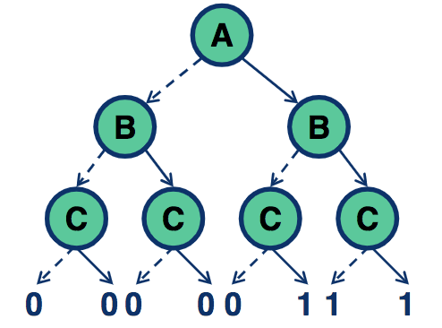

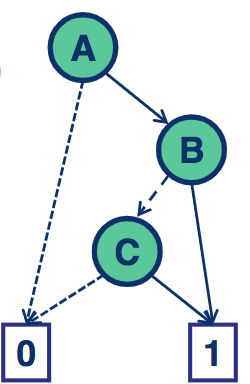

==== ROBDD Checklist

* Define and ordering of variables
* A ROBDD is a directed acyclic graph with one root and two leaf nodes
* Make decisions in that order along all paths
* Remove Redundant nodes
* Merge isomorphic subtrees

==== Test Cases from ROBDDs

1. Map ROBDD into ROBDD determinant table
2. Generate ROBDD test suite for each determinant

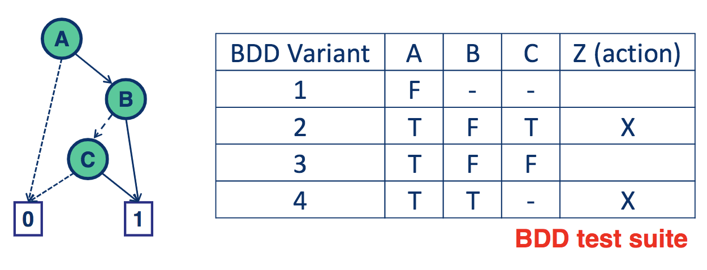

=== Cause-Effect Modeling

* Technique that helps derive decision tables and generate boolean formulas
to yield test cases
* Causes must be boolean expressions

==== Cause-Effect Graph

* A node is drawn for each cause and effect: nodes are places on opposite sides
of the sheet
* A line from a cause tot an effect indicates that the cause is a necessary
condition for the effect
* If a single effect has two or more causes, the logical relationship of
the causes is annotated by symbols for logical and and logical or
* A cause whose negation is necessary is shown by a logical not
* A single cause may be necessary for many effects
* Intermediate nodes may be used to simplify the graph and its construction

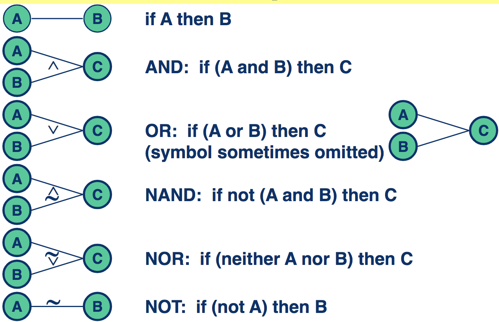

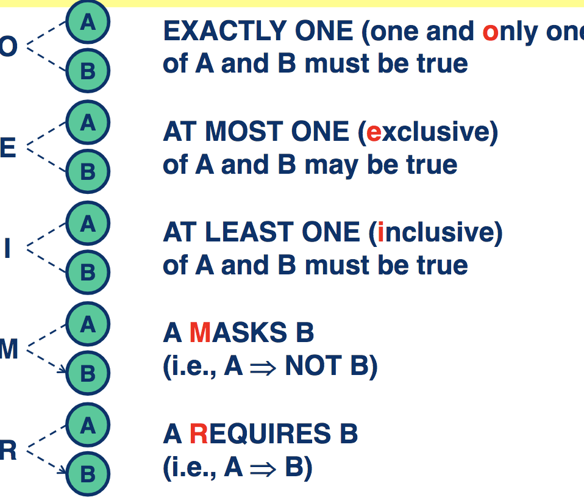

=== Test Generation from Cause and Effect Graphs

* Divide specification into workable pieces
* Identify causes and effects from the specification
* Annotate model with constraints describing impossible combinations of causes
and/or effects
* Link causes and effects

1. Use model to Generate a limited entry decision table and convert each
column of table into a test case
2. Use model to derive Boolean formulas and generate test cases from logic
formulas

==== Deriving a Decision Table

* A row for each cause or effect
* A column corresponds to a test variant
* Work with a single effect at a time
** Set effect to true
** look backward for all combinations of inputs which will force effect to be
true subject to constraints

* Create a column for each possible combination of causes
* For each combination, determine state of other effects

==== Deriving Logic Formulas

* One predicate exists for each effect (output variable)
* If several effects are present then the resulting test is a composite of
several predicates that happen to share decision/input variables and effects/actions

. Generate initial function from cause-effect graph
.. Start from effect node then backtrack through graph
.. Substitute higher level clauses with lower level clauses and Boolean expressions
. Transform into minimal, DNF form
.. Use boolean algebra laws to reduce Boolean expressions
.. re-express in sum of products form

==== Test Generation Strategies for Logic Formulas

===== Each-condition/all-condition

* Derive the set of variants following these rules
** For each variable, include a variant such that the variable is made true
with all other variables being false
** One variant such that all variables are true, or one variant such that all
variables are false

===== Variable Negations

* Strategy designed to reveal faults resulting from dont care implementation
* Unique true points: one variant for each product term such that this variant
makes the product term true but no other product term is true
* Near false points: one variant for each literal such that this variant
makes the whole function false and, if the value for the literal is negated,
the whole function is true

==== Full Predicate Coverage

* Clause: boolean expressions that contains no boolean operators
* Predicate: boolean expression that is composed of a clauses and zero or more
boolean operators
* Full predicate coverage: tries to determine whether each clause in a predicate
is necessary and formulated correctly

== 07. Integration Testing

=== Integration Testing

* Objective: ensure components interact correctly when assembled
* Assumption: components are already unit tested
* Need a component dependency structure

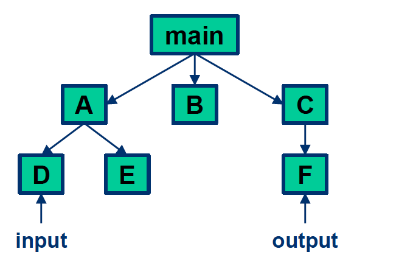

==== Integration Strategy

* How individual components are assembled to form larger program entities
** Problem 1: test component interaction
** Problem 2: determine optimal order of integration

* Strategy impacts
** The form in which unit test cases are written
** The type of test tools to use
** The order of coding/testing components
** The cost of generating test cases
** The cost of locating and correcting detected defects

=== Stubs Vs. Drivers

==== Integration Testing: Stubs

* Stub - replaces a called modules:
** Stub for input module passes test data
** Stub for output module returns test results

* Can replace whole components
* Must be declared/invoked as the real module
** Same name as replaced module
** Same parameter list as replaced module
** Same return type as replaced module
** Same modifiers as replaced module

* Common functions of a stub
** Display/log trace message
** Display/log passed parameters
** return value according to test objective

==== Integration Testing: Drivers

* Driver module used to call tested modules
** Parameter passing
** Handling return values

* Typically, drivers are simpler than stubs

==== Integration Strategies

===== Big Bang Integration

* Non-incremental strategy
* Integrate all components as a whole
* Assumes components are initially tested in isolation
* Advantages: convenient for small/stable systems
* Disadvantages
** Does not allow parallel development
** Fault localization difficult
** Easy to miss interface faults

==== Top-Down Integration

* Incremental Strategy
* Test high-level components, then called components until lowest level components
* Possible to alter order in a way to test as early as possible
** Critical components
** I/O components

* Advantages
** Fault localization easier
** Few or no drivers needed
** Possibility to obtain early prototype
** Testing can be in parallel with implementation
** Different order of testing/implementation possible
** Major design flaws found first

* Disadvantages
** Needs lots of stubs
** Potentially reusable components can be inadequately tested

==== Bottom-Up Integration

* Incremental Strategy
* Test low-level components, then components calling them until highest-level
component
* Advantages
** Fault localization easier
** No need fo stubs
** reusable components tested thoroughly
** Testing can be in parallel with implementation
** Different order of testing/implementation possible

* Disadvantages
** Needs drivers
** High-level components tested last
** NO concept of early skeletal system

==== Sandwich integration

* Combines top-down and bottom-up approaches
* Distinguishes three layers
** Logic(top) -> tested top-down
** Middle
** Operational (bottom) -> tested bottom

== 07.1 Testing OO Systems

=== Introduction

==== Motivation

* Object-orientation helps analysis and design of large systems but, based on
existing data, it seems that more, not less, testing is needed for OO software
* Need to account for in testing
** Encapsulation of State
** Inheritance
** Polymorphism and dynamic binding
** Abstract classes
** Exceptions

==== Class vs Procedure Testing

* Procedural programming
** Basic component = function
** Testing method = based on I/O relation

* Object-oriented programming
** Basic component = class
** Objects are tested
** Correctness cannot simply be defined as an I/O relation, but must also include
the object state

* Testing single methods can be based on traditional unit testing techniques
* In OO systems, most methods contain a few LOCs - complexity lies in method
interactions
* Method behavior is meaningless unless analyzed in relation to other operations
and their joint effect on a shared state

* Testing classes poses new problems
** The identification of behavior to be observed
** The manipulation of object state without violating encapsulation principle
** Polymorphism and dynamic binding leads to the test of one-to-many possible
invocations of the same interfaces
* Each exception needs to be analyzed

==== New Fault Models

* Traditional fault taxonomies, do not include faults due to OO features
* New fault models are vital

=== Integration Levels

==== OO Integration Levels

* Functions are basic units in procedural software
* Classes introduce a new abstraction level
* Basic unit testing: the testing of a single operation (method) of a class
(intra-method testing)
* Unit testing: the testing of methods within a class (intra-class testing)
** It is claimed that any significant unit to be tested cannot be smaller than
the instantiation of one class

* Intra-class testing
** Data flow-based testing
** Each exception raised at least once
** Each interrupt forced to occur at least once
** Each attribute set and got at least once
** State-based testing
** Big bang approach indicated for situation where methods are tightly coupled
** Alpha-omega cycle
** Complex methods can be tested with stubs/mocks

* Cluster integration
** Integration of two or more classed through inheritance -> incremental test
of inheritance hierarchies
** Integration of two or more classes through containment
** Integration of two or more associated classes/clusters to form a component

* Integration of components into a single application

=== Mock Objects

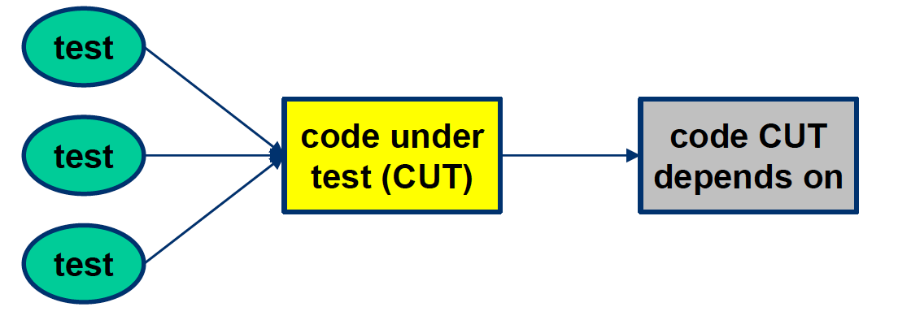

* Testing of OO systems requires drivers and stubs
* Difficult to flexibly stib dependent code without
** Changing CUT
** Maintaining a library of stub objects

* Mock objects - form of stubs:
** Based on interfaces
** Easier to setup and control
** Isolates code from details that may be filled later
** Can be refined incrementally by replacing with actual code

* Based on dependency inversion model
** Higher level modules use interfaces as an abstract layer instead of
lower-level modules directly

* Test controls mock behavior
* Mock transparently replaces actual code

=== Integration Strategies

==== Cluster Integration

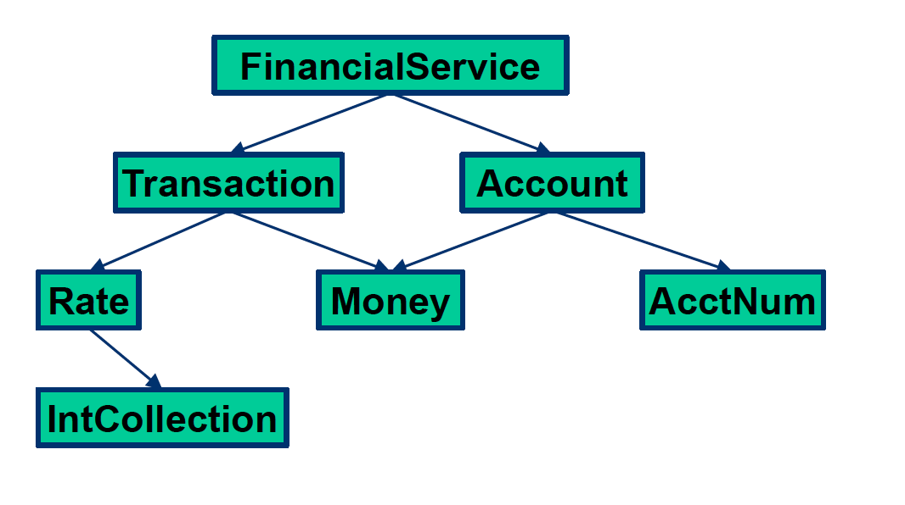

* needs a class dependency tree

===== Cluster Integration: Big Band

* Recommended only when
** Cluster is stable, only few elements added/changed
** Small Cluster
** Components are very tightly coupled

===== Cluster Integration: Bottom-up

* Most widely used technique
** Integrate classes starting from leaves and moving up

===== Cluster Integration: Top-Down

* Widely used technique
** Integration classes starting from the top and moving down

===== Cluster Integration: Scenario Based

* Scenario
** Describes interaction of classes

* Approach
. Map collaborations onto dependency tree
. Choose a sequence to apply collaborations
. Develop and run test exercising collaboration

==== Client/Server Integration: Two Tiers System

. Test each representative client with stub for server
. Test server with stub for each client type
. Test pairs of client types with the actual server
. Remove all stubs and test server with clients

==== Client/Server Integration: Three Tiers System

. Test each client type with middle-tier
. Test server with middle-tier
. Test each client type with middle-tier and server proxy
. Test server with middle-tier and client proxy for each client type
. Test each client type with middle-tier and the actual server

=== Kung et al. Integration Strategy

==== Integration Order Problem

* It is not advised to perform a big-bang integration of classes; integration
must be down in stepwise manner

== 08. System Testing

=== Overview of System Testing

* Performed after the software has been assembled
* Check if the system satisfies requirements
* High-order testing criteria should be expressed in the specification in a
measurable way

* Acceptance Tests
** System tests carried out by customers or under customers' responsibility
** Verifies if the system works according to customers' expectations

* Common types of user acceptance tests:
** Alpha testing - end user testing performed on a system that may have
incompatible features
*** Within the development environment
*** Performed by an in house testing panel including end users
** Beta testing - an end user testing performed within the user environment

=== System Level Functional (Black-box) Testing

==== Functional Testing

* Ensure the system meets functional requirements
* Test cases derived from statement of functional requirements:
** Natural language requirements
** Use cases
** Models

==== Test Case Derivations from Use Cases

* For each use case
. Develop a scenario graph
. Determine all possible scenarios
. Analyze and rank scenarios
. Generate test cases from scenarios to meet coverage goal
. Execute test cases

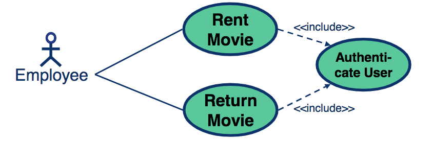

==== Scenario Graph

* Generated from a use case
* A node corresponds to a point where we are waiting for the next event to occur
* There is a single starting node
* End of use case is finish node
* An edge corresponds to a an event occurrence (may include conditions, special
looping edge)
* Scenario = path from starting node to a finishing node

== Grey-Box Testing

* Testing strategy based on limited knowledge of system internal
* Coverage is based on models

=== Testing vs. Formal Verification

==== Testing

* Scope
** A test case/simulation run analyses one execution trace of the system

* Characteristics
** Can detect errors
** Cannot guarantee/prove absence of errors

* Cost
** Expensive to design
** Cheap to execute

==== Formal Verification

* Scope
** Exhaustively analysis all possible execution traces of the system

* Characteristics
** Can detect errors
** Can guarantee/prove absence of errors

* Cost
** Expensive to design
** Expensive to execute

=== Concrete vs Abstract States

* Concrete
** Combination of possible values of attributes
** Can be infinite

* Abstract state
** Predicates over concrete states
** One abstract state <- many concrete states
** Hierarchal status

=== State Machines

image::images/ECSE429LectureNotes-098f3.png[align=center

==== State-based Testing: Overview

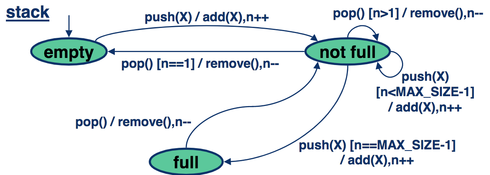

* Objective: check conformance of implementation with design model

==== Equivalent States

* Two states are equivalent if for every input sequence, the output sequences
from the two states are the same

==== Tests for State-Based models

* State machine execution depends on input events and data
* Data flow testing methods -> for data dependencies
* A test consists of a test sequence and test data

==== Challenges for State-based Tests

* Executability problem: find data to execute the test sequence
* Scalability problem: large number of concrete states
* Missing state model: need to revers-engineer model

==== Example

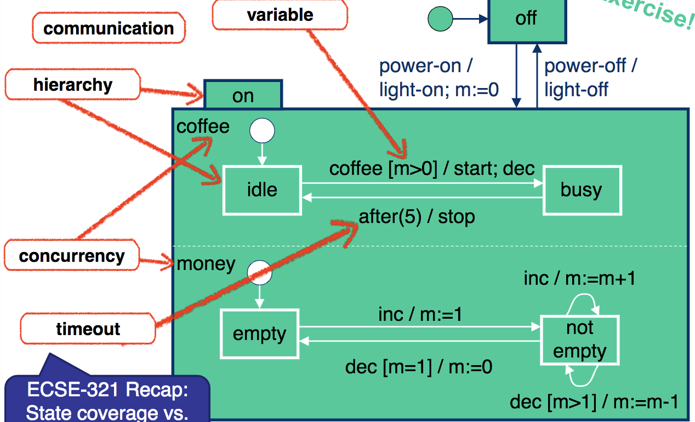

=== Fault Model for State Machines

==== Fault Model

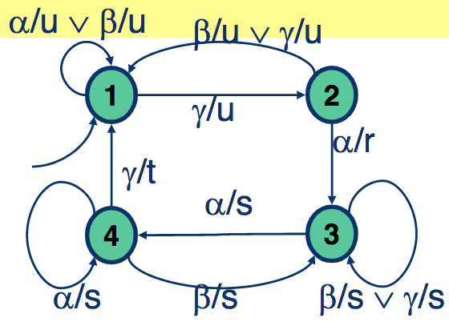

* Missing or incorrect transition based on a correct input (*transfer fault*)
** If transition from 2 to 1 on input _B_ is missing
** If transition from 1 to 2 (on input _y_) is from 1 to 3 instead

* Missing or incorrect output (action), based on a correct input and transition
(*output fault*)
** If transition from 1 to 2 (on input _y_) outputs r instead of u

* Corrupt state: based on a correct input, the implementation computes a state
that is not valid (additional state)
** If transition is from 1 to 5 (on input _y_) instead of 2

* Sneak path (extra transition): the implementation accepts a valid input that
is illegal or unspecified for a state
** Example state machine is fully specified -> sneak path not possible

* Illegal input failure: the implementation fails to handle an illegal mesage
correctly (incorrect output, state corrupted)

* Trap door: implementation accepts undefined messages
** Transition from 1 to 4 on input

=== State-Based Testing Strategies

* All States: Testing passes through all states
* All Events: all events consumed at least once
* All Actions: all actions produced at least once
* All Transitions: All (explicit) transitions taken at least once
** Implies all states/events/actions
** All n-transitions sequences: sequences of length n

==== N+ Test Strategy

* Reveals:
** All state control faults
** All sneak paths
** Many corrupt states

* Procedure:
. Derive round-trip path tree from state model
. Generate the round-trip path test cases
. Generate sneak path test cases
. Sensitize transitions in each test case

==== Round-Trip Path Tree

* Prerequisite
** Flatten state model (remove concurrency and hierarchy)

* Algorithm
** Initial state is the root node of the tree
** An edge is drawn for every transition out of the initial node, with new
leaf nodes representing resultant states
** A leaf node is marked as terminal, if the state it represents has already
been drawn or is a final state
** No more transition are traced out of a terminal node (only one iteration of
a loop is allowed
** Repeat until all leaf nodes are terminal

* Tree structure depends on the order in which transitions are traced (breadth
first or depth first)
* Depth first search yields fewer, longer test sequences
* The order in which sates are investigated is supposed to be irrelevant

* Is used to:
** Check conformance to explicit behavior model
** Find sneak paths

==== Conformance Test Cases

* Each test sequence begins at the root node and ends at a leaf node -> each
path through the round-trip path three produces a test case
* The expected result (oracle) is the sequence of states and actions (outputs) -
assuming states can be "observed"
* Test cases are completed by identifying method parameter values and required
conditions to traverse a path
* Run the test cases by setting the object under test to the initial state,
applying the sequence, and then checking the intermediary states, final state,
and outputs

==== Sneak Path Test Cases

* Covering all round-trip paths shows conformance to the explicitly modeled
behavior
* When state machines are incompletely specified, need to test for sneak paths
* A sneak path is possible for each unspecified transition and for guarded
transitions that evaluate false -> show if implicitly excluded behavior is
correctly handled
* Need to test all states' illegal events -> guarantees to reveal all sneak paths
* Place the object in the corresponding state
* Apply illegal event by sending message or forcing the virtual machine to
generate the desired event
* Check the actual response matches the specified response
* Check that the resultant state is unchanged

==== Hierarchy of State-based Testing Strategies

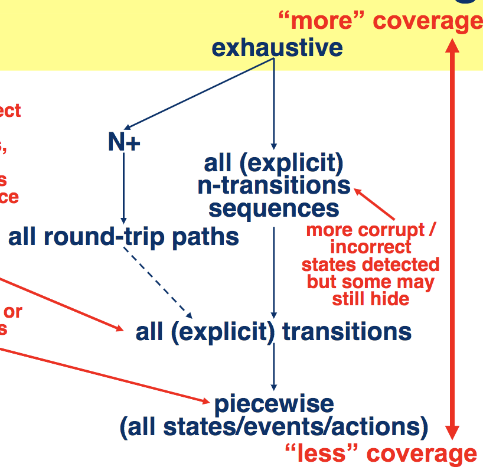

==== Support for State-Based Testability

* How to compare the actual result state from a test exec. sequence with the
expected result?
* Possible approaches:
** Built-in test support
** Test Repetition (heuristic to reveal corrupted states when impossible to
alter code)
. Run test case saving all output actions
. Repeat test and compare output with saved output - it is unlikely to get the
same result starting from a corrupt state

==== Built-In Test Support

* Get state methods: methods that evaluate the state invariants and return boolean
indicating whether an object is in a specific state
* During OO analysis and design, state is defined by a state invariant
* Each state invariant is associated with an executable assertions in the code

* Set state methods: built in methods to set objects in certain states that are
difficult to reach but are the starting state for a test sequence
* Only test drivers should be allowed to use these methods

== Exam Review

* 10 conceptual classes
** IE. Compare A to B
** Everything covered in lectures
** Every concept covered in tutorials
** No technology specific questions
** No multiple choice/true or false questions

* 7 practical exercises
** Similar to project deliverables, or assignments, quizzes, lecture slides
** *Basically everything covered in assignments*

=== LTL

* Use link on mycourses to help study with ltl portion of the exam
* Here is the automaton, here is the property, see that the property holds
*
