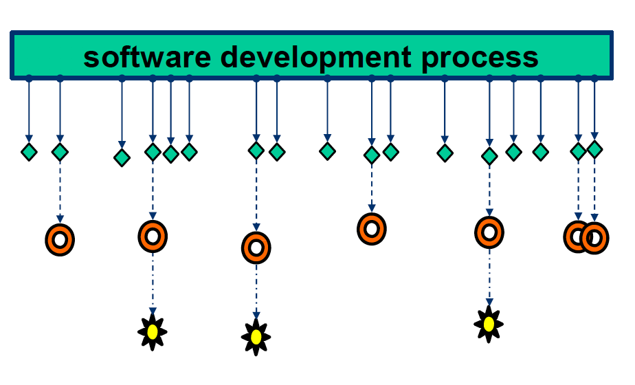
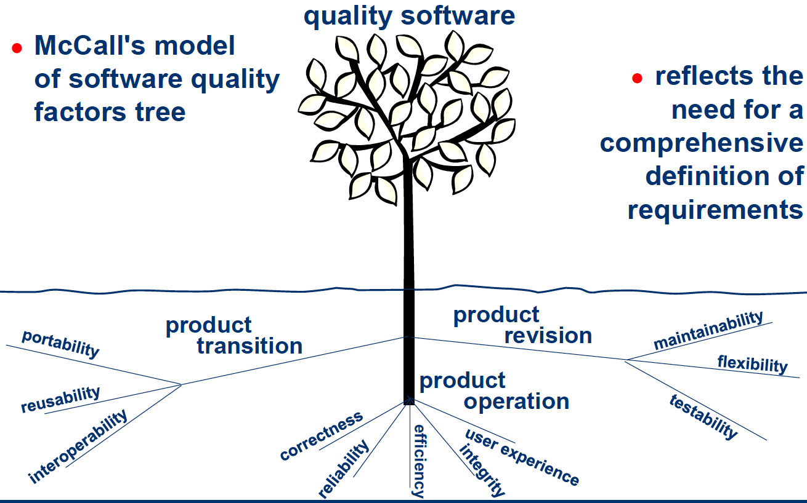
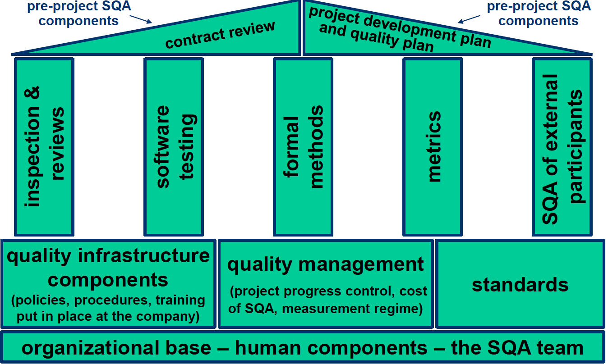
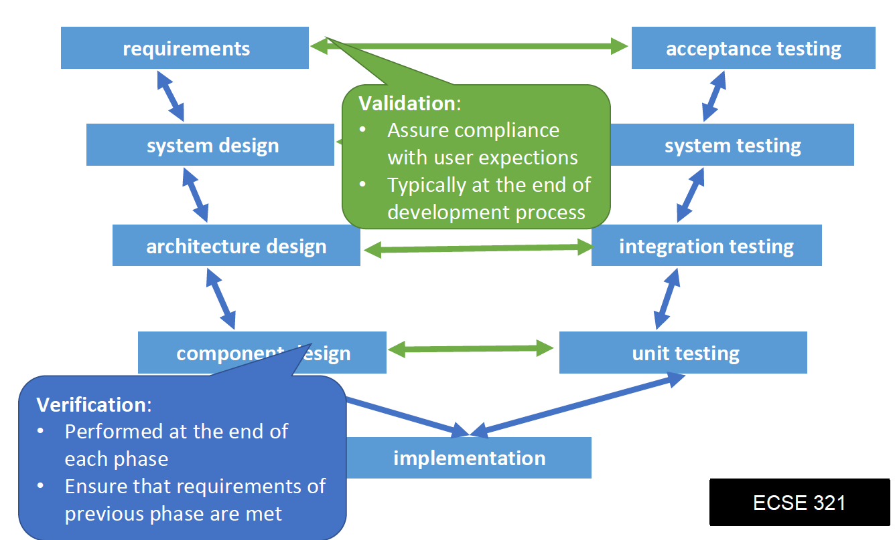
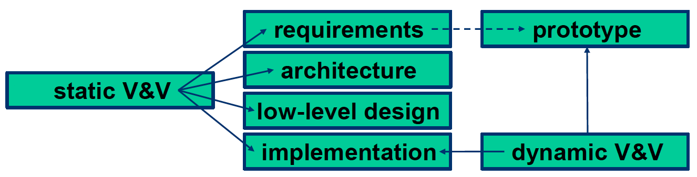
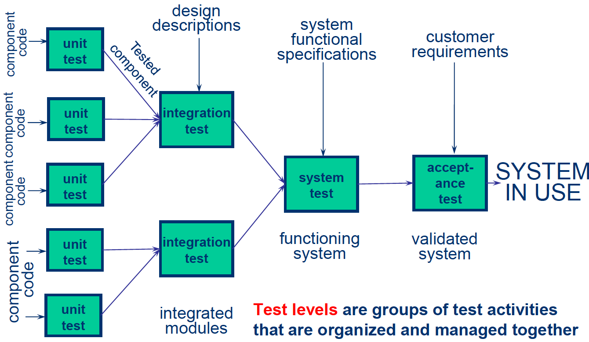

= ECSE 429

== Intro to Software Quality Assurance

=== Basic Terminology

==== Error, Fault, and Failure

* mistake: people commit errors
* defect: a mistake in software can lead to defect
* failure: occurs when defect executes
* incident: consequence of failures-failure occurrence may or may not be apparent
to user

==== Defects Root Cause and Effect

* Root cause of defect: earliest action/condition that contributed to creating
defect
* Root Cause Analysis: Identify root cause to reduce occurence of similar
defects in the future
* Effects of a defect: observed by user/customer, product owner

==== Nine Causes of Software Defects

1. Faulty requirements definitions
2. Client-developer communication
3. Deliberate deviations from software requirements
4. Logical design errors
5. Coding errors
6. non-compliance with documentation and coding instructions
7. Shortcomings of the testing process
8. Procedure errors
9. Documentation errors

=== Software Quality

==== Conformance to Requirements

* Lack of bugs:
** Low defect rate
** well documented defects

* High reliability/Availability
** *Mean time to failure* the probability of failure free operation until a
specified time
** *Mean time between failures* the probability that the system is up and
running at any given point in time

==== Software Quality Challenge

* The uniqueness of the software product
** High complexity: pervasive in an increasing number of industries
** Invisibility of the product
** Limited opportunities to detect defect compared to other industries
*** Development, not production

* The environments in which software is developed
** Contracted
** Subjected to customer-supplier relationship
** Requirements for teamwork
** etc.

=== Software Quality Factors

==== McCaul Method

* Correctness
** Accuracy and completeness of required output
** up to date

* Reliability
** First failure
** Max failure rate

* Efficiency
** hardware resources needed to perform function

* Integrity
** System security

* UX
* Maintainability
** Effort to identify and fix errors

* Flexibility
* Testability
** Support for testing, traceability

* Portability
** Adaptation to other environments

* Reusability
** Use of software components for other projects

* Interoperability
** Ability to interface with other components/systems

=== SQA

==== Objectives

1. Acceptable confidence that software will conform to functional technical
requirements
2. Acceptable confidence that software will conform to managerial scheduling
and budgetary requirements
3. Activities for the improvement/efficiency of software software development,
software maintenance, and software quality assurance activities

==== Three key principles

1. know what you are doing
* what is being built, how its being built, what it does
* Management structure
* Reporting Policies
* Tracking

2. know what you should be doing
* Having explicit requirements and specifications
* Requirements analysis
* Acceptance tests
* User feedback

3. know how to measure the difference
* Measure comparing what is being done with what should be done
* Includes:
** Formal methods: prove mathematically
** Testing: explicit input to exercise software and check for expected output
** Inspections: human examination of requirements, design, code... checklists\
** Metrics: measure a known set of properties related so quality

==== Software Quality Shrine

==== Verification vs Validation

* Verification: are we building the product right?
* Validation: are we building the right product?

==== SQA Includes

* Defect prevention
** Prevents defects from occurring in the first place
** Activities: training, planning, simulation

* Defect detection
** finds defects in a software artifact
** Activities: inspections, testing, or measuring

* Defect removal
** Isolation, correction, verification of fixes
** Activities: fault isolation, fault analysis, regression testing

* Typical Activities of an SQA Process
** Requirements validation
** design verification
** Static code checking
** dynamic testing
** Process engineering and standards
** Metrics and continuous improvement

=== Software Development Lifecycle Models

* Sequential and Iterative development processes
* Continuous Integration (CI)
** A software development process where a continuous integration server rebuilds
a branch of source code ever time code is committed to the source control
system

* Continuous Deployment
** A software production process where changes are automatically deployed to
production without any manual intervention

* Continuous Delivery
** A software production process where the software can be released to
production at any time with as much automation as possible for each step

== Software Testing

=== Why is Testing Difficult

* Upper limit to total number of test cases
* *continuity property* small differences in operating conditions will not result
in dramatically different behavior -> *not true in software!*

=== Seven Testing Principles

1. Program testing can be used to show the presence of bugs, but never
their absence
2. Exhaustive testing is impossible
3. Early testing saves time and money
4. Defects cluster together
5. Pesticide Paradox: a system tends to build a resistance to a particular
technique
6. Testing is context dependent
7. Absence of errors is a fallacy

=== Test Levels

==== Component/Unit Testing

==== Integration Testing

==== System Testing

==== Acceptance Testing

* User level: fitness for use by intended users
* Operational
* Contractual: check with respect to contract's acceptance criteria
* Alpha and Beta

=== Test Types

* Functional vs. non-functional
** Functional: evaluate that the system performs with respects to requirements
** non-functional: evaluate characteristics system as a whole

* Black-box vs. White-box
** Black-box (functional)
** White-box: aim to derive tests based on systems internal structure

=== Oracles and Test Coverage
