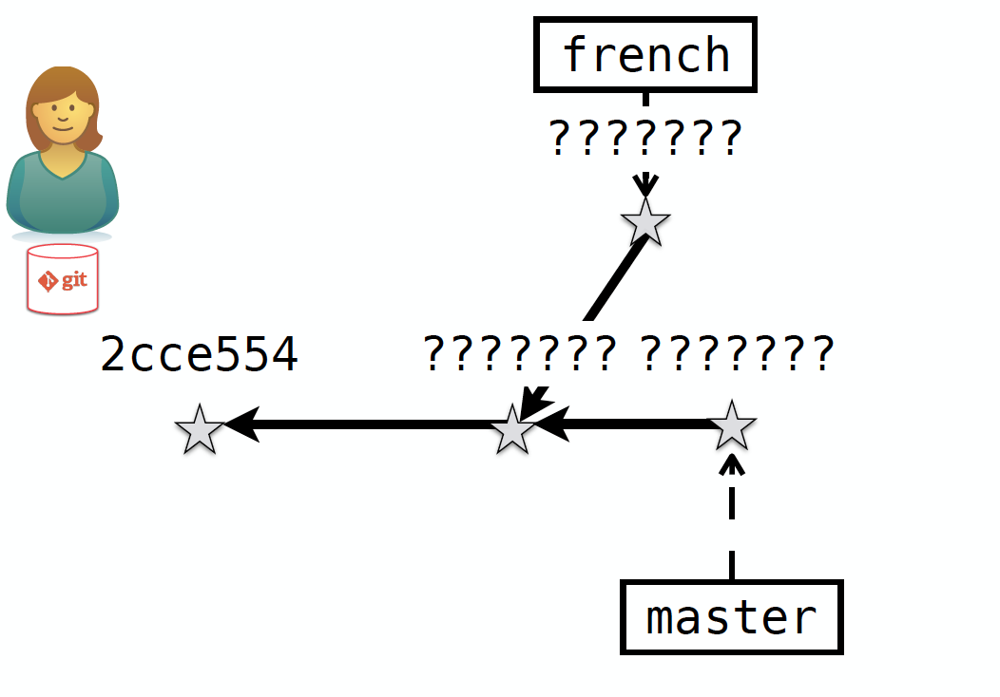

= ECSE 437

== Overview

=== Reading: Modern Release Engineering in a Nutshell

* 6 major phases of a release pipeline

==== Integration Branching and Merging

* Movement of code changes made on development up to master
* A branch is made as a revision of some parent, has a record of chronicle
sequence of changes (commits) and is eventually merged back into the parent
* Quality assurance activities (code reviews) should be down before merge
* Branch merges can create merge conflicts of different types (text-level,
build-level, test-level, semantic level)
* Rules of thumb to mitigate merge conflicts
** Keep branch merges short-lived and merge often
** Rebase (synch up) with recent changes of the parent branch

* Trunk Based Development: eliminate branches, everyone works off master, thus
eliminating the problem of merge conflicts
* Feature Toggle: Allow the source code of incomplete features to be put inside
a conditional block that is controlled by means of a variable

==== Continuous Integration: Building and Testing

* CI: refers to the activity of
** Continuously polling the VCS for new commits and merges
** Checking these revisions out on dedicated build machines, compiling them
** Running an initial set of tests to check for regressions

* Allows for fast feedback to developer or team while info is fresh in their
mind
* Test stages obtain deliverables built by CI process from "artifact repository"
which is a file server that cant tag files with metadata

==== Build System

* Set of build specification files used by the CI infrastructure to generate
project deliverables from source code
* Consists of two layers
** Configuration Layer: used to select features to be compiled and included
in the resulting deliverables
** Construction: used to specify build tool invocations that generate deliverables
from source code

* Different type of build systems:
** File Level: Make
** Task Based: Ant
** Lifecycle Based: Maven
** High level: cmake

==== Infrastructure as Code

* Refers to server, cloud, container or virtual machine on which a new version
of the system should be deployed for testing or production
* Used to generate the right environment based on a specification developed
in a dedicated programming language
* Virtual machines: self contained systems containing and operating system, and
library or services required to emulate a server that can run the application
under development
* Container: lightweight alternative to a virtual machine
** Share as many components as possible in the form of images
** Save disk space and memory

==== Deployment

* Deployment is the phase in which the tested variables for the upcoming
release are staged in preparation for release
* Dark Launching: deploying new features without releasing them to the public
** The system automatically make calls to hidden features in a way invisible
to end users

* Blue/Green Deployment: deploys the next version on a copy of the production
environment, updates DNS to redirect traffic to new environment
* Canary Deployment: release of the software system is loaded to a subset of
the production environments
* A/B Testing: deploys alternative A of a feature to the environment of a
subset of the user base, while alternative B is released to another subset
** Check which is better

==== Release

* "Rolling Forward": rolling back a release is difficult, instead roll out
a new release to fix the problem

=== Release Pipelines

1. Integrate: VCS
2. Build
* 1. Configuration
* 2. Construction
* 3. Certification
* 4. Packaging
* 5. Deployment

3. Deploy
4. Monitor

== Version Control

=== Git: Distributed Version Control System

* Offline Accessibility:
** Centralized VCS clients need server connections for most operators
** By contrast most operations can be performed on the DVCS clients without
using the server

* Branch and Merge operations
** Branches in CVCSs must be created and merged on the server
** DVCS clients can create and merge branches as lightweight operations on their
client machines

==== Rebasing

* Rebase before merging, automatically rewinds your branch changes

image::images/lecturenotes-2e4e5.png[align=center]

* Reapply the changes to the new head of the target branch

image::images/lecturenotes-645bd.png[align=center]

image::images/lecturenotes-ffea7.png[align=center]

* After rebasing, the merge option is trivial

image::images/lecturenotes-41342.png[align=center]

==== Overview of Git Architecture

* Decentralized by design
** Each repository can act as a server or a client
** By convention, a server side only repository is typically a bare repository
named with the .git extension

* Git can be served over several protocols
** Local: fasted and most secure
** Git Protocol: slow and bad
** HTTPS and SSH: about same speed and security\

== Build Systems

=== Using C

* Have a group of uncompiled c code *.c
* Then need to compile all the c code: gcc -c *.c
* Then need to link all the dependencies to make program gcc *.o -o program_name
* When we fix a bug in one of the source code files the file must be
rebuilt and then everything thing that depends on it must also be rebuilt
* Tedious

=== Reading: A Large-Scale Empirical Study of the Relationship between Build Technology and Maintenance

* Build System: refers to specification that outline how a software system is
assembled from its sources
* Build Process: the act of assembling a software system, consists of 4 steps
** Configuration step: a set of build tools and features are selected
** Construction step: compiler and other commands that produce deliverables are
executed in an order to satisfy dependencies
** Certification step: automatically execute tests to ensure that produces
deliverables have not regressed
** Packaging step: bundles certified deliverables together with required
libraries, documentation and data files

==== Low-Level

* Explicitly define build dependencies between input and output files, as well
as the commands that implement the input-output transformation
* Make: targets specify build files created by a recipe, i.e. a shell script
that is executed when target either does not exist or is older than one
of its dependencies
* Phony Target: represents abstract phases of a build process rather than
concrete files in a filesystem

==== Abstraction Based

* Maintainers have to constantly repeat low-level expressions to account for
variability in platform, abstraction fixes this
* Automatically generate low-level specifications based on higher level
abstractions

==== Framework driven

* Framework-driven technologies favor build convention over configuration
* Maven

==== Dependency Management

* Augment build systems by managing external dependencies, making sure the local
cache contains all APIs necessary to build the project
* Offer two advantages
1. users no longer need to carefully install required versions of libraries
manually
2. production and development environments can coexist, since the potentially
unstable versions of libraries that are required for development are placed
in the local cache that is quarantined from the running system

=== Low Level Build Systems

==== Make

1. Expressing Dependencies
** Program
*** random.o , input.o, main.o
**** random.c, input.c main.c

2. Writing Recipes
----
program : random.o input.o main.o
  gcc -o program random.o input.o main.o

random.o : random.c
  gcc -c random.c

my_command="gcc -c input.c"
input.o : input.c
  $(my_command)

main.o : main.c ; gcc -c main.c

.PHONY: clean
clean:
  rm -f random.o input.o main.o program
----

* Equivalent to above *Good to know, Midterm*
----
program: random.o input.o main.o
  gcc -c $@ $^
%.o
  gcc -c $<

.PHONY: clean
clean:
  rm -f random.o input.o main.o program
----

===== How does make work?

image::images/lecturenotes-166a8.png[align=center]

image::images/lecturenotes-c7fca.png[align=center]

===== Shortcomings with low-level build tools like make

* Platform specific scripts: not portable, repeated lines
* Recursion based build design is harmful
** to handle dependencies across directories, recursive calls to make are used,
this fractures the global dependency graph

=== Abstraction Based Build Systems

* Addresses shortcomings of low-level specs

* GNU Autotools
** Expands macros to generate platform specific Makefiles and production code

* CMake:
** A toolchain that again expands higher level abstractions to generate lower
level build specs
** Generates Makefiles, MVS and xcode files
** Exercise Using CMAKE from lecture: *Lab Tutorial*

=== Framework Driven Build System

==== Maven

* Maven Build Process
** Maven assumes that a build job follows a lifecycle
** A lifecycle is a sequential series of phases
** A phase performs a series of goals that are bound via plugins

* Maven build lifecycles
** Default: produces the project deliverables
** Clean: undoes build commands to return the project to its initial state
** Site: generates the project website materials

image::images/lecturenotes-fb9af.png[align=center]

===== Goal Binding for Maven Lifecycles

* Phase to goal bindings
** What is performed during a phase depends on the goals that are bound to it,
and the plugins that are associated with those goals
** A phase with no goals or plugins is a noop

* The bindings depend on the deliverable
** The deliverable is what maven is tasked with producing
** The goals that are bound to lifecycle phases by default depend on the
deliverable that we are trying to produce

=== Dependency Management Tools

* Internal dependencies become easier to track
* Projects are becoming more and more connected
* Maven manages repositories of dependencies on your machine
* Maven Central: an online resource where packages are published and made
available to Maven users

==== Maven as an External Dependency tool

* Dependency resolution:
** Dependencies are expressed in the pom.xml file
** If an appropriate version of a dependency is not available in your local repo,
it is downloaded from maven central

* Dependency Scope:
** Dependencies can be bound to specific phases, scoping their impact down to
those users who run those phases

== Routine Builds and Continuous Integration

=== Build system Interactions

==== Developers

* Developers execute personal builds on their development machines to:
** Synch their changes into deliverables so that they can perform basic tests
** Ensure that their changes have not introduced build problems

==== Quality Assurance

* QA teams hook automated tests into the build system
* Since normal builds should proved quick feedback only quick tests are run
by defaults
* Slower test can be relegated to special build targets

==== Release Engineers

* Release engineers are concerned with micro and macro aspects of build systems
** Micro-build: concerns about the behavior of a build system within a single
execution
** Macro-build: concerns about how to best provision a fleet of build resources

==== Static Analysis

* Static analysis tools listen to commands that are executed by the build system
* Use executed commands to put together a graph of how source code files are
connected
* Scan the graph for common bugs like resource leaks and dead code

==== Code Review Environments

* Teams that use modern code review tools like Gerrit connect build hobs to
the code reviewing dashboards

==== Nightly Builds

* At night, a build is executed to produce deliverables that include the changes
of the prior day
* QA teams can pick up those deliverables in the morning to test the new feature
and verify bug fixes
* Issues:
** As the amount of change per day has grown, nightly builds have become
difficult
** If there is build commits on the build then it is hard to tell which commit
caused the break

* Solution: run frequent smaller builds

=== Continuous Builds

.Continuous Integration Feedback loop
image::images/lecturenotes-17154.png[align=center]

* Each push gets its own build job
* CI simplifies problem assignment: problems correspond to a logical set of
changes made by one developer
* CI simplifies problem analysis: reports errors quickly

=== Reading: Modern CI Process

==== Build Triggering Events

* Cycle begins with build triggering event
* Builds are triggered:
** During development
** When the code is submitted for review
** The change is integrated into the project VCS

==== Build Job Creation Service

* When a build triggering event occurs, a build job creations node will add
a job to the queue of pending build jobs

==== Build Job Processing Service

* build jobs in the pending queue will be allocated to a build job processing
node
* The job processing node will first download the latest version of the source
code and apply the change under consideration
* Next the job processing node will initiate the build process, which will
compile the system if necessary, execute a system of automated tests, and make
the system available for users

==== Build Job Reporting Service

* build jobs results in the reporting queue will be communicated to the
development team
* Reporting preferences can be configured such that particular receipts receive
notifications when builds are successful

=== Keeping Build Systems Robust

* Build systems need maintenance
** As source code changes, occasionally the build system will need to be updated
** Neglected build maintenance makes the build process produce incorrect
results

=== Test Flakiness

* Flaky Tests: a test with non-deterministic behavior
* False positives: test code has a failed test when the code is actually fine
* False negatives: test passes when it should have failed

image::images/lecturenotes-17154.png[align=center]

== Code Inspections and Code Review

* Use knowledge of the system, its domain and the technologies used to discover
problems

=== Software inspections and Review: Advantages over dynamic V&V

* Cascading errors can obfuscate test results: Once an error occurs, later
errors may be new, or are the cascading effect of prior error
* Incomplete versions can be inspected: tests require an executable version of
the system, while inspections do not
* Good inspections are more than "Bug Hunts"
** Inspection uncover inefficiencies and style issues
** Inspection are a form of knowledge sharing and collaborative problem solving

=== Structured Inspections

* Rigid heavyweight process
* Involve in-person meetings, review checklists

* Roles
** Moderator
** Scribe
** Reviewer
** Reader
** Producer

.Structured Inspection
image::images/lecturenotes-a91a3.png[align=center]

=== Tips for a Productive Code Review

[options="header"]
|==================
|Do: | Dont:
| Critique the artifact | Attack the person
| Keep review chunks short and succinct | submit fixes for multiple issues at the same time
| Plan time for review | skip reviews
| Prioritize review of important issues | FIFO queue reviews
| Keep things light | Use sarcasm or exaggerations
|==================

=== Code Review Manifesto

We are uncovering better ways of critiquing code by doing it and helping others
to do it. Trough this work we have come to value +
Constructive Feedback _over_ Ad hominem attacks +
Clearly articulated rationale _over_ strongly worded opinion +
Suggested means for improvement _over_ only focussing on the criticism +

=== Modern Reviews

==== Reading: Why do programmers do code reviews?

===== Finding Defects

The top listed reason for doing code reviews. Both low-level (correct logic is
  in place) and high-level (catch errors in design).

===== Code Improvement

Comments or changes in the code in terms of reliability, commenting, consistency,
dead code removal , etc but do not involve correctness or defects.

===== Alternative Solutions

Regard changes and comments on improving submitted code by adopting an idea
that leads to a better implementation.

===== Knowledge Transfer

One of the main purposes for a code review is distribution of knowledge, if you
did not learn anything from a code review then it wasn't a very good review.

===== Team Awareness and Transparency

Code reviews act as a signaling mechanism to notify other devs that there are
changes being made in the the code base and that if they would like, they can
observe these changes.

===== Share code ownership

Breaks the idea that each person owns their code and instead code was writte
so the team can progress as a whole.

==== Roles

* Author
* Reviewer
* Integrator
* Verifier

==== Gerrit

image::images/lecturenotes-4ebb1.png[align=center]

== Midterm Questions

* Describe a file based build system (ie. Make)
* What is a container and what are its benefits over a VM?
* What is trunk-based development and how does it reduce the burden of branches
merges and conflicts
* what is a phony target/example?
* what are the four steps of a build system
* Why do companies prefer rolling forward over rollbacks
* Give 1 advantage and 1 disadvantage of GitFlow over trunk-based development
* What is trunk based development and how does it reduce the burden of branches
merges and conflicts
* What is a container and what are its benefits over a virtual machine

== Cloud-based Deployment

=== What is the Cloud

* Shared pools of configurable computing resources
* Can be rapidly provisioned (semi-)automatically
* Can "elastically" scale based on demeand

=== Business Case for Cloud Computing

* For cloud computing: cloud providers automatically scale applications based
on demand

.Business Case for Cloud Computing

* Business case against cloud computing: you are using someone else's computer,
security, privacy and other concerns about IP

=== Infrastructure as a Service (IaaS)

* A service that provides computing resources to users
* Typically, the computing resources are in the form of virtual machines or
containers

* Business Models
** Compute hours/month
** Per-machine, tshrt sizing

* Examples:
** Linode
** Amazon EC2
** Azure
** Google Cloud Platform
** IBM Cloud
** Digital Ocean

==== IaaS vs In-house Infrastructure

* Pros:
** Explainable infrastructure operation costs
** IT support is offloaded to cloud provider
** Elastic scaling

* Cons:
** Data privacy and security may be difficult to verify
** Costs can grow in unexpected ways

NOTE: Here we did the exercise on Amazon EC2

=== Platform as a Service (PaaS)

* A service that provides a development platform to users
* The platform provides users with a comfortable application development entry
point
* Exposes configuration options relevant for devs while hiding irrelevant options

* Business Models
** Wall clock hours of availability per month
** Per-machine t-shirt sizing

* Examples
** Heroku
** Azure
** Cloud Foundry
** IBM Cloud
** Google Cloud Platform

==== PaaS vs. IaaS

* Pros:
** Devs can focus on app development instead of infrastructure config
** Platforms are typically tuned to near-optimal settings for most application
workloads

* Cons:
** Convenience at the cost of configurability
** Platform lock-in: hard to port applications to other platforms

NOTE: Did an exercise in Heroku here

=== Software as a Service (SaaS)

* The entire stack (infrastructure, platform, execution environment) is hosted
in the cloud and delivered over the web
* Usually involves a so-called "thin client" that connects to a backend that
delivers most of the functionality

* Business Models:
** Public user plans (typically free)
** Business user plans (monthly rate on usage capactity)

* Examples
** GSuite (goolge docs etc.)

=== Mobile Backend as a Service (MBaaS)

* Many application backends provide similar features
** Identity management
** Notification routing
** Social media integration
** Cloud-like storage

* Rather than "reinvent the wheel", providers share these features as APIs

* Business Models:
** Freemium Models
** Up to a certain number of active users per month are provided for free
** More active user is more money

* Examples
** Backendless
** Firebase

NOTE: Did an example where we integrate firebase authentication

=== Serverless

* Serverless is a of variant of IaaS where capacity planning decisions are made
by the provider
* Costumers are charged for the resources their applications use
* Elastic scalability at the application level rather than the virtual machine
level

* Business Models:
** Similar to IaaS except charges are calculated based on the resouces that
your application requires

==== Serverless vs. IaaS

* Pros:
** Users pay for only the compute resources their code consumes
** Code can be deployed can scaled on a finer granularity

* Cons:
** A little complex to learn
** Costs can be a little tough to predict

=== Function as a Service (FaaS)

* Primary means by which serverless computing is realized today
* Functions are deployed to be executed on demand within a cloud environment

* Business Models:
** Freemium style

NOTE: complete the AWS lambda tutorial https://is.gd/xyUQEj

== Virtualization

* Virtual Machines
** Emulate computer system
** Provide a computer system from within the scope of another system

* Makes entire machines "shippable"
* Gives shared infrastructure users the impression of having their own machine

=== Different Types of Virtualization

* System virtualization
** Hosts an entire operating system

* Process Virtualization
** Provides the isolation of system virtualization while also sharing common
software tools with the underlying platform

=== History of Virtualization

image::images/lecturenotes-41f24.png[align=center]

==== '60s

* Early server virtualization
** Goal: run legacy software on newer hardware
** Result: CP-67 system, first commercial mainframe to support virtualization
** Pros: isolation

==== '80s and '90s

* chroot
** Goal: treat a directory within filesystem as another root directory
** Pros: sharing of system and kernel level features

NOTE: did an exercise where we set up a chroot jail

* Java
** Goal: compile-once-run anywhere
** JVM abstracts hardware details

* VMware
** Workstation: run VMs on UNIX/Linux (Type 2)
** GSX Server: run VMs on Windows (Type 2)
** ESX Server: run VMs without host OS (Type 1)

===== Hypervisor Types

* AKA Virtual Machine Monitors (VMMs)

image::images/lecturenotes-dc3d7.png[align=center]

==== '00s and '10as

* Containers:
** Initial appearance on solaris 10
** Linux support in 2008 "Zones" allow lightweight isolation with a shared core
of OS, system, and application software
** Containers popularized by Docker, which automates deployment

==== Linux Containers and Docker

* Containers:
** A set of processes, running on top of a common kernel
** Isolated from the rest
** Cannot impact each other on the host
** Achieved through namespaces and cgroups

image::images/lecturenotes-b6606.png[align=center]

=== Docker:

* An orchestration tool for containers with severel features
** Portability
** App-centric
** Builds from "source"
** Versioning
** Component reuse
** Public registry
** Tool Ecosystem

image::images/lecturenotes-48038.png[align=center]

* Docker provided standardized container format
* Fixed inefficient use of CPU resources, allowing for isolated services in fewer
VMs

NOTE: read article describing docker architecture https://is.gd/Dqjy9z

.Docker Overview
image::images/lecturenotes-1958a.png[align=center]

.Docker Ecosystem
image::images/lecturenotes-54213.png[align=center]

==== Traditional vs Container-based Development

* Traditional Development
** Presume we are developing a Python app
** First, we need a python runtime for your development machine
** The chouce of python runtime imposes constraints on the runtime that can be
used in produciton

* Container-based Development
** Development requirements, execution platform, dependency stack, and application
code all evolve together
** Portable images define execution platfrom
** Defined using Dockerfiles
** Instantiated as containers

NOTE: did a docker exercise

== Infrastructure as Code

=== Operating System Configuration

* Networking
** Network Connection
** Identity services
** Mounting shared storage

* Kernel Features
** Storage disk encryption
** File systems
** Hardware acceleration

=== Middleware and Application Server Configuration

* Spring/Spring Boot
** Bean config
** Component settings

* httpd
** Plugins
** DocumentRoot
** SSL

=== Application Configuration

* Many UNIX application have an rc file:
** By convention these are read at application launch time
** Vim: ~/.vimrc
** Bash: ~/.bashrc, ~/.bash_profile

=== Why is Infrastructure Config a Problem

* Automation is hindered
* If configuration is done by hand, it can become difficult to maintain
* Release engineers and operators spend too much time putting out fires with
configuration details
* This wastes precious resources (human hours)

=== Solution: Infrastructure as Code

* Write your configuration as code
* Manage and provision machines using code-like syntax rather than interactive
configuration tools
* Has all of the advantages of code
** Can be stored and versioned in a VCS
** Can be automatically executed to perform tasks

NOTE: All puppet quests are testable

=== Puppet

* Puppet lets you define a desired state for all systems in your infrastructure
* Puppet automates getting your systems into the desired state
* Puppet runs using a master-agent architecture
* De-centralized: Agent periodically checks the master and updates locally

==== Resource Syntax

* type: the kind of thing the resource describes
* Body: is a resource list of parameter value pairs (parameter => value)
* title: a unique name that puppet uses to identify the resource internally
** You can set the resource title to something other than its path if you set
the path parameter to its path

* ensure parameter: tells us the basic state of the resource
* Provider: is the translation layer that sits between Puppet's resource
representation and the native system tools it uses to discover and modify the
underlying system state
* puppet resource: allows you to see the system the way puppet does, through
the resource abstraction layer

==== Agent Master

image::images/lecturenotes-bf97d.png[align=center]

* Agent begins Puppet run by sending a catalog request to master (Facter)
* Master uses information from catalog and puppet code to tell the agent
how the resource code should be configured
* Agents must present a certified signed certificate to communicate with master
* On *sudo puppet agent -t* (puppet run):
** plugins are copied from master to agent to ensure all tools are available

==== Classification

* Node classification: determine what puppet code will be compiled to generate
a catalog for agent, triggers when the master receives a catalog request with
valid certificate
* Three ways to handle node classification
1. site.pp manifest
2. PE console node classifier GUI
3. External node classifier

==== Classes and Modules

* A class is named block of Puppet code
* Defining a class combines a group of resources into single reusable and
configurable unit
* Once defined, a class can then be declared to tell Puppet to apply the
resources it contains
* A module is a directory structure that lets Puppet keep track of where to find
the manifests that contain your classes.

== Midterm Questions

* Cloud types of the following technologies
** Heroku: PaaS
** Amazon EC2: IaaS
** Firebase: MBaaS
** IaaS

* Type 1, Type 2 and Container based deployment environments

.Type 1
image::images/lecturenotes-c50aa.png[align=center]

.Type 2

.Type 3
image::images/lecturenotes-50da1.png[align=center]

* Key Difference between a type 1 and type 2 hypervisor
** A type 1 hypervisor has no OS running on he host system, a type 2 hypervisor
does have an OS

* How does container-based development differ from traditional development
** Container based development ships complete and runnable bundles
** Containers are portable
** Containers contain the infrastructure required for the application

* What is serverless and how is it typically achieved?
** Serverless is a variant of IaaS where capacity planning decisions are made by
the provider
** Serverless is elastically scalable at the application level
** This is usually achieved by function as a service
** Functions are deployed to be executed in a cloud environment and owner is
charged by number of function calls

* Dockerfile
----
FROM rikorose/gcc-cmake
WORKINGDIR /tmp/
COPY . /tmp/

CMD ["cmake"]
CMD ["make"]
----

* What is the purpose of virtualization? what are two key types?
** VM, and Container
** The purpose of virtualization is two allow one machine to run multiple
instances of an operating system

* Which Docker command do we need to use to transform a Dockerfile into its
image?
** docker build

* Which sub command do we use to view the shared libraries that an executable
depends on?
** ldd <executable>

* How does a technology like docker differ from a technology like puppet?
** Docker comes pre-assembled with all the necessary requirements, ie. correct
version of python installed, correct OS etc.
** Puppet maintains the appropriate configs by writing the infrastructure as code
and maintaining the infrastructure by referencing this code

* Draw a diagram to illustrate how the docker client, daemon, and registry
communicate when the docker build subcommand is run on the below Dockerfile
----
FROM jekyll/Jekyll
WORKDIR /app
COPY . /app
CMD ['jekyll', 'serve']
----

** Daemon communicates with registry to retrieve the jekyll image
** Not sure...

* After deploying a web application to an IaaS cloud
